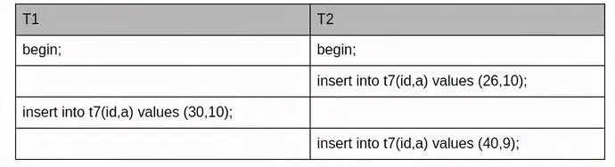
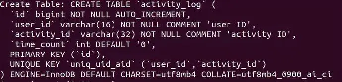
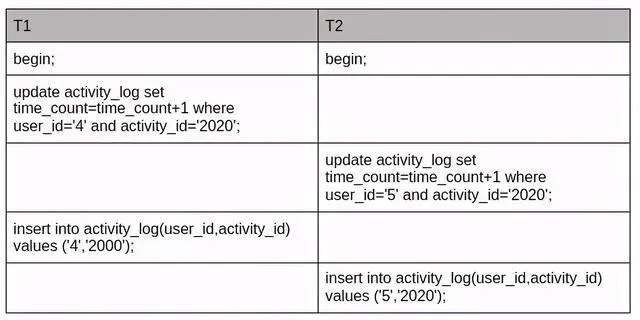

# 什么是死锁
死锁是并发系统中常见的问题，同样也会出现在数据库MySQL的并发读写请求场景中。  
当两个及以上的事务，双方都在等待对方释放已经持有的锁或因为加锁顺序不一致造成循环等待锁资源，就会出现“死锁”。  
常见的报错信息为 Deadlock found when trying to get lock...  
举例来说 A 事务持有 X1 锁 ，申请 X2 锁，B事务持有 X2 锁，申请 X1 锁。A 和 B 事务持有锁并且申请对方持有的锁进入循环等待，就造成了死锁。

如上图，是右侧的四辆汽车资源请求产生了回路现象，即死循环，导致了死锁。

# 死锁出现要素

* 两个或者两个以上事务
* 每个事务都已经持有锁并且申请新的锁
* 锁资源同时只能被同一个事务持有或者不兼容
* 事务之间因为持有锁和申请锁导致彼此循环等待

# 经典案例
## 案例一:事务并发 insert 唯一键冲突
表结构如下所示:

测试用例如下:

日志分析如下:

* 事务 T2 insert into t7(id,a) values (26,10) 语句 insert 成功，持有 a=10 的 排他行锁( Xlocks rec but no gap )

* 事务 T1 insert into t7(id,a) values (30,10), 因为T2的第一条 insert 已经插入 a=10 的记录,事务 T1 insert a=10 则发生唯一键冲突,需要申请对冲突的唯一索引加上S Next-key Lock( 即 lock mode S waiting ) 这是一个间隙锁会申请锁住(,10],(10,20]之间的 gap 区域。

* 事务 T2 insert into t7(id,a) values (40，9)该语句插入的 a=9 的值在事务 T1 申请的 gap 锁4-10之间， 故需事务 T2 的第二条 insert 语句要等待事务 T1 的 S-Next-key Lock 锁释放,在日志中显示 lock_mode X locks gap before rec insert intention waiting 。

## 案例二:先 update 再 insert 的并发死锁问题
表结构如下，无数据:

测试用例如下:

死锁分析:
可以看到两个事务 update 不存在的记录，先后获得间隙锁( gap 锁)，gap 锁之间是兼容的所以在update环节不会阻塞。

两者都持有 gap 锁，然后去竞争插入意向锁。当存在其他会话持有 gap 锁的时候，当前会话申请不了插入意向锁，导致死锁。

# 如何尽可能避免死锁

* 合理的设计索引，区分度高的列放到组合索引前面，使业务 SQL 尽可能通过索引定位更少的行，减少锁竞争。

* 调整业务逻辑 SQL 执行顺序， 避免 update/delete 长时间持有锁的 SQL 在事务前面。

* 避免大事务，尽量将大事务拆成多个小事务来处理，小事务发生锁冲突的几率也更小。

* 以固定的顺序访问表和行。比如两个更新数据的事务，事务 A 更新数据的顺序为 1，2;事务 B 更新数据的顺序为 2，1。这样更可能会造成死锁。

* 在并发比较高的系统中，不要显式加锁，特别是是在事务里显式加锁。如 select … for update 语句，如果是在事务里（运行了 start transaction 或设置了autocommit 等于0）,那么就会锁定所查找到的记录。

* 尽量按主键/索引去查找记录，范围查找增加了锁冲突的可能性，也不要利用数据库做一些额外额度计算工作。比如有的程序会用到 “select … where … order by rand();”这样的语句，由于类似这样的语句用不到索引，因此将导致整个表的数据都被锁住。

* 优化 SQL 和表设计，减少同时占用太多资源的情况。比如说，减少连接的表，将复杂 SQL 分解为多个简单的 SQL。