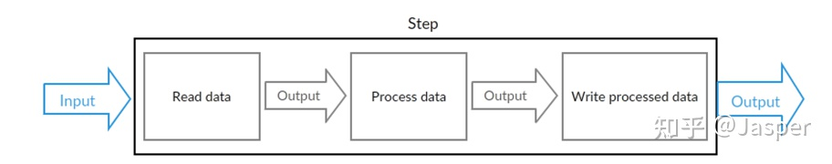
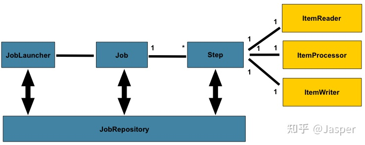
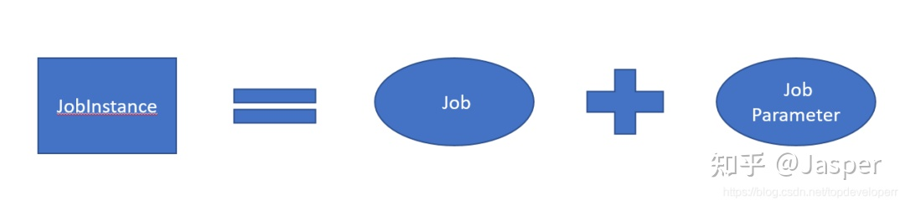
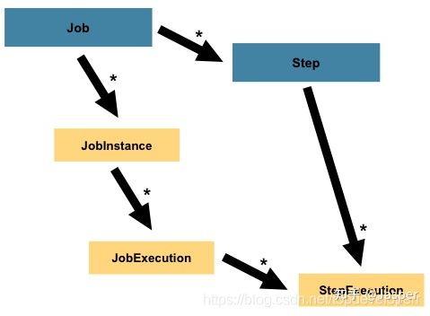
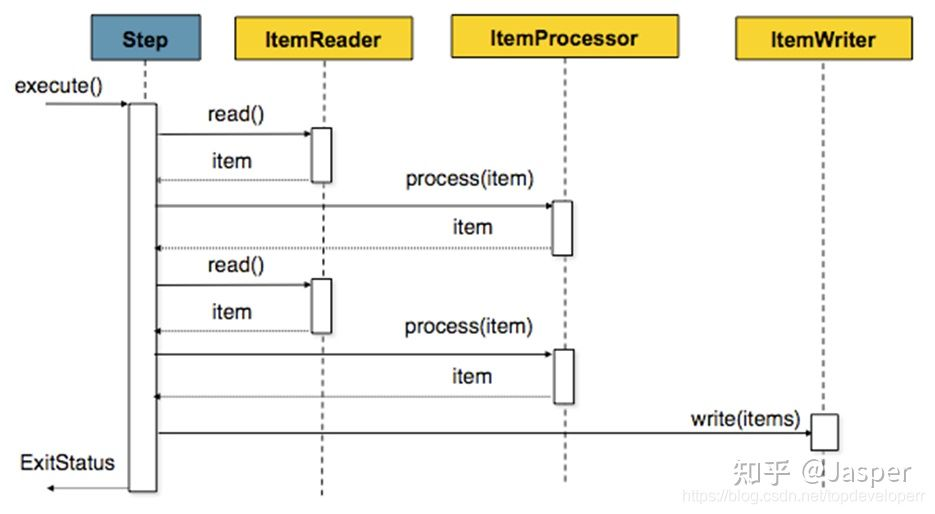

### 什么是SpringBatch

一个轻量级，全面的**批处理框架，不是一个 schuedling 的框架**。

一个标准的批处理程序：
* 通常会从数据库，文件或者队列中读取大量的数据和记录，
* 然后对获取的数据进行处理，
* 然后将修改后的格式写回到数据库中。



通常 Spring Batch 在离线模式下进行工作，不需要用户干预就能自动进行基本的批处理迭代，进行类似事务方式的处理。批处理是大多数 IT 目的一个组成部分，而 Spring Batch
是唯一能够提供健壮的企业级扩展性的批处理开源框架。

### 什么情况下需要用到SpringBatch

在大型企业中，由于业务复杂、数据量大、数据格式不同、数据交互格式繁杂，并非所有的操作都能通过交互界面进行处理。而有一些操作需要定期读取大批量的数据，然后进行一系列的后续处理。这样的过程就是“批处理”。

* 数据量大，从数万到数百万甚至上亿不等；
* 整个过程全部自动化，并预留一定接口进行自定义配置；
* 这样的应用通常是周期性运行，比如按日、周、月运行；
* 对数据处理的准确性要求高，并且需要容错机制、回滚机制、完善的日志监控等。

### SpringBatch提供了哪些功能

* 事务管理：全批次事务(因为可能有小数据量的批处理或存在存储过程/脚本中)
* 基于Web的管理员接口
* 分阶段的企业消息驱动处理
* 极高容量和高性能的基于块的处理过程(通过优化和分区技术)
* 按顺序处理任务依赖（使用工作流驱动的批处理插件）
* 声明式的输入/输出操作
* 启动、终止、（失败后的手动或定时）重启任务
* 重试/跳过任务，部分处理跳过记录（例如，回滚）
  <details><summary>具体使用场景</summary>
  
  ```markdown  
  在处理百万级的数据过程过程中难免会出现异常。如果一旦出现异常而导致整个批处理工作终止的话那么会导致后续的数据无法被处理。Spring Batch内置了Retry（重试）和Skip（跳过）机制帮助我们轻松处理各种异常。我 们需要将异常分为三种类型。
  
  * 第一种是**需要进行Retry的异常**，它们的特点是该异常可能会随着时间推移而消失，比如数据库目前有锁无法写入、web服务当前不可用、web服务满载等。所以对它们适合配置Retry机制。
  * 第二种是**需要Skip的异常**，比如解析文件的某条数据出现异常等，因为对这些异常即使执行Retry每次的结果也都是相同，但又不想由于某条数据出错而停止对后续数据的处理。
  * 第三种异常是**需要让整个Job立刻失败的异常**，比如如果出现了OutOfMemory的异常，那么需要整个Job立刻终止运行。
  
  一般来说需要Retry的异常也要配置Skip选项，从而保证后续的数据能够被继续处理。我们也可以配置SkipLimit选项保证当Skip的数据条目达到一定数量后及时终止整个Job。
  ```
  </details>
  
### SpringBatch整体架构


Spring batch框架有4个主要组件：JobLauncher、Job、Step和JobRepository。

* JobLauncher（任务启动器）：通过它启动任务，可以理解为程序的入口。
* Job（任务）：一个具体的任务。
  * 由一个或多个step组成，
  * 通过JobBuilderFactory实例创建Bean，
  * 使用next指向下一个step,  可以按照指定的逻辑顺序组合 step,
  * 提供了我们给所有 step 设置相同属性的方法（例如一些事件监听，跳过策略）;
* Step（步骤）：一个具体的执行步骤，一个Job中可以有多个Step。
* JobRepository（任务仓库）：存储数据的仓库，在任务执行的时候，需要用它来记录任务状态信息，可以看做是一个数据库的接口。

#### JOB
Job 是一个封装整个批处理过程的一个概念。Job 在 spring batch 的体系当中只是一个最顶层的一个抽象概念，体现在代码当中则它只是一个最上层的接口。
```java
/**
 * Batch domain object representing a job. Job is an explicit abstraction
 * representing the configuration of a job specified by a developer. It should
 * be noted that restart policy is applied to the job as a whole and not to a
 * step.
 */
public interface Job {
 
 String getName();
 
 
 boolean isRestartable();
 
 
 void execute(JobExecution execution);
 
 
 JobParametersIncrementer getJobParametersIncrementer();
 
 
 JobParametersValidator getJobParametersValidator();
 
}
```

在 Job 这个接口当中定义了五个方法，它的实现类主要有两种类型的 job，一个是 simplejob，另一个是 flowjob。

Spring Batch 以 SimpleJob 类的形式提供了 Job 接口的默认简单实现，它在 Job 之上创建了一些标准功能。一个使用 java config 的例子代码如下：
```
@Bean
public Job footballJob() {
    return this.jobBuilderFactory.get("footballJob")
                     .start(playerLoad())
                     .next(gameLoad())
                     .next(playerSummarization())
                     .end()
                     .build();
}
```

#### JobInstance
他是 Job 的更加底层的一个抽象，他的定义如下：
```java
public interface JobInstance {
 /**
  * Get unique id for this JobInstance.
  * @return instance id
  */
 public long getInstanceId();
 /**
  * Get job name.
  * @return value of 'id' attribute from <job>
  */
 public String getJobName(); 
}
```
他的方法很简单，一个是返回 Job 的 id，另一个是返回 Job 的名字。

JobInstance 指的是 job 运行当中，作业执行过程当中的概念。

比如说现在有一个批处理的 job，它的功能是在一天结束时执行行一次。我们假定这个批处理 job 的名字为'EndOfDay'。在这个情况下，那么每天就会有一个逻辑意义上的 JobInstance, 而我们必须记录 job 的每次运行的情况。

#### JobParameters
JobParameters 对象包含一组用于启动批处理作业的参数，它可以在运行期间用于识别或甚至用作参考数据。

例如, 我们前面的'EndOfDay'的 job 现在已经有了两个实例，一个产生于 1 月 1 日，另一个产生于 1 月 2 日，那么我们就可以定义两个 JobParameter 对象：一个的参数是 01-01, 另一个的参数是 01-02。



因此，我么可以通过 Jobparameter 来操作正确的 JobInstance

#### JobExecution
JobExecution 指的是单次尝试运行一个我们定义好的 Job 的代码层面的概念。job 的一次执行可能以失败也可能成功。只有当执行成功完成时，给定的与执行相对应的 JobInstance 才也被视为完成。

还是以前面描述的 EndOfDay 的 job 作为示例，假设第一次运行 01-01-2019 的 JobInstance 结果是失败。那么此时如果使用与第一次运行相同的 Jobparameter 参数（即 01-01-2019）作业参数再次运行，那么就会创建一个对应于之前 jobInstance 的一个新的 JobExecution 实例, JobInstance 仍然只有一个。

JobExecution 的接口定义如下：
```java
public interface JobExecution {
 /**
  * Get unique id for this JobExecution.
  * @return execution id
  */
 public long getExecutionId();
 /**
  * Get job name.
  * @return value of 'id' attribute from <job>
  */
 public String getJobName(); 
 /**
  * Get batch status of this execution.
  * @return batch status value.
  */
 public BatchStatus getBatchStatus();
 /**
  * Get time execution entered STARTED status. 
  * @return date (time)
  */
 public Date getStartTime();
 /**
  * Get time execution entered end status: COMPLETED, STOPPED, FAILED 
  * @return date (time)
  */
 public Date getEndTime();
 /**
  * Get execution exit status.
  * @return exit status.
  */
 public String getExitStatus();
 /**
  * Get time execution was created.
  * @return date (time)
  */
 public Date getCreateTime();
 /**
  * Get time execution was last updated updated.
  * @return date (time)
  */
 public Date getLastUpdatedTime();
 /**
  * Get job parameters for this execution.
  * @return job parameters  
  */
 public Properties getJobParameters();
 
}
```
JobExecution 当中提供了一个方法 getBatchStatus 用于获取一个 job 某一次特地执行的一个状态。BatchStatus 是一个代表 job 状态的枚举类，其定义如下：
```java
public enum BatchStatus {
    STARTING, STARTED, STOPPING, STOPPED, FAILED, COMPLETED, ABANDONED
}
```

#### Step
每一个 Step 对象都封装了批处理作业的一个独立的阶段。事实上，每一个 Job 本质上都是由一个或多个步骤组成。每一个 step 包含定义和控制实际批处理所需的所有信息。任何特定的内容都由编写 Job 的开发人员自行决定。



StepExecution 表示一次执行 Step, 每次运行一个 Step 时都会创建一个新的 StepExecution，类似于 JobExecution。但是，某个步骤可能由于其之前的步骤失败而无法执行。且仅当 Step 实际启动时才会创建 StepExecution。

一次 step 执行的实例由 StepExecution 类的对象表示。每个 StepExecution 都包含对其相应步骤的引用以及 JobExecution 和事务相关的数据，例如提交和回滚计数以及开始和结束时间。

此外，每个步骤执行都包含一个 ExecutionContext，其中包含开发人员需要在批处理运行中保留的任何数据，例如重新启动所需的统计信息或状态信息。

```
@Bean
public Job JobFlowDemo1(){
    return jobBuilderFactory.get("jobFlowDemo1")
//                .start(step1())
//                .next(step2())
//                .next(step3())
//                .build();
                .start(step1())
                .on("COMPLETED").to(step2())
                .from(step2()).on("COMPLETED").to(step3())
                .from(step3()).end()
                .build();
    }

当step1 成功执行完成后，返回COMPLETED， 才调用step2进行下一步处理。但是过多的step，不易于程序维护和复用
```
#### chunk



由于我们一次 batch 的任务可能会有很多的数据读写操作，因此一条一条的处理并向数据库提交的话效率不会很高，因此 spring batch 提供了 chunk 这个概念，我们可以设定一个 chunk size，spring batch 将一条一条处理数据，但不提交到数据库，只有当处理的数据数量达到 chunk size 设定的值得时候，才一起去 commit.

### 总结
Spring Batch为我们提供了非常实用的功能，对批处理场景进行了完善的抽象，它不仅能实现小数据的迁移，也能应对大企业的大数据实践应用。它让我们开发批处理应用可以事半功倍。  

