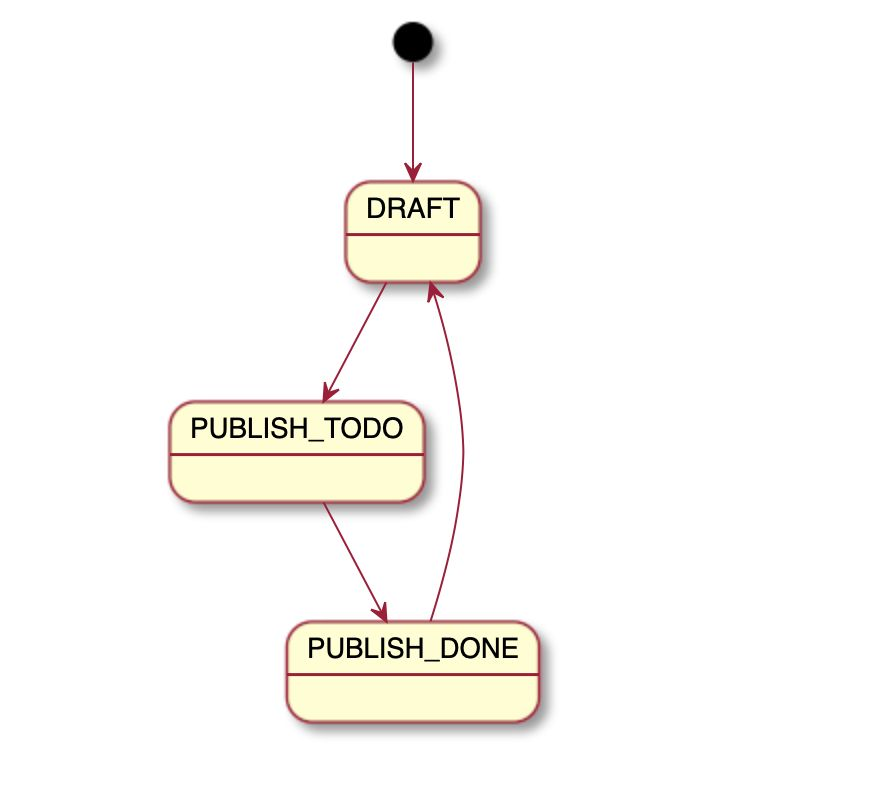

## 什么是状态机
有限状态机是一种用来进行对象行为建模的工具，其作用主要是描述对象在它的生命周期内所经历的状态序列，以及如何响应来自外界的各种事件。

在电商场景（订单、物流、售后）、社交（IM消息投递）、分布式集群管理（分布式计算平台任务编排）等场景都有大规模的使用。

### 状态机的要素
* **现态**：指当前所处的状态
* **条件**：又称“事件”，当一个条件被满足，将会触发一个动作，或者执行一次状态的迁移
* **动作**：条件满足后执行的动作。动作执行完毕后，可以迁移到新的状态，也可以仍旧保持原状态。动作不是必须的，当条件满足后，也可以不执行任何动作，直接迁移到新的状态。
  * 进入动作：在进入状态时进行
  * 退出动作：在退出状态时进行
  * 输入动作：依赖于当前状态和输入条件进行
  * 转移动作：在进行特定转移时进行
* **次态**：条件满足后要迁往的新状态。“次态”是相对于“现态”而言的，“次态”一旦被激活，就转换成“现态”。

### 什么时候需要用到状态机
Spring文档指出，在以下情况下，项目很适合使用状态机：
* 您可以将应用程序或其结构的一部分表示为状态。
* 您想将复杂的逻辑拆分为更小的可管理任务。
* 应用程序已经遇到了（例如）异步发生的并发问题。

如果满足以下条件，您已经在尝试实现状态机 ：  
* 使用布尔标志或枚举对情况进行建模。
* 具有仅对应用程序生命周期的一部分有意义的变量。
* 遍历if / else结构并检查是否设置了特定的标志或枚举，然后进一步对当标志和枚举的某些组合存在或不存在时的处理方式作进一步的例外。

#### 使用状态机的优缺点
**优点**
* 状态及转换与业务解耦；
* 代码的可维护性增强；
* 对于流程复杂易变的业务场景能大减轻维护和测试的难度。

**缺点**
* 事务不好控制；
* 增加更多的类。
### 状态机对比

| 状态机 | 优点 | 缺点 |
|------|-----|-----|
|stateless4j|轻量级<br>支持基本事件迁移<br>二次开发难度低|不支持持久化和上下文传参|
|squirrel-foundation|功能齐全<br>StatueMachine精简版|---|
|Spring StatusMachine|功能齐全<br>&ensp; 状态：初始终止、历史状态、连接交并；<br>&ensp; 延迟事件;<br>&ensp; Guard;<br>&ensp; 持久化;<br>&ensp; JPA<br>使用方便<br>&ensp; 配置+注解，文档齐全|学习成本较高<br>状态机已捕获异常，需要手动编码处理异常，单个状态机可以被共享，需要builder多个实例<br>同时使用多个状态机事务需要手工控制|

### Spring StatusMachine使用案例
假设在一个业务系统中，有这样一个对象，它有三个状态：草稿、待发布、发布完成，针对这三个状态的业务动作也比较简单，分别是：上线、发布、回滚。该业务状态机如下图所示。


创建一个基础的Spring Boot工程，在主pom文件中加入Spring StateMachine的依赖：
```xml
<!--加入spring statemachine的依赖-->
<dependency>
  <groupId>org.springframework.statemachine</groupId>
  <artifactId>spring-statemachine-core</artifactId>
  <version>2.1.3.RELEASE</version>
</dependency>
```
定义状态枚举和事件枚举，代码如下：
```java
/**
* 状态枚举
**/
public enum States {
    DRAFT,
    PUBLISH_TODO,
    PUBLISH_DONE,
}
/**
 * 事件枚举
 **/
public enum Events {
  ONLINE,
  PUBLISH,
  ROLLBACK
}
```
完成状态机的配置，包括：（1）状态机的初始状态和所有状态；（2）状态之间的转移规则
```java
@Configuration
// @EnableStateMachine批注时，它将在应用程序启动时自动创建默认状态机。
@EnableStateMachine
public class StateMachineConfig extends EnumStateMachineConfigurerAdapter<States, Events> {

    @Override
    public void configure(StateMachineStateConfigurer<States, Events> states) throws Exception {
        states.withStates().initial(States.DRAFT).states(EnumSet.allOf(States.class));
    }

    @Override
    public void configure(StateMachineTransitionConfigurer<States, Events> transitions) throws Exception {
        transitions.withExternal()
            .source(States.DRAFT).target(States.PUBLISH_TODO)
            .event(Events.ONLINE)
            .and()
            .withExternal()
            .source(States.PUBLISH_TODO).target(States.PUBLISH_DONE)
            .event(Events.PUBLISH)
            .and()
            .withExternal()
            .source(States.PUBLISH_DONE).target(States.DRAFT)
            .event(Events.ROLLBACK);
    }
}
```
定义一个测试业务对象，状态机的状态转移都会反映到该业务对象的状态变更上
```java
@WithStateMachine
@Data
@Slf4j
public class BizBean {

    /**
     * @see States
     */
    private String status = States.DRAFT.name();

    @OnTransition(target = "PUBLISH_TODO")
    public void online() {
        log.info("操作上线，待发布. target status:{}", States.PUBLISH_TODO.name());
        setStatus(States.PUBLISH_TODO.name());
    }

    @OnTransition(target = "PUBLISH_DONE")
    public void publish() {
        log.info("操作发布,发布完成. target status:{}", States.PUBLISH_DONE.name());
        setStatus(States.PUBLISH_DONE.name());
    }

    @OnTransition(target = "DRAFT")
    public void rollback() {
        log.info("操作回滚,回到草稿状态. target status:{}", States.DRAFT.name());
        setStatus(States.DRAFT.name());
    }

}
```
编写测试用例，这里我们使用CommandLineRunner接口代替，定义了一个StartupRunner，在该类的run方法中启动状态机、发送不同的事件，通过日志验证状态机的流转过程。
```java
public class StartupRunner implements CommandLineRunner {

    @Resource
    StateMachine<States, Events> stateMachine;

    @Override
    public void run(String... args) throws Exception {
        stateMachine.start();
        stateMachine.sendEvent(Events.ONLINE);
        stateMachine.sendEvent(Events.PUBLISH);
        stateMachine.sendEvent(Events.ROLLBACK);
    }
}
```

**使用步骤总结：**
* 定义状态枚举和事件枚举
* 定义状态机的初始状态和所有状态
* 定义状态之间的转移规则
* 在业务对象中使用状态机，编写响应状态变化的监听器方法

使用Spring StateMachine的好处在于自己无需关心状态机的实现细节，只需要关心业务有什么状态、它们之间的转移规则是什么、每个状态转移后真正要进行的业务操作。

### 其他
Spring State Machine可以做的事情还很多。 

* [状态可以嵌套](https://docs.spring.io/spring-statemachine/docs/current/reference/#statemachine-config-states)
* [可以配置为检查是否允许过渡的防护措施](https://docs.spring.io/spring-statemachine/docs/current/reference/#sm-security)
* [允许定义选择状态，接合状态等的伪状态](https://docs.spring.io/spring-statemachine/docs/current/reference/#sm-extendedstate) 
* [事件可以由操作或在计时器上触发](https://docs.spring.io/spring-statemachine/docs/current/reference/#sm-triggers)
* [状态机可以持久化以提高性能](https://docs.spring.io/spring-statemachine/docs/current/reference/#sm-persist) 
  
要浏览所有内容，您需要研究 [Spring StateMachine文档](https://docs.spring.io/spring-statemachine/docs/current/reference/) 并确定适合您的特定情况的文档。

