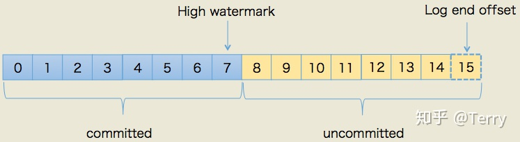
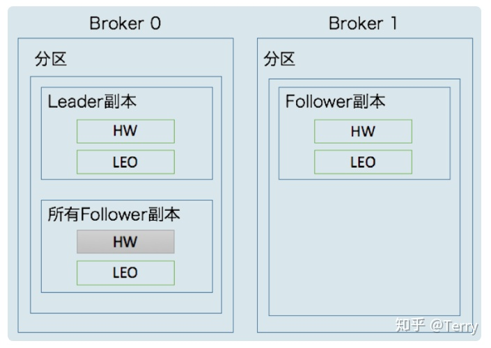

### 预备知识


#### HW（High Watermark）：
* 在分区高水位以下的消息被认为是已提交消息，反之就是未提交消息；
* 定义消息可见性，即用来标识分区下的哪些消息是可以被消费者消费的；
* 小于等于HW值的所有消息都被认为是“已备份”的（replicated）。

#### LEO（Log End Offset）
* 记录了该副本底层日志(log)中下一条消息的位移值（注意是下一条消息！！）
* 数字 15 所在的方框是虚线，这就说明，这个副本当前只有 15 条消息，位移值是从 0 到 14，下一条新消息的位移是 15；

### 更新机制



**流程如下**

1. 生产者写入消息到leader副本
2. leader副本LEO值更新
3. follower副本尝试拉取消息，发现有消息可以拉取，更新自身LEO
4. follower副本继续尝试拉取消息，这时会更新remote副本LEO，同时会更新leader副本的HW
5. 完成4步骤后，leader副本会将已更新过的HW发送给所有follower副本
6. follower副本接收leader副本HW，更新自身的HW

```
Kafka副本之间的数据复制既不是完全的同步复制，也不是单纯的异步复制；
Leader副本的HW更新原则：取当前leader副本的LEO和所有remote副本的LEO的最小值
Follower副本的HW更新原则：取leader副本发送的HW和自身的LEO中的最小值
```