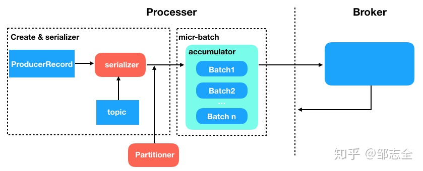
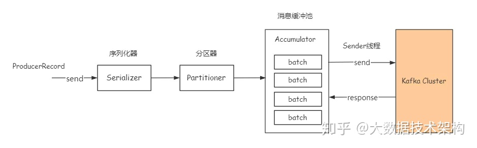
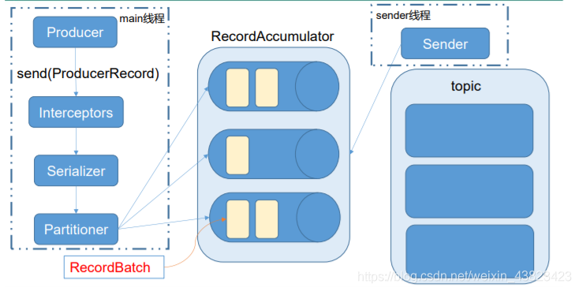
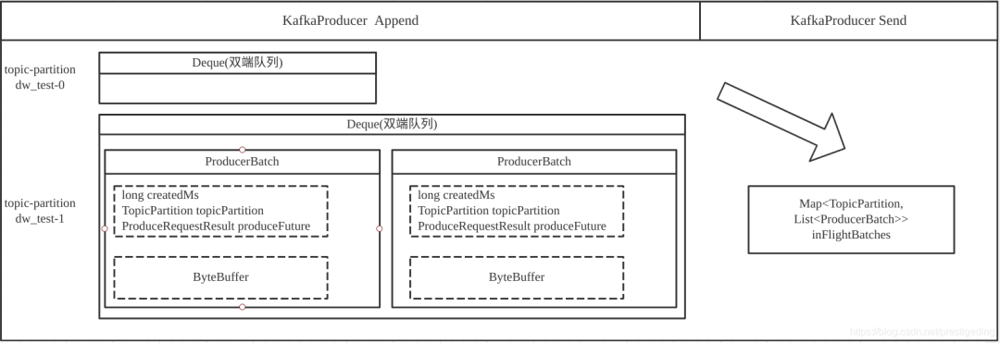
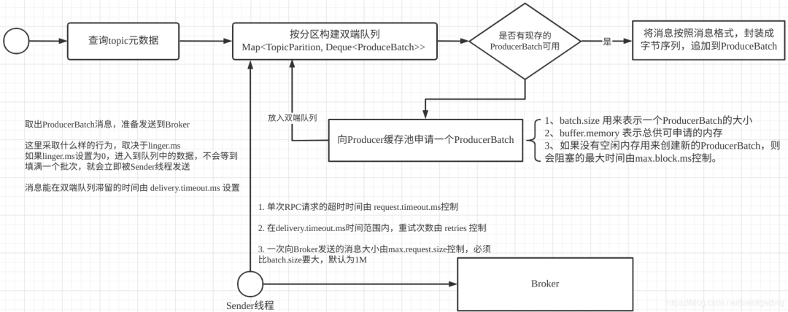
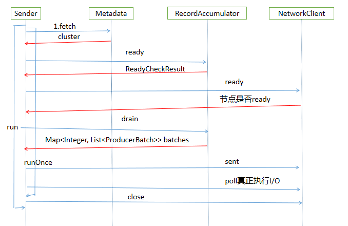
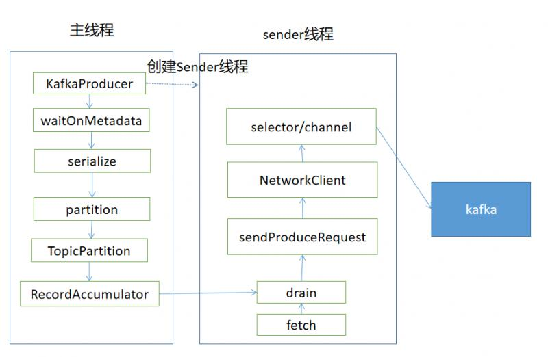
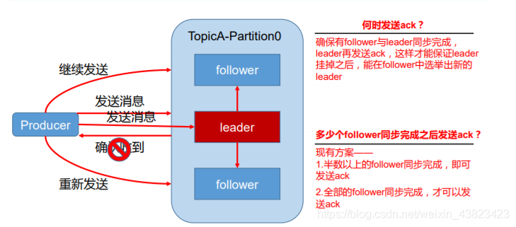
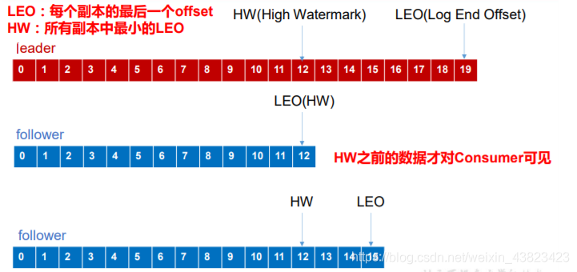

本文将从Kafka Producer的配置属性为突破口，结合源码深入提炼出Kafka Producer的工作机制，方便大家更好使用Kafka Producer，并且胸有成竹的进行性能调优。

将Kafka Producer相关的参数分成如下几个类型：
* 常规参数
* 工作原理(性能相关)参数(图解)

本文会结合图解方式，重点阐述与Kafka生产者运作机制密切相关的参数。 

### Producer 核心流程一览

producer也就是生产者，是kafka中消息的产生方，产生消息并提交给kafka集群完成消息的持久化。

#### KafkaProducer构造方法
KafkaProducer构造方法主要是根据配置文件进行一些实例化操作

1. 解析clientId，若没有配置则由是producer-递增的数字
2. 解析并实例化分区器partitioner
3. 解析key、value的序列化方式并实例化
4. 解析并实例化拦截器
5. 解析并实例化RecordAccumulator
6. 解析Broker地址
7. 创建一个Sender线程并启动

<details><summary>一个KafkaProducer的小demo</summary>

```
public static void main(String[] args) throws ExecutionException, InterruptedException {
        if (args.length != 2) {
            throw new IllegalArgumentException("usage: com.ding.KafkaProducerDemo bootstrap-servers topic-name");
        }

        Properties props = new Properties();
        // kafka服务器ip和端口，多个用逗号分割
        props.put("bootstrap.servers", args[0]);
        // 确认信号配置
        // ack=0 代表producer端不需要等待确认信号，可用性最低
        // ack=1 等待至少一个leader成功把消息写到log中，不保证follower写入成功，如果leader宕机同时follower没有把数据写入成功
        // 消息丢失
        // ack=all leader需要等待所有follower成功备份，可用性最高
        props.put("ack", "all");
        // 重试次数
        props.put("retries", 0);
        // 批处理消息的大小，批处理可以增加吞吐量
        props.put("batch.size", 16384);
        // 延迟发送消息的时间
        props.put("linger.ms", 1);
        // 用来换出数据的内存大小
        props.put("buffer.memory", 33554432);
        // key 序列化方式
        props.put("key.serializer", "org.apache.kafka.common.serialization.StringSerializer");
        // value 序列化方式
        props.put("value.serializer", "org.apache.kafka.common.serialization.StringSerializer");

        // 创建KafkaProducer对象，创建时会启动Sender线程
        Producer<String, String> producer = new KafkaProducer<>(props);
        for (int i = 0; i < 100; i++) {
            // 往RecordAccumulator中写消息
            Future<RecordMetadata> result = producer.send(new ProducerRecord<>(args[1], Integer.toString(i), Integer.toString(i)));
            RecordMetadata rm = result.get();
            System.out.println("topic: " + rm.topic() + ", partition: " +  rm.partition() + ", offset: " + rm.offset());
        }
        producer.close();
    }
```
</details>

相关参数:
* **bootstrap.servers**: 配置Kafka broker的服务器地址列表，多个用英文逗号分开，可以不必写全，Kafka内部有自动感知Kafka broker的机制。
* **key.serializer**: 消息key的序列化策略，为org.apache.kafka.common.serialization接口的实现类。
* **value.serializer**: 消息体的序列化策略
* **client.id**: 客户端ID，如果不设置默认为producer-递增，**强烈建议设置该值，尽量包含ip,port,pid**。
* **client.dns.lookup**: 客户端寻找bootstrap地址的方式，支持如下两种方式：
  * **resolve_canonical_bootstrap_servers_only**: 这种方式，会依据bootstrap.servers提供的主机名(hostname)，根据主机上的名称服务返回其IP地址的数组(InetAddress.getAllByName)，然后依次获取inetAddress.getCanonicalHostName()，再建立tcp连接。  
    **一个主机可配置多个网卡，如果启用该功能，应该可以有效利用多网卡的优势，降低Broker的网络端负载压力。**
  * **use_all_dns_ips**: 这种方式会直接使用bootstrap.servers中提供的hostname、port创建tcp连接，默认选项。
  
#### KafkaProducer消息发送流程

Kafka将一条待发送的消息抽象为ProducerRecord对象，其数据结构是：

```java
public class ProducerRecord<K, V> {
    private final String topic; //目标topic
    private final Integer partition; //目标partition
    private final Headers headers;//消息头信息
    private final K key;   //消息key
    private final V value; //消息体
    private final Long timestamp; //消息时间戳
    //省略构造方法与成员方法
}
```
目前消息结构包括6个核心属性，分别是topic，partition，headers，key，value与timestamp，各属性含义如上也比较好理解，其中headers属性是Kafka 0.11.x 版本引入的，可以用它存储一些应用或业务相关的信息。

Kafka消息发送过程中主要涉及ProducerRecord对象的构建、分区选择、元数据的填充、ProducerRecord对象的序列化、进入消息缓冲池、完成消息的发送、接受broker的响应。

消息的发送入口是KafkaProducer.send方法，具体流程如下: 



1. 确定topic信息
2. 确定value信息
3. 然后进行消息的序列化处理
4. 由分区选择器确定对应的分区信息
5. 将消息写入消息缓冲区
6. 完成消息请求的发送
7. 完成消息响应的处理
   


总的来说，Kafka生产端发送数据过程涉及到序列化器Serializer、分区器Partitioner，消息缓存池Accumulator，还可能会涉及到拦截器Interceptor（这部分暂不做介绍）。

Kafka 的 Producer 发送消息采用的是异步发送的方式。

在消息发送的过程中，涉及到了 两个线程——**main线程**和 **Sender线程**，以及**一个线程共享变量——RecordAccumulator。 main 线程将消息发送给 RecordAccumulator**，Sender 线程不断从 RecordAccumulator 中拉取消息发送到 Kafka broker



在消息发送端Kafka引入了批的概念，发送到服务端的消息通常不是一条一条发送，而是一批一批发送，一个批次对应源码层级为ProducerBatch对象。
相关参数：
* **batch.size**  
  该值用于设置每一个批次的内存大小,默认为16K,只有数据积累到 batch.size 之后，sender 才会发送数据。
* **linger.ms**:  
  Kafka希望一个批次一个批次去发送到Broker，应用程序往KafkaProducer中发送一条消息，首先会进入到内部缓冲区，具体是会进入到某一个批次中(ProducerBatch), 等待该批次堆满后一次发送到Broker，这样能提高消息的吞吐量，但其消息发送的延迟也会相应提高。  
  为了解决该问题，linger.ms参数应运而生。  
  它的作用是控制在缓存区中未积满时来控制消息发送线程的行为。 如果linger.ms 设置为 0表示立即发送，如果设置为大于0，则消息发送线程会等待这个值后才会向broker发送。有点类似于 TCP 领域的 Nagle 算法。.如果数据迟迟未达到 batch.size，sender 等待 linger.time 之后就会发送数据。
  


Kafka的每一个消息发送者，也就是KafkaProducer对象内部会有一块缓存区，缓冲区内存的组织会按照topic+parition构建双端队列。
相关参数：
* **buffer.memory**:  
  指定缓存区大小，默认为32M
  
* **delivery.timeout.ms**:  
  默认为120s，该参数控制在双端队列中的过期时间，从进入双端队列开始计时，超过该值未被sender发送后会返回超时异常(TimeoutException)。

队列中的每一个元素为一个ProducerBatch对象，表示一个消息发送批次，但发送线程将消息发送到Broker端时，一次可以包含多个批次。



相关参数：
* **max.block.ms**:  
  默认为60s，当消息发送者申请空闲内存时，如果在指定时间（包含发送端用于查找元信息的时间）内未申请到内存，消息发送端会直接报TimeoutException。

* **max.request.size**:  
  Send线程一次发送的最大字节数量，也就是Send线程向服务端一次消息发送请求的最大传输数据，默认为1M。

* **request.timeout.ms**:  
  请求的超时时间，主要是Kafka消息发送线程(Sender)与Broker端的网络通讯的请求超时时间。

* **retries**:  
  Kafka Sender线程从缓存区尝试发送到Broker端的重试次数，默认为Integer.MAX_VALUE。  
  为了避免无限重试，只针对可恢复的异常，例如Leader选举中这种异常就是可恢复的，重试最终是能解决问题的。
* **max.in.flight.requests.per.connection**:  
  设置每一个客户端与服务端连接，在应用层一个通道的积压消息数量，默认为5，有点类似Netty用高低水位线控制发送缓冲区中积压的多少，避免内存溢出。

##### RecordAccumulator
RecordAccumulator是消息队列用于缓存消息，根据TopicPartition对消息分组

<details><summary>RecordAccumulator源码解读</summary>

```
/**
 * Add a record to the accumulator, return the append result
 * <p>
 * The append result will contain the future metadata, and flag for whether the appended batch is full or a new batch is created
 * <p>
 *
 * @param tp The topic/partition to which this record is being sent
 * @param timestamp The timestamp of the record
 * @param key The key for the record
 * @param value The value for the record
 * @param headers the Headers for the record
 * @param callback The user-supplied callback to execute when the request is complete
 * @param maxTimeToBlock The maximum time in milliseconds to block for buffer memory to be available
 */
public RecordAppendResult append(TopicPartition tp,
                                 long timestamp,
                                 byte[] key,
                                 byte[] value,
                                 Header[] headers,
                                 Callback callback,
                                 long maxTimeToBlock) throws InterruptedException {
    // We keep track of the number of appending thread to make sure we do not miss batches in
    // abortIncompleteBatches().
    // ---记录进行applend的线程数---
    appendsInProgress.incrementAndGet();
    ByteBuffer buffer = null;
    if (headers == null) headers = Record.EMPTY_HEADERS;
    try {
        // check if we have an in-progress batch
        // ---根据TopicPartition获取或新建Deque双端队列---
        Deque<ProducerBatch> dq = getOrCreateDeque(tp);
        // ---尝试将消息加入到缓冲区中---
        // ---加锁保证同一个TopicPartition写入有序---
        synchronized (dq) {
            if (closed)
                throw new KafkaException("Producer closed while send in progress");
            // 尝试写入
            RecordAppendResult appendResult = tryAppend(timestamp, key, value, headers, callback, dq);
            if (appendResult != null)
                return appendResult;
        }

        // we don't have an in-progress record batch try to allocate a new batch
        byte maxUsableMagic = apiVersions.maxUsableProduceMagic();
        int size = Math.max(this.batchSize, AbstractRecords.estimateSizeInBytesUpperBound(maxUsableMagic, compression, key, value, headers));
        log.trace("Allocating a new {} byte message buffer for topic {} partition {}", size, tp.topic(), tp.partition());
        // 尝试applend失败（返回null），会走到这里。如果tryApplend成功直接返回了
        // 从BufferPool中申请内存空间，用于创建新的ProducerBatch
        buffer = free.allocate(size, maxTimeToBlock);
        synchronized (dq) {
            // Need to check if producer is closed again after grabbing the dequeue lock.
            if (closed)
                throw new KafkaException("Producer closed while send in progress");
            
            // 注意这里，前面已经尝试添加失败了，且已经分配了内存，为何还要尝试添加？
            // 因为可能已经有其他线程创建了ProducerBatch或者之前的ProducerBatch已经被Sender线程释放了一些空间，所以在尝试添加一次。这里如果添加成功，后面会在finally中释放申请的空间
            RecordAppendResult appendResult = tryAppend(timestamp, key, value, headers, callback, dq);
            if (appendResult != null) {
                // Somebody else found us a batch, return the one we waited for! Hopefully this doesn't happen often...
                return appendResult;
            }
            // 尝试添加失败了，新建ProducerBatch
            MemoryRecordsBuilder recordsBuilder = recordsBuilder(buffer, maxUsableMagic);
            ProducerBatch batch = new ProducerBatch(tp, recordsBuilder, time.milliseconds());
            FutureRecordMetadata future = Utils.notNull(batch.tryAppend(timestamp, key, value, headers, callback, time.milliseconds()));

            dq.addLast(batch);
            incomplete.add(batch);

            // 将buffer置为null,避免在finally汇总释放空间
            // Don't deallocate this buffer in the finally block as it's being used in the record batch
            buffer = null;
            return new RecordAppendResult(future, dq.size() > 1 || batch.isFull(), true);
        }
    } finally {
        // 最后如果再次尝试添加成功，会释放之前申请的内存（为了新建ProducerBatch）
        if (buffer != null)
            free.deallocate(buffer);
        appendsInProgress.decrementAndGet();
    }
}
```
```
private RecordAppendResult tryAppend(long timestamp, byte[] key, byte[] value, Header[] headers,
                                     Callback callback, Deque<ProducerBatch> deque) {
    // 从双端队列的尾部取出ProducerBatch
    ProducerBatch last = deque.peekLast();
    if (last != null) {
        // 取到了，尝试添加消息
        FutureRecordMetadata future = last.tryAppend(timestamp, key, value, headers, callback, time.milliseconds());
        // 空间不够，返回null
        if (future == null)
            last.closeForRecordAppends();
        else
            return new RecordAppendResult(future, deque.size() > 1 || last.isFull(), false);
    }
    // 取不到返回null
    return null;
}
public FutureRecordMetadata tryAppend(long timestamp, byte[] key, byte[] value, Header[] headers, Callback callback, long now) {
    // 空间不够，返回null
    if (!recordsBuilder.hasRoomFor(timestamp, key, value, headers)) {
        return null;
    } else {
        // 真正添加消息
        Long checksum = this.recordsBuilder.append(timestamp, key, value, headers);
        ...
        FutureRecordMetadata future = ...
        // future和回调callback进行关联    
        thunks.add(new Thunk(callback, future));
        ...
        return future;
    }
}
```
```
// 将消息写入缓冲区
RecordAccumulator.RecordAppendResult result = accumulator.append(tp, timestamp, serializedKey,serializedValue, headers, interceptCallback, remainingWaitMs);
if (result.batchIsFull || result.newBatchCreated) {
    // 缓冲区满了或者新创建的ProducerBatch，唤起Sender线程
    this.sender.wakeup();
}
return result.future;
```

</details>

##### Sender

KafkaProducer的构造方法在实例化时启动一个KafkaThread线程来执行Sender

Sender主要流程如下： 
```
Sender.run
Sender.runOnce
Sender.sendProducerData
// 获取集群信息
Metadata.fetch
// 获取可以发送消息的分区且已经获取到了leader分区的节点
RecordAccumulator.ready
// 根据准备好的节点信息从缓冲区中获取topicPartion对应的Deque队列中取出ProducerBatch信息
RecordAccumulator.drain
// 将消息转移到每个节点的生产请求队列中
Sender.sendProduceRequests
// 为消息创建生产请求队列
Sender.sendProducerRequest
KafkaClient.newClientRequest
// 下面是发送消息
KafkaClient.sent
NetWorkClient.doSent
Selector.send
// 其实上面并不是真正执行I/O，只是写入到KafkaChannel中
// poll 真正执行I/O
KafkaClient.poll
```

<details><summary></summary>

```
// KafkaProducer构造方法启动Sender
String ioThreadName = NETWORK_THREAD_PREFIX + " | " + clientId;
this.ioThread = new KafkaThread(ioThreadName, this.sender, true);
this.ioThread.start();
```
```
// Sender->run()->runOnce()
long currentTimeMs = time.milliseconds();
// 发送生产的消息
long pollTimeout = sendProducerData(currentTimeMs);
// 真正执行I/O操作
client.poll(pollTimeout, currentTimeMs);
```
```
// 获取集群信息
Cluster cluster = metadata.fetch();
```
```
// 获取准备好可以发送消息的分区且已经获取到leader分区的节点
RecordAccumulator.ReadyCheckResult result = this.accumulator.ready(cluster, now);
// ReadyCheckResult 包含可以发送消息且获取到leader分区的节点集合、未获取到leader分区节点的topic集合
public final Set<Node> 的节点;
public final long nextReadyCheckDelayMs;
public final Set<String> unknownLeaderTopics;
```

ready方法主要是遍历在上面介绍RecordAccumulator添加消息的容器，Map<TopicPartition, Deque>，从集群信息中根据TopicPartition获取leader分区所在节点，找不到对应leader节点但有要发送的消息的topic添加到unknownLeaderTopics中。同时把那些根据TopicPartition可以获取leader分区且消息满足发送的条件的节点添加到的节点中

```
// 遍历batches
for (Map.Entry<TopicPartition, Deque<ProducerBatch>> entry : this.batches.entrySet()) {
    TopicPartition part = entry.getKey();
    Deque<ProducerBatch> deque = entry.getValue();
    // 根据TopicPartition从集群信息获取leader分区所在节点
    Node leader = cluster.leaderFor(part);
    synchronized (deque) {
        if (leader == null && !deque.isEmpty()) {
            // 添加未找到对应leader分区所在节点但有要发送的消息的topic
            unknownLeaderTopics.add(part.topic());
        } else if (!readyNodes.contains(leader) && !isMuted(part, nowMs)) {
				....
                if (sendable && !backingOff) {
                    // 添加准备好的节点
                    readyNodes.add(leader);
                } else {
                   ...
}
```

然后对返回的unknownLeaderTopics进行遍历，将topic加入到metadata信息中，调用metadata.requestUpdate方法请求更新metadata信息
```
for (String topic : result.unknownLeaderTopics)
    this.metadata.add(topic);
    result.unknownLeaderTopics);
	this.metadata.requestUpdate();
```
对已经准备好的节点进行最后的检查，移除那些节点连接没有就绪的节点，主要根据KafkaClient.ready方法进行判断
```
Iterator<Node> iter = result.readyNodes.iterator();
long notReadyTimeout = Long.MAX_VALUE;
while (iter.hasNext()) {
    Node node = iter.next();
    // 调用KafkaClient.ready方法验证节点连接是否就绪
    if (!this.client.ready(node, now)) {
        // 移除没有就绪的节点
        iter.remove();
        notReadyTimeout = Math.min(notReadyTimeout, this.client.pollDelayMs(node, now));
    }
}
```
下面开始创建生产消息的请求
```
// 从RecordAccumulator中取出TopicPartition对应的Deque双端队列，然后从双端队列头部取出ProducerBatch，作为要发送的信息
Map<Integer, List<ProducerBatch>> batches = this.accumulator.drain(cluster, result.readyNodes, this.maxRequestSize, now);
```
把消息封装成ClientRequest
```
ClientRequest clientRequest = client.newClientRequest(nodeId, requestBuilder, now, acks != 0,requestTimeoutMs, callback);
```
调用KafkaClient发送消息（并非真正执行I/O），涉及到KafkaChannel。Kafka的通信采用的是NIO方式
```
// NetworkClient.doSent方法
String destination = clientRequest.destination();
RequestHeader header = clientRequest.makeHeader(request.version());
...
Send send = request.toSend(destination, header);
InFlightRequest inFlightRequest = new InFlightRequest(clientRequest,header,isInternalRequest,request,send,now);
this.inFlightRequests.add(inFlightRequest);
selector.send(send);

...

// Selector.send方法    
String connectionId = send.destination();
KafkaChannel channel = openOrClosingChannelOrFail(connectionId);
if (closingChannels.containsKey(connectionId)) {
    this.failedSends.add(connectionId);
} else {
    try {
        channel.setSend(send);
    ...
```
到这里，发送消息的工作准备的差不多了，调用KafkaClient.poll方法，真正执行I/O操作
```
client.poll(pollTimeout, currentTimeMs);
```
</details>

用一张图总结Sender线程的流程



##### 总结
Kafka生产消息的主要流程，涉及到主线程往RecordAccumulator中写入消息，同时后台的Sender线程从RecordAccumulator中获取消息，使用NIO的方式把消息发送给Kafka，用一张图总结



### Producer分区器

分区器partitioner，可以实现自己的partitioner，比如根据key分区，可以保证相同key分到同一个分区，对保证顺序很有用。

相关参数：

* **partitioner.class**:  
  消息发送队列负载算法，其默 DefaultPartitioner，路由算法如下：
  * 如果指定了 key，则使用 key 的 hashcode 与分区数取模。
  * 如果未指定 key，则轮询所有的分区(用随机数对可用分区取模, counter值初始值是随机的，但后面都是递增的，所以可以算到roundrobin)。

### Producer 压缩算法

Kafka支持的压缩算法还是很可观的：GZIP、Snappy、LZ4，默认情况下不进行消息压缩，毕竟会消耗很大一部分cpu时间，导致send方法处理时间变慢。启动LZ4 进行消息压缩的producer的吞吐量是最高的。

**发送方与Broker 服务器采用相同的压缩类型，可有效避免在Broker服务端进行消息的压缩与解压缩，大大降低Broker的CPU使用压力**

相关参数：
* **compression.type**:  
  消息的压缩算法，目前可选值：none、gzip、snappy、lz4、zstd，**默认不压缩，建议与Kafka服务器配置的一样**。

当然Kafka服务端可以配置的压缩类型为 producer，即采用与发送方配置的压缩类型。

### Producer interceptor

拦截器是新版本才出现的一个特性，并且是非必须的。

interceptor 核心的函数有: 
* onSend（在消息序列化计算分区之前就被调用）
* onAcknowleagement（被应答前或者说在发送失败时，这个方法是运行在producer的I/O线程中的，所以说如果存在很多重逻辑的话会导致严重影响处理消息的速率）
* close。通常是通过为clients定制一部分通用且简单的逻辑时才会使用的。

相关参数: 

* **interceptor.classes**:  
  拦截器列表，kafka运行在消息真正发送到broker之前对消息进行拦截加工。

### 数据可靠性保证

为保证producer发送的数据，能可靠的发送到指定的topic，topic的每个partition收到producer发送的数据后都需要向producer发送ack(acknowledgement 确认收到)，如果producer收到ack,就会进行下一轮的发送，否则重新发送数据。



#### 副本数据同步策略

| 方案 | 优点 | 缺点 |
| :--- | :--- | :--- |
| 半数以上完成同步，就发送ack | 延迟低 | 选举新的leader时，容忍n台节点故障，需要2n+1个副本 |
| 全部完成同步，才发送ack | 选举新的leader时，容忍n台节点故障，需要n+1个副本 | 延迟高 |

Kafka选择了第二种方案，原因如下：

同样为了容忍 n 台节点的故障，第一种方案需要 2n+1 个副本，而第二种方案只需要 n+1 个副本，而 Kafka 的每个分区都有大量的数据，第一种方案会造成大量数据的冗余。

虽然第二种方案的网络延迟会比较高，但网络延迟对 Kafka 的影响较小。

#### ISR

采用第二种方案之后，设想以下情景：leader 收到数据，所有 follower 都开始同步数据， 但有一个 follower，因为某种故障，迟迟不能与 leader 进行同步，那 leader 就要一直等下去， 直到它完成同步，才能发送 ack。这个问题怎么解决呢？

Leader 维护了一个动态的 in-sync replica set (ISR)，意为和 leader 保持同步的 follower 集合。当 ISR 中的 follower 完成数据的同步之后，leader 就会给 follower 发送 ack。如果 follower 长时间未向 leader 同步数据 ， 则该 follower 将被踢出ISR ， 该时间阈值由replica.lag.time.max.ms 参数设定。Leader 发生故障之后，就会从 ISR 中选举新的 leader。

#### ack 应答机制
对于某些不太重要的数据，对数据的可靠性要求不是很高，能够容忍数据的少量丢失，所以没必要等 ISR 中的 follower 全部接收成功。

所以 Kafka 为用户提供了三种可靠性级别，用户根据对可靠性和延迟的要求进行权衡，选择以下的配置。
* 0: 表示生产者不关心该条消息在 broker 端的处理结果，只要调用 KafkaProducer 的 send 方法返回后即认为成功，显然这种方式是最不安全的，因为 Broker 端可能压根都没有收到该条消息或存储失败。
* 1: 等待至少一个leader成功把消息写到log中，不保证follower写入成功，如果leader宕机同时follower没有把数据写入成功，数据丢失。
* all 或 -1: 表示消息不仅需要 Leader 节点已存储该消息，并且要求其副本（准确的来说是 ISR 中的节点）全部存储才认为已提交，才向客户端返回提交成功。这是最严格的持久化保障，当然性能也最低。
  * 但是如果在 follower 同步完成后，broker 发送 ack 之前，leader 发生故障，那么会造成数据重复。

相关参数:
* **acks**:  
  ack应答级别

#### 故障处理细节

Log文件中的HW和LEO



LEO：指的是每个副本最大的 offset；
HW：指的是消费者能见到的最大的 offset，ISR 队列中最小的 LEO。

* follower 故障: follower 发生故障后会被临时踢出 ISR，待该 follower 恢复后，follower 会读取本地磁盘 记录的上次的 HW，并将 log 文件高于 HW 的部分截取掉，从 HW 开始向 leader 进行同步。 等该 follower 的 LEO 大于等于该 Partition 的 HW，即 follower 追上 leader 之后，就可以重 新加入 ISR 了
* leader 故障: leader 发生故障之后，会从 ISR 中选出一个新的 leader，之后，为保证多个副本之间的数据一致性，其余的 follower 会先将各自的 log 文件高于 HW 的部分截掉，然后从新的 leader 同步数据。

**注意：这只能保证副本之间的数据一致性，并不能保证数据不丢失或者不重复。**

### 消息队列投递语义

* At Least Once 可以保证数据不丢失，但是不能保证数据不重复。
* At Most Once 可以保证数据不重复，但是不能保证数据不丢失。
* 对于一些非常重要的信息，比如说交易数据，下游数据消费者要求数据既不重复也不丢失，即 Exactly Once 语义。

Kafka投递语义实现方案：

* 将服务器的 ACK 级别设置为-1，可以保证 Producer 到 Server 之间不会丢失数据，即 At Least Once 语义。

* 相对的，将服务器 ACK 级别设置为 0，可以保证生产者每条消息只会被 发送一次，即 At Most Once 语义。

在 0.11 版本以前的 Kafka，对Exactly Once 语义是无能为力的，只能保证数据不丢失，再在下游消费者对数据做全局去重。

对于多个下游应用的情况，每个都需要单独做全局去重，这就对性能造成了很大影响。

0.11 版本的 Kafka，引入了一项重大特性：**幂等性**。

    所谓的幂等性就是指 Producer 不论向 Server 发送多少次重复数据，Server 端都只会持久化一条。

幂等性结合 At Least Once 语义，就构成了 Kafka 的 Exactly Once 语义。即：

**At Least Once + 幂等性 = Exactly Once**

相关参数: 
* **enable.idempotence**: 是否开启发送端的幂等，默认为false。
* **acks**: all

```
Kafka 的幂等性实现其实就是将原来下游需要做的去重放在了数据上游。 
开启幂等性的 Producer 在初始化的时候会被分配一个 PID，发往同一 Partition 的消息会附带 Sequence Number。
而 Broker 端会对做缓存，当具有相同主键的消息提交时，Broker 只会持久化一条。
```

但是 PID 重启就会变化，同时不同的 Partition 也具有不同主键，所以**幂等性无法保证分区跨会话的 Exactly Once**

### 其他参数

* **send.buffer.bytes**: 网络通道(TCP)的发送缓存区大小，默认为128K。
* **receive.buffer.bytes**: 网络通道(TCP)的接收缓存区大小，默认为32K。
* **reconnect.backoff.ms**: 重新建立链接的等待时长，默认为50ms，属于底层网络参数，基本无需关注。
* **reconnect.backoff.max.ms**: 重新建立链接的最大等待时长，默认为1s，连续两次对同一个连接建立重连，等待时间会在reconnect.backoff.ms的初始值上成指数级递增，但超过max后，将不再指数级递增。
* **transaction.timeout.ms**: 事务协调器等待客户端的事务状态反馈的最大超时时间，默认为60s。
* **transactional.id**: 事务id,用于在一个事务中唯一标识一个客户端

