### 什么是Rebalance
如果对RocketMQ或者对消息中间件有所了解的话，消费端在进行消息消费时至少需要先进行队列（分区）的负载，即一个消费组内的多个消费者如何对订阅的主题中的队列进行负载均衡,当消费者新增或减少、队列增加或减少时能否自动重平衡，做到应用无感知，直接决定了程序伸缩性，其说明图如下：

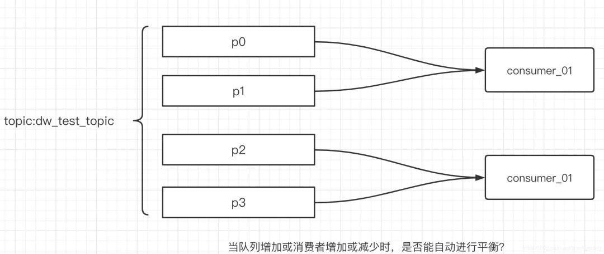

Rebalance本质上是一种协议，规定了一个Consumer Group下的所有的Consumer如何达成一致来分配订阅Topic的每个Partition；

```
比如某个group下有5个consumer，它订阅了一个具有10个分区的topic。正常情况下，Kafka平均会为每个consumer分配2个分区。这个分配的过程就叫rebalance。
```

### Kafka消费端基本流程
在介绍kafka消费端重平衡机制之前，我们首先简单来看看消费者拉取消息的流程，从整个流程来看重平衡的触发时机、在整个消费流程中所起的重要作用，消费端拉取消息的简要流程如下图所示：

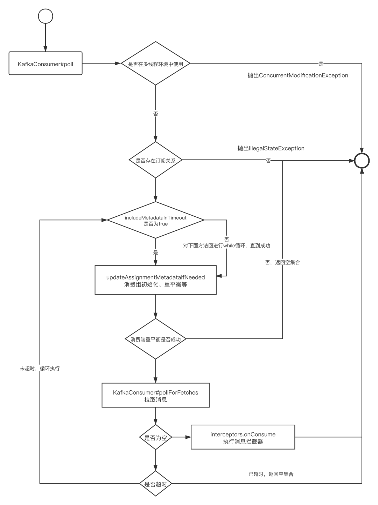

主要的关键点如下：
* 判断KafkaConsumer对象是否处在多线程环境中。注意：**该对象是多线程不安全的，不能有多个线程持有该对象。**
* 消费组初始化，包含了队列负载(重平衡)
* 消息拉取
* 消息消费拦截器处理

关于poll方法的核心无非就是两个：**重平衡**与**消费拉取**，本篇文章将重点剖析Kafka消费者的重平衡机制。

### 消费者队列负载(重平衡)机制
通过对updateAssignmentMetadataIfNeeded方法的源码剖析，最终调用的核心方法为ConsumerCoordinator的poll方法，核心流程图如下：

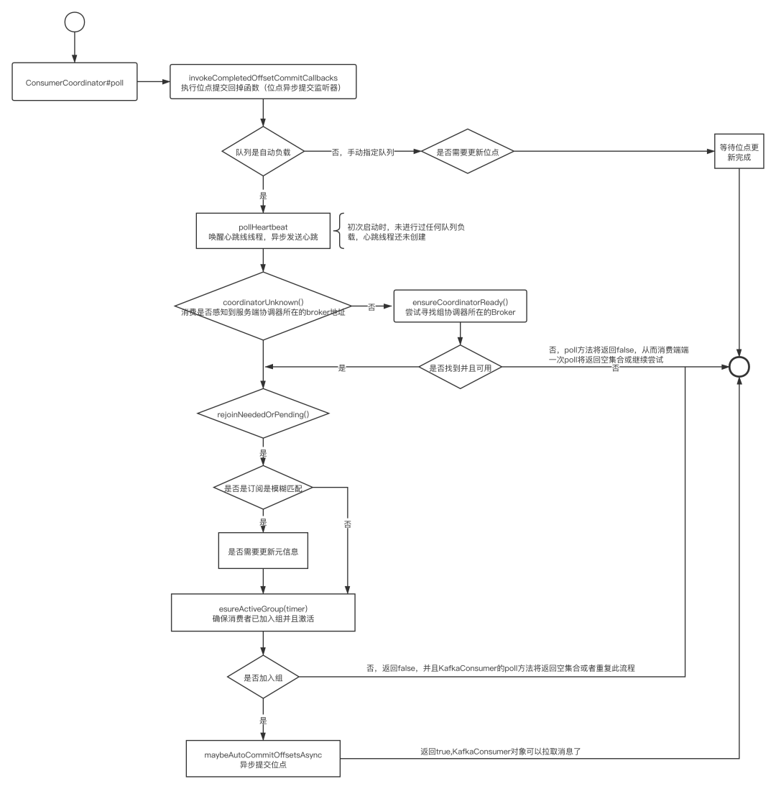

消费者协调器的核心流程关键点：
* 消费者协调器寻找组协调器
* 队列负载(重平衡)
* 提交位点

**Some Question**  
* 重平衡会阻塞消息消费吗？
* Kafka的加入组协议哪些变更能有效减少重平衡
* Kafka与RocketMQ的重平衡机制上各有什么优劣势

#### 消费者协调器
在Kafka中，在客户端每一个消费者会对应一个消费者协调器(ConsumerCoordinator),在服务端每一个broker会启动一个组协调器。

接下来将对该过程进行源码级别的跟踪，根据源码提练工作机制，该部分对应上面流程图中的：ensureCoordinatorReady方法。

<details>
    <summary>protected synchronized boolean ensureCoordinatorReady(final Timer timer)</summary>
    
```
protected synchronized boolean ensureCoordinatorReady(final Timer timer) {
    if (!coordinatorUnknown())
        return true;

    do {
        final RequestFuture<Void> future = lookupCoordinator();
        client.poll(future, timer);

        if (!future.isDone()) {
            // ran out of time
            break;
        }

        if (future.failed()) {
            if (future.isRetriable()) {
                log.debug("Coordinator discovery failed, refreshing metadata");
                client.awaitMetadataUpdate(timer);
            } else
                throw future.exception();
        } else if (coordinator != null && client.isUnavailable(coordinator)) {
            // we found the coordinator, but the connection has failed, so mark
            // it dead and backoff before retrying discovery
            markCoordinatorUnknown();
            timer.sleep(retryBackoffMs);
        }
    } while (coordinatorUnknown() && timer.notExpired());

    return !coordinatorUnknown();
}
```
</details>

该方法的关键点如下：
* 首先判断一下当前消费者是否已找到broker端的组协调器，如果以感知，则返回true。
* 如果当前并没有感知组协调器，则向服务端(broker)寻找该消费组的组协调器。
* 寻找组协调器的过程是一个同步过程，如果出现异常，则会触发重试，但引入了重试间隔机制。
* 如果未超时并且没有获取组协调器，则再次尝试(do while)。

核心要点为**lookupCoordinator**方法，该方法的核心是**选择一台负载最小的broker**,构建请求，向broker端查询消费组的组协调器，代码如下：

<details>
    <summary>private RequestFuture<Void> sendFindCoordinatorRequest(Node node)</summary>

```
/**
 * Discover the current coordinator for the group. Sends a GroupMetadata request to
 * one of the brokers. The returned future should be polled to get the result of the request.
 * @return A request future which indicates the completion of the metadata request
 */
private RequestFuture<Void> sendFindCoordinatorRequest(Node node) {
    // initiate the group metadata request
    log.debug("Sending FindCoordinator request to broker {}", node);
    FindCoordinatorRequest.Builder requestBuilder =
            new FindCoordinatorRequest.Builder(
                    new FindCoordinatorRequestData()
                        .setKeyType(CoordinatorType.GROUP.id())
                        .setKey(this.groupId));
    return client.send(node, requestBuilder)
            .compose(new FindCoordinatorResponseHandler());
}
```
</details>

查询组协调器的请求，核心参数为：
* ApiKeys apiKey  
    请求API，类比RocketMQ的RequestCode，根据该值很容易找到服务端对应的处理代码，这里为ApiKeys.FIND_COORDINATOR。

* String coordinatorKey  
    协调器key，取消费组名称。
    
    ```
    Kafka服务端每一台Broker会创建一个组协调器(GroupCoordinator),每一个组协调器可以协调多个消费组，但一个消费组只会被分配给一个组协调器，那这里负载机制是什么呢？服务端众多Broker如何竞争该消费组的控制权呢？
    ```

* coordinatorType  
  协调器类型，默认为GROUP,表示普通消费组。

* short minVersion  
  版本。

针对客户端端请求，服务端统一入口为KafkaApis.scala，可以根据ApiKeys快速找到其处理入口：
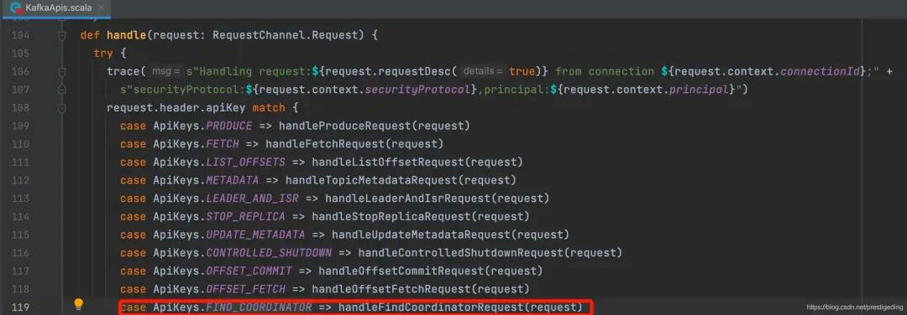
具体的处理逻辑在KafkaApis的handleFindCoordinatorRequest中，如下图所示:
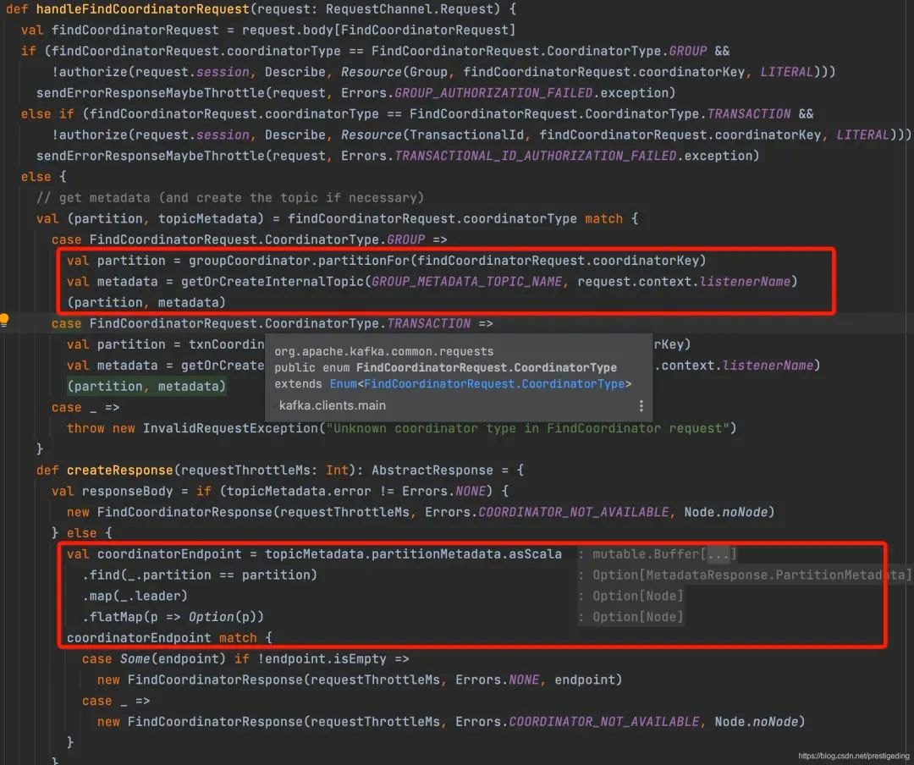

服务端为消费组分配协调器的核心算法竟然非常简单：
* 根据消费组的名称，取hashcode，
* 然后与kafka内部topic(__consumer_offsets)的分区个数取模，
* 然后返回该分区所在的物理broker作为消费组的分组协调器
* 即内部并没有复杂的选举机制，这样也能更好的说明，客户端在发送请求时可以挑选负载最低的broker进行查询的原因。

客户端收到响应结果后更新ConsumerCoordinator的(Node coordinator)属性，这样再次调用coordinatorUnknown()方法，将会返回false,至此完成消费端协调器的查找。

#### 消费者加入消费组流程剖析
用一张时序图来说明协调者一端是如何处理新成员入组的: 
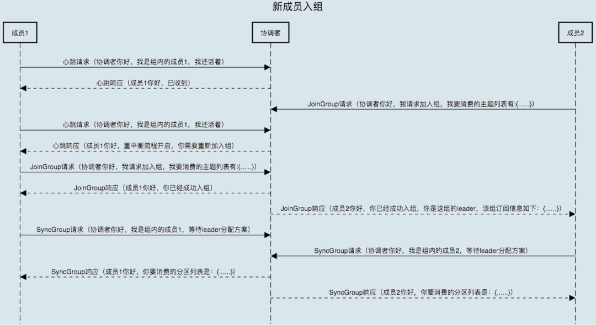

在消费者获取到协调器后，根据上文提到的协调器处理流程，接下来消费者需要加入到消费者组中，加入到消费组也是参与队列负载机制的前提，接下来我们从源码角度分析一下消费组加入消费组的流程，对应上文中的**AbstractCoordinator的ensureActiveGroup**方法。

<details>
    <summary>boolean ensureActiveGroup(final Timer timer)</summary>

```
/**
 * Ensure the group is active (i.e., joined and synced)
 *
 * @param timer Timer bounding how long this method can block
 * @return true iff the group is active
 */
boolean ensureActiveGroup(final Timer timer) {
    // always ensure that the coordinator is ready because we may have been disconnected
    // when sending heartbeats and does not necessarily require us to rejoin the group.
    if (!ensureCoordinatorReady(timer)) {
        return false;
    }

    startHeartbeatThreadIfNeeded();
    return joinGroupIfNeeded(timer);
}
```
</details>

该方法的核心关键点：
* 在加入消费组之前必须确保该消费者已经感知到组协调器。
* 启动心跳线程，当消费者加入到消费组后处于MemberState.STABLE后需要定时向协调器上报心跳，表示存活，否则将从消费组中移除。
* 加入消费组。

心跳线程稍后会详细介绍，先跟踪一下加入消费组的核心流程，具体实现方法为
<details><summary>joinGroupIfneeded</summary>

```
/**
 * Joins the group without starting the heartbeat thread.
 *
 * Visible for testing.
 *
 * @param timer Timer bounding how long this method can block
 * @return true iff the operation succeeded
 */
boolean joinGroupIfNeeded(final Timer timer) {
    while (rejoinNeededOrPending()) {
        if (!ensureCoordinatorReady(timer)) {
            return false;
        }

        // call onJoinPrepare if needed. We set a flag to make sure that we do not call it a second
        // time if the client is woken up before a pending rebalance completes. This must be called
        // on each iteration of the loop because an event requiring a rebalance (such as a metadata
        // refresh which changes the matched subscription set) can occur while another rebalance is
        // still in progress.
        if (needsJoinPrepare) {
            onJoinPrepare(generation.generationId, generation.memberId);
            needsJoinPrepare = false;
        }

        final RequestFuture<ByteBuffer> future = initiateJoinGroup();
        client.poll(future, timer);
        if (!future.isDone()) {
            // we ran out of time
            return false;
        }

        if (future.succeeded()) {
            // Duplicate the buffer in case `onJoinComplete` does not complete and needs to be retried.
            ByteBuffer memberAssignment = future.value().duplicate();
            onJoinComplete(generation.generationId, generation.memberId, generation.protocol, memberAssignment);

            // We reset the join group future only after the completion callback returns. This ensures
            // that if the callback is woken up, we will retry it on the next joinGroupIfNeeded.
            resetJoinGroupFuture();
            needsJoinPrepare = true;
        } else {
            resetJoinGroupFuture();
            final RuntimeException exception = future.exception();
            if (exception instanceof UnknownMemberIdException ||
                    exception instanceof RebalanceInProgressException ||
                    exception instanceof IllegalGenerationException ||
                    exception instanceof MemberIdRequiredException)
                continue;
            else if (!future.isRetriable())
                throw exception;

            timer.sleep(retryBackoffMs);
        }
    }
    return true;
}
```
</details>

接下来对该方法进行分步解读：
1. 加入消费组之前必须先获取对应的组协调器，因为后续所有的请求都是需要发送到组协调器上。
    ```
    if (!ensureCoordinatorReady(timer)) {
        return false;
    }
    ```
   
2. 每一次执行重平衡之前调用其回调函数，我们可以看看ConsumerCoordinatory的实现
    ```
    // call onJoinPrepare if needed. We set a flag to make sure that we do not call it a second
    // time if the client is woken up before a pending rebalance completes. This must be called
    // on each iteration of the loop because an event requiring a rebalance (such as a metadata
    // refresh which changes the matched subscription set) can occur while another rebalance is
    // still in progress.
    if (needsJoinPrepare) {
        onJoinPrepare(generation.generationId, generation.memberId);
        needsJoinPrepare = false;
    }
    ```
   ```
    @Override
    protected void onJoinPrepare(int generation, String memberId) {
        // commit offsets prior to rebalance if auto-commit enabled
        maybeAutoCommitOffsetsSync(time.timer(rebalanceTimeoutMs));

        // execute the user's callback before rebalance
        ConsumerRebalanceListener listener = subscriptions.rebalanceListener();
        Set<TopicPartition> revoked = subscriptions.assignedPartitions();
        log.info("Revoking previously assigned partitions {}", revoked);
        try {
            listener.onPartitionsRevoked(revoked);
        } catch (WakeupException | InterruptException e) {
            throw e;
        } catch (Exception e) {
            log.error("User provided listener {} failed on partition revocation", listener.getClass().getName(), e);
        }

        isLeader = false;
        subscriptions.resetGroupSubscription();
    }
    ```
   消费端协调器在进行重平衡(加入一个新组)之前通常会执行如下操作：
    * 如果开启了自动提交位点，进行一次位点提交。
    * 执行重平衡相关的事件监听器。

3. 向消费组的组协调器发送加入请求，但加入消费组并不是目的，而是手段，最终要达成的目的是进行队列的负载均衡。
    ```
    final RequestFuture<ByteBuffer> future = initiateJoinGroup();
    ```

4. 调用onJoinComplete方法，通知消费端协调器队列负载的最终结果
    ```
    ByteBuffer memberAssignment = future.value().duplicate();
    onJoinComplete(generation.generationId, generation.memberId, generation.protocol, memberAssignment);
    ```
    * generationId
    * memberId 成员id
    * protocol 协议名称，这里是consumer。
    * memberAssignment 队列负载结果，包含了分配给当前消费者的队列信息，其序列后的结果如图所示
    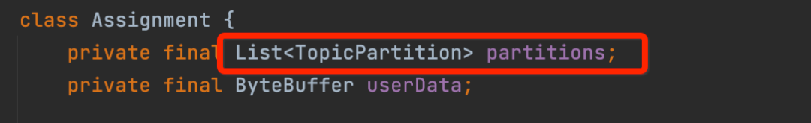

故队列的负载机制蕴含在构建请求中，接下来深入分析一下客户端与服务端详细的交互流程。

##### 构建加入消费组请求
构建加入消费组代码见AbstractCoordinator的sendJoinGroupRequest,其代码如下：

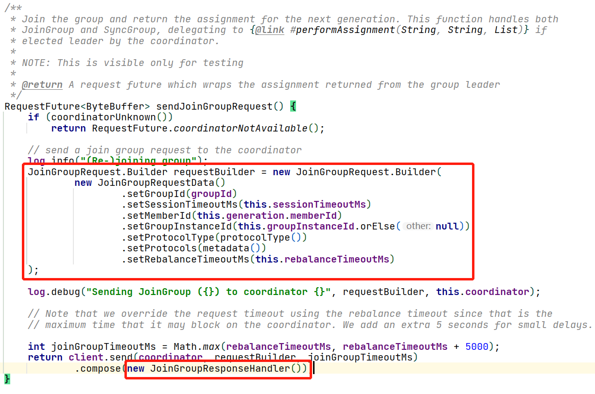

发起一次组加入请求，请求体主要包含如下信息：
* 消费组的名称
* session timeout，会话超时时间，默认为10s
* memberId 消费组成员id,第一次为null，后续服务端会为该消费者分配一个唯一的id,构成为客户端id + uuid。
* protocolType 协议类型，消费者加入消费组固定为 consumer
* 消费端支持的所有队列负载算法

收到服务端响应后将会调用JoinGroupResponseHandler回掉，稍后会详细介绍。

##### 服务端响应逻辑
服务端处理入口：KafkaApis的handleJoinGroupRequest方法，该方法为委托给GroupCoordinator。

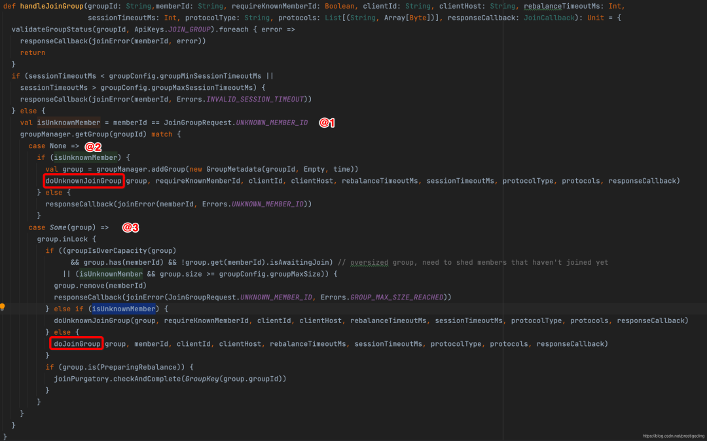

通过这个入口，基本可以看到服务端处理加入请求的关键点：
* 从客户端请求中提取客户端的memberId,如果为空，表示第一次加入消费组，还未分配memberId。
* 如果协调器中不存在该消费组的信息，表示第一次加入，创建一个，并执行doUnknownJoinGroup(第一次加入消费组逻辑)
* 如果协调器中已存在消费组的信息，判断一下是否已达到**最大消费者个数限制**(默认不限制)，超过则会抛出异常；然后根据消费者是否是第一次加入进行对应的逻辑处理。

**组协调器会为每一个路由到的消费组维护一个组元信息(GroupMetadata)，存储在HashMap< String, GroupMetadata>，每一个消费组云信息中存储了当前的所有的消费者，由消费者主动加入，组协调器可以主动剔除消费者。**

接下来分情况处理，来看一下第一次加入(doUnknownJoinGroup)与重新加入(doJoinGroup)分别详细探讨。
###### 初次加入消费组
初次加入消费组的代码如下：

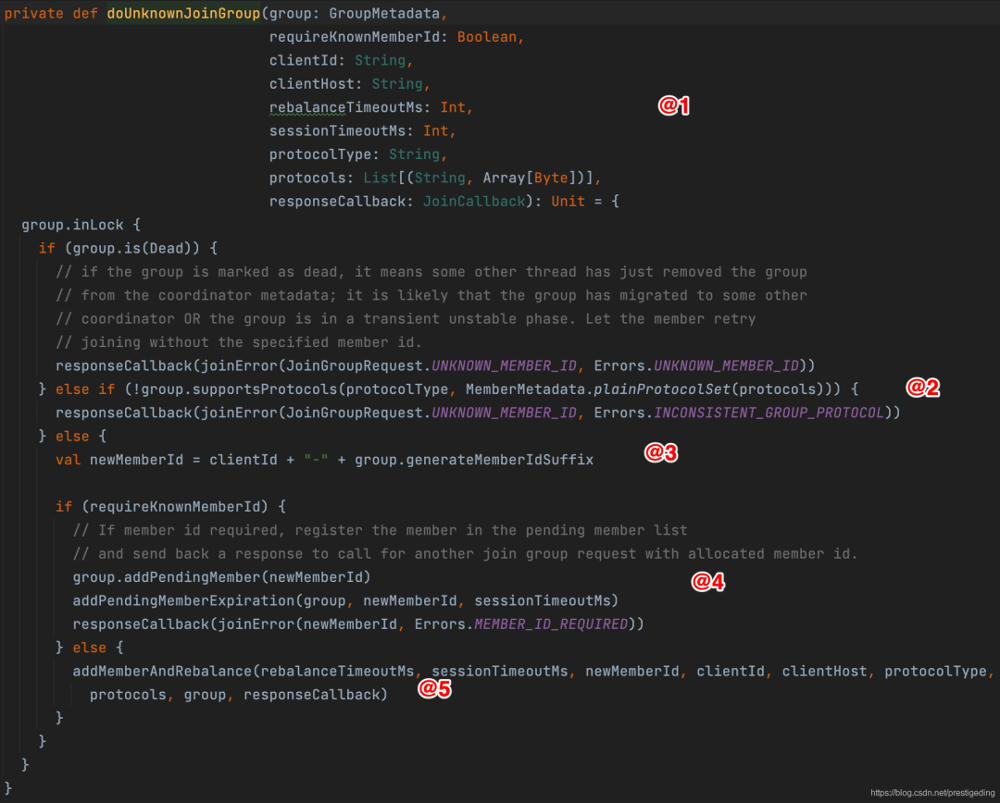

关键点如下：
* 首先来看一下该方法的参数含义：
    * GroupMetadata group: 消费组的元信息，并未持久化，存储在内存中，一个消费组当前消费者的信息。 
    * boolean requireKnownMemberId: 是否一定需要知道客户端id,如果客户端请求版本为4,在加入消费组时需要明确知道对方的memberId。
    * String clientId: 客户端ID,消息组的memberId生成规则为 clientId + uuid
    * String clientHost: 消费端端ip地址 
    * int rebalanceTimeoutMs: 重平衡超时时间，取自消费端参数max.poll.interval.ms，默认为5分钟。
    * int sessionTimeoutMs: 会话超时时间，默认为10s
    * String protocolType: 协议类型，默认为consumer
    * List protocols: 客户端支持的队列负载算法。

* 对客户端进行状态验证，其校验如下：
    * 如果消费者状态为dead，则返回UNKNOWN_MEMBER_ID
    * 如果当前消费组的负载算法协议不支持新客户端端队列负载协议，则抛出UNKNOWN_MEMBER_ID，并提示不一致的队列负载协议。

* Kafka 的加入请求版本4在加入消费端组时使用有明确的客户端memberId，消费组将创建的memberId加入到组的pendingMember中，并向客户端返回MEMBER_ID_REQUIRED，引导客户端重新加入，客户端会使用服务端生成的memberId，重新发起加入消费组。

* 调用addMemberAndRebalance方法加入消费组并触发重平衡。

接下来继续探究加入消费组并触发重平衡的具体逻辑，具体实现见GroupCoordinator的addMemberAndRebalance。

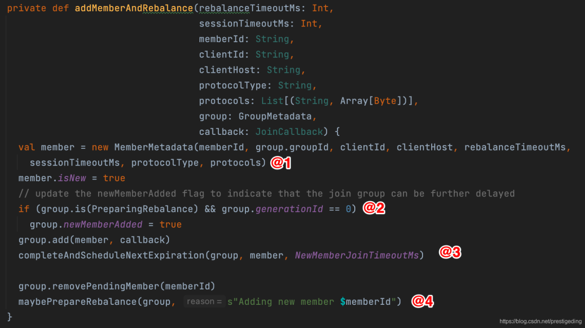

核心要点如下：
* 组协调器为每一个消费者创建一个MemberMetadata对象。
* 如果消费组的状态为PreparingRebalance(此状态表示正在等待消费组加入)，并将组的newMemberAdded设置为true，表示有新成员加入，后续需要触发重平衡。
* 将消费组添加到组中，这里会触发一次**消费组选主**,选主逻辑：**该消费组的第一个加入的消费者成为该消费组中的Leader**, Leader的职责是什么呢？
    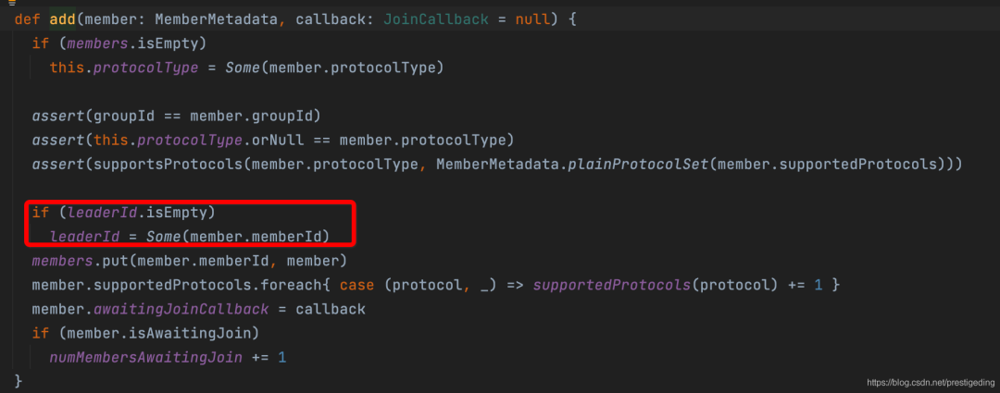
  总体而言： **消费组Leader的任务是收集所有成员的订阅信息，然后根据这些信息，制定具体的分区消费分配方案**。
    * 为每一个消费者创建一个DelayedHeartbeat对象，用于检测会话超时，组协调器如果检测会话超时，会将该消费者移除组，会重新触发重平衡，消费者为了避免被组协调器移除消费组，需要按间隔发送心跳包。
    * 根据当前消费组的状态是否需要进行重平衡。

接下来继续深入跟踪maybePrepareRebalance方法，其实现如下图所示：

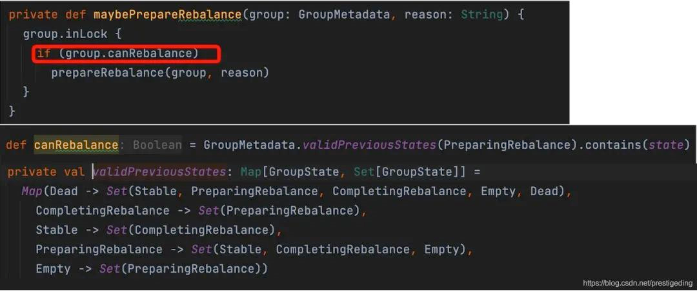

根据状态机的驱动规则，判断是否可以进入到PrepareRebalance，其判断逻辑就是根据状态机的驱动，判断当前状态是否可以进入到该状态，其具体实现是为每一个状态存储了一个可以进入当前状态的前驱状态集合。

如果符合状态驱动流程，消费组将进入到PrepareRebalance，其具体实现如下图所示：

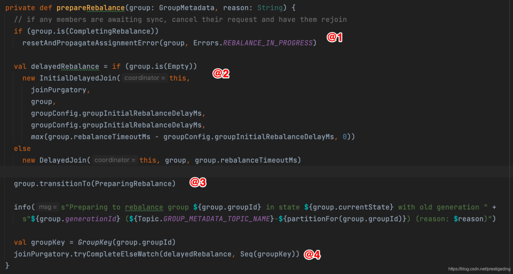

* 如果当前消费组的状态为CompletingRebalance，需要重置队列分配动作，并让消费组重新加入到消费组，即重新发送JOIN_GROUP请求。具体实现技巧：
    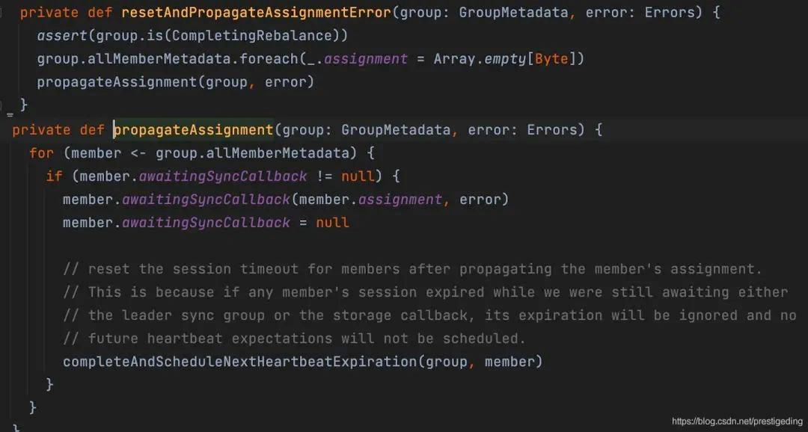
    * 将所有消费者已按分配算法分配到的队列信息置空
    * 将空的分配结果返回给消费者，并且错误码为REBALANCE_IN_PROGRESS，客户端收到该错会重新加入消费组。
    
* 如果当前没有消费者，则创建InitialDelayedJoin，否则则创建DelayedJoin
    * 值得注意的是这里有一个参数：group.initial.rebalance.delay.ms，用于设置消费组进入到PreparingRebalance真正执行其业务逻辑的延迟时间，其主要目的是等待更多的消费者进入。
    * 驱动消费组状态为PreparingRebalance。
    * 尝试执行initialDelayedJoin或DelayedJoin的tryComplete方法，如果没有完成，则创建watch，等待执行完成，最终执行的是组协调器的相关方法，其说明如下：
    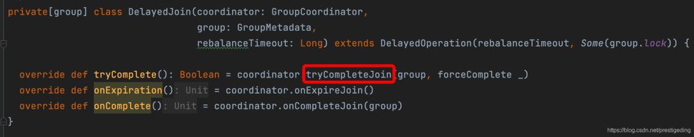
    接下来看一下组协调器的tryCompleteJoin方法，其实现如下图所示：
    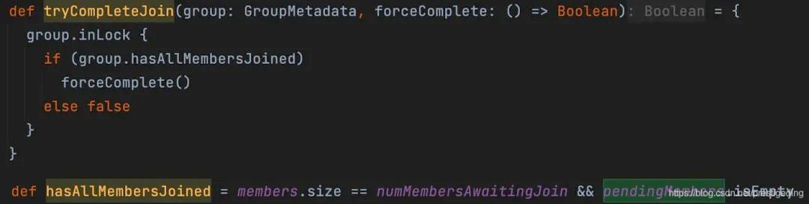
    **完成PreparingRebalance状态的条件是: 已知的消费组都成功加入到消费组**。该方法返回true后，onCompleteJoin方法将被执行。

接下来看一下GroupCoordinator的onCompleteJoin方法的实现。

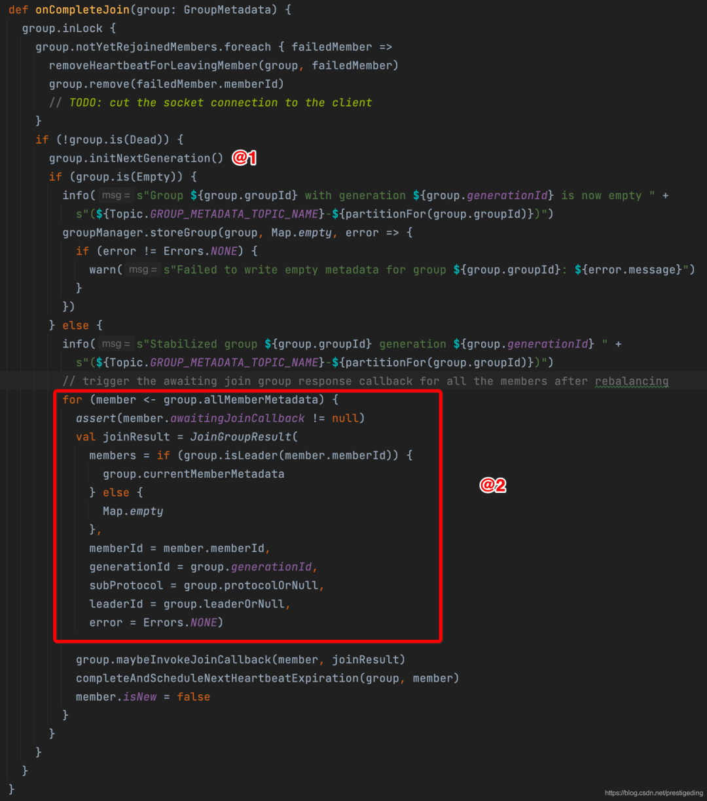

核心的关键点如下：
* 驱动消费组的状态转化为CompletingRebalance，将进入到重平衡的第二个阶段(队列负载)
* 为每一个成员构建对应JoinResponse对象，其中三个关键点
    * generationId 消费组每一次状态变更，该值加一
    * subProtocol 当前消费者组中所有消费者都支持的队列负载算法
    * leaderId 消费组中的leader，一个消费组中第一个加入的消费者为leader

接下来，消费者协调器将根据服务端返回的响应结果，进行第二阶段的重平衡，即进入到队列负载算法。

###### 已知memberId加入消费组处理逻辑
组协调在已知memberid处理加入请求的核心处理代码在GroupCoordinator的doJoinGroup中，即重新加入请求。

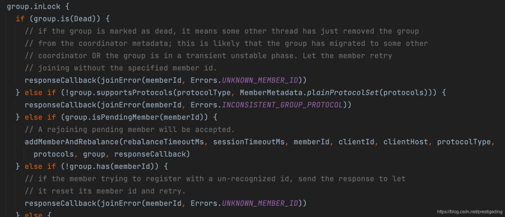

1. 首先进行相关的错误校验
    * 如果消费组状态为Dead，返回错误unknown_member_id错误。
    * 如果当前消费者支持的队列负载算法消费组并不支持，返回错误inconsistent_group_protocol
    * 如果当前的memberid处在pendingMember中，对于这种重新加入的消费者会接受并触发重平衡。
        ```
        值得注意的是，在Kafka JOIN_REQUEST版本为4后，首先会在服务端生成memberId,并加入到pendingMember中，并立即向客户端返回memberId,引导客户端重新加入。
        ```
   * 如果消费组不存在该成员，返回错误，说明消费组已经将该消费者移除。
    
2. 根据消费组的状态采取不同的行为
    * 如果当前状态为PreparingRebalance
      
        更新成员的元信息，按照需要触发重平衡。
        
        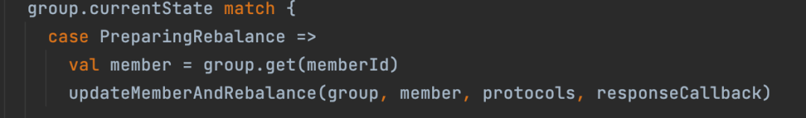
        
        ```
        PreparingRebalance状态，消费组在等待消费组中的消费者加入。
        ```
      
    * 如果状态为CompletingRebalance
      
        * 如果收到join group请求，但其元信息并没有发生变化(队列负载算法)，只需将最新的信息返回给消费者；
      
        * 如果状态发生变更，则会进行再次回到重平衡的第一阶段，消费组重新加入。
        
        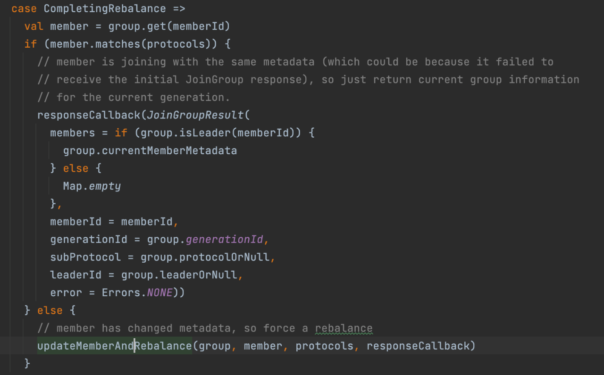
        
        ```
        消费组如果处于CompletingRebalance状态，其实不希望再收到Join Group请求，因为处于CompletingRebalance状态的消费组，正在等待消费者Leader分配队列。
        ```
      
    * 如果消费组处于Stable状态
        
        如果成员是leader并且支持的协议发生变化，则进行重平衡，否则只需要将元信息发生给客户端即可。
    
        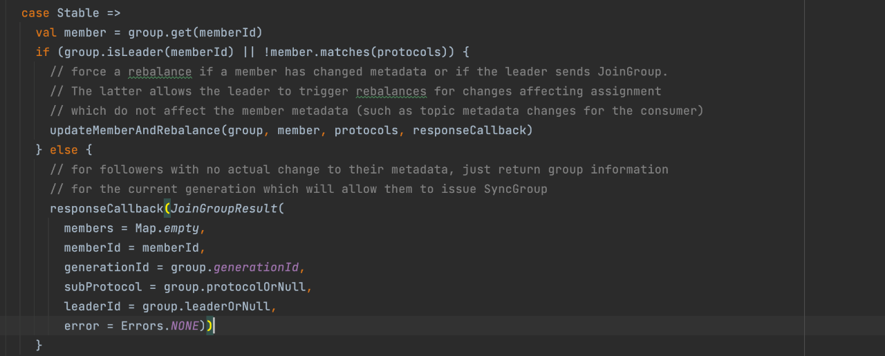
    
###### 客户端处理组协调器的Join Group响应包
客户端对Join_Group的响应处理在：JoinGroupResponseHandler，其核心实现如下：

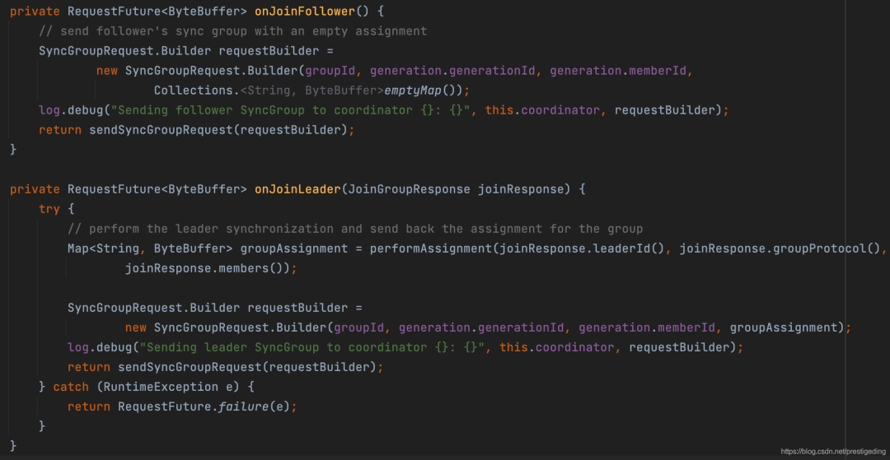

关键点：
* 队列的负载算法是由Leader节点来分配，
* 将分配结果通过向组协调器发送SYNC_GROUP请求，
* 然后组协调器从Leader节点获取分配算法后，
* 再返回给所有的消费者，
* 从而开始进行消费。

#### 心跳与离开


消费者通过消费者协调器与组协调器交互完成消费组的加入，但如何退出呢？例如当消费者宕机，协调器如何感知呢？

原来在Kafka中，消费者协调器会引入心跳机制，即定时向组协调器发送心跳包，在指定时间内未收到客户端的心跳包，表示会话过期，过期时间通过参数session.timeout.ms设置，默认为10s。
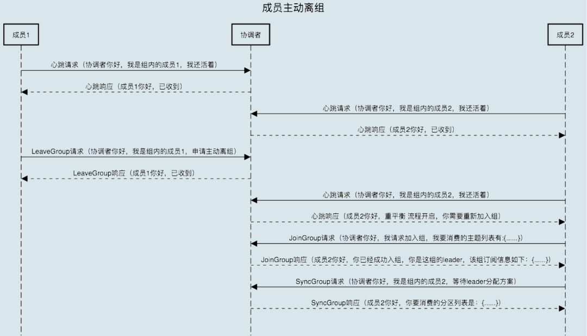
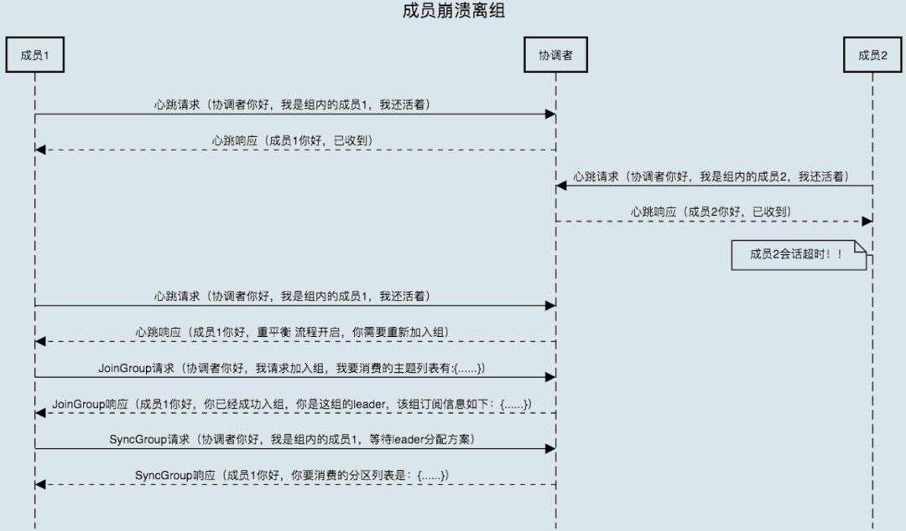

通过对ConsumerCoordinator的poll流程可知，消费者协调器在得知消费组的组协调器后，就会启动心跳线程，其代码如下：

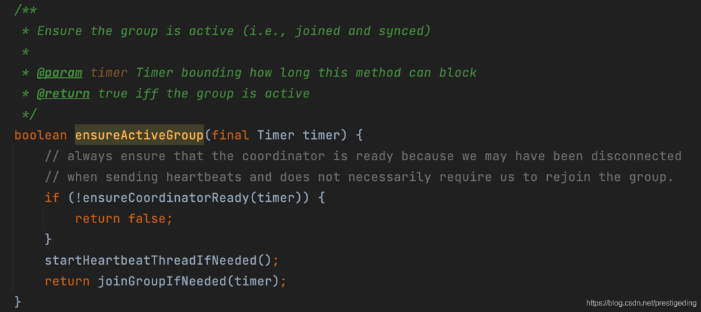

启动心跳线程后，主要关注HeartbeatThread的run方法。

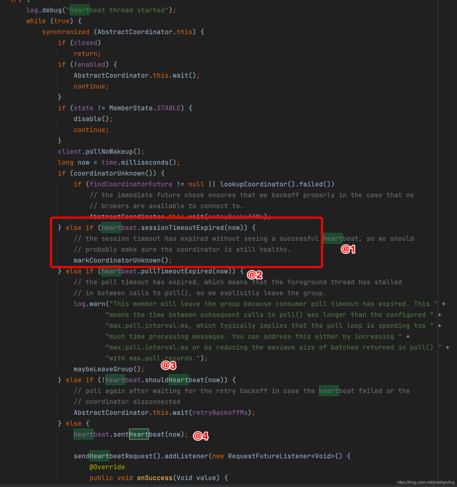

心跳线程的核心要点如下：

* 如果距离上一次心跳超过了会话时间，会断开与GroupCoordinator断开链接，并设置为coordinatorUnknow 为true，需要重新寻找组协调器。
* 如果此次心跳发送时间距离上一次心跳发送时间超过了pollTimeout，客户端将发送LEAVE_GROUP，离开消费组，并在下一个poll方法调用时重新进入加入消费组的操作，会再次触发重平衡。
* 如果两次心跳时间超过了单次心跳发送间隔，将发送消息。

```
温馨提示：尽管心跳包通常是定时类任务，但kafka的心跳机制另辟蹊径，使用了Object的wait与notify，心跳线程与消息拉取线程相互协助，**每一次消息拉取，都会进行判断是否应该发送心跳包**。
```

关于消费组的离开，服务端端处理逻辑比较简单，就不在这一一介绍了。

### 重平衡机制总结
Kafka的重平衡其实包含两个非常重要的阶段：
* 消费组加入阶段(PreparingRebalance)
    * 此阶段是消费者陆续加入消费组，该组第一个加入的消费者被推举为Leader
    * 当该组所有已知memberId的消费者全部加入后，状态驱动到CompletingRebalance。
* 队列负载(CompletingRebalance)
    * PreparingRebalance状态完成后，如果消费者被推举为Leader，**Leader会采用该消费组中都支持的队列负载算法进行队列分布**，然后将结果回报给组协调器；
    * 如果消费者的角色为非Leader，会向组协调器发送同步队列分区算法，组协调器会将Leader节点分配的结果分配给消费者。
    

**消费组如果在进行重平衡操作，将会暂停消息消费（STW），频繁的重平衡会导致队列消息消费的速度受到极大的影响。**

与重平衡相关的消费端参数：
* **max.poll.interval.ms**
  
    两次poll方法调用的最大间隔时间，单位毫秒，默认为5分钟。如果消费端在该间隔内没有发起poll操作，该消费者将被剔除，触发重平衡，将该消费者分配的队列分配给其他消费者。

* **session.timeout.ms**

    消费者与broker的心跳超时时间,默认10s，broker在指定时间内没有收到心跳请求，broker端将会将该消费者移出，并触发重平衡。

* **heartbeat.interval.ms**

    心跳间隔时间，消费者会以该频率向broker发送心跳，默认为3s，主要是确保session不会失效。
  
#### 重平衡触发条件---消费群组或者topic分区出现变化时

* 消费组内成员个数发生变化(**这种情况在实际情况中更加常见。因为订阅分区数、以及订阅 topic 数都是我们主动改变才会发生，而组内消费组成员个数发生变化，则是更加随机的。**)
    * 有新的消费者加入Consumer Group,
    * 由消费者主动退出，Consumer Group/调用unsubscribe()取消对某Topic的订阅,
    * 有消费者崩溃，可能由于长时间未向GroupCoordinator(协调者)发送心跳，GroupCoordinator会认为其已下线；
* 订阅的 Topic 分区数出现变化；
* 订阅的 Topic 个数发生变化:  
  一个 consumer group 如果之前只订阅了 A topic，那么其组内的 consumer 知会消费 A topic 的消息。而如果现在新增订阅了 B topic，那么 kafka 就需要把 B topic 的 partition 分配给组内的 consumer 进行消费。

### 线上环境频繁重平衡问题实例

#### 消息处理逻辑太重，超过max.poll.interval.ms限制

##### 问题原因：

kafkaConsumer调用一次轮询方法只是拉取一次消息。客户端为了不断拉取消息，会用一个外部循环不断调用消费者的轮询方法。每次轮询到消息，在处理完这一批消息后，才会继续下一次轮询。但如果一次轮询返回的结构没办法及时处理完成，会有什么后果呢？服务端约定了和客户端max.poll.interval.ms，两次poll最大间隔。如果客户端处理一批消息花费的时间超过了这个限制时间，服务端可能就会把消费者客户端移除掉，并触发rebalance。

##### 引发出的其他问题：

拉取偏移量与提交偏移量：kafka的偏移量(offset)是由消费者进行管理的，偏移量有两种，拉取偏移量(position)与提交偏移量(committed)。拉取偏移量代表当前消费者分区消费进度。每次消息消费后，需要提交偏移量。在提交偏移量时，kafka会使用拉取偏移量的值作为分区的提交偏移量发送给协调者。

如果没有提交偏移量，下一次消费者重新与broker连接后，会从当前消费者group已提交到broker的偏移量处开始消费。

所以，问题就在这里，当我们处理消息时间太长时,已经被broker剔除，提交偏移量又会报错。所以拉取偏移量没有提交到broker，分区又rebalance。

下一次重新分配分区时，消费者会从最新的已提交偏移量处开始消费。

这里就出现了**重复消费**的问题。

##### 处理方案：

1. 调大max.poll.interval.ms参数值或优化消息处理逻辑
    ```properties
    max.poll.interval.ms=300
    ```
2. 设置分区拉取阈值
   kafkaConsumer调用一次轮询方法只是拉取一次消息。客户端为了不断拉取消息，会用一个外部循环不断调用轮询方法poll()。每次轮询后，在处理完这一批消息后，才会继续下一次的轮询。
   ```properties
   max.poll.records = 50
   ```
   
3. poll到的消息，处理完一条就提交一条，当出现提交失败时，马上跳出循环，这时候kafka就会进行rebalance,下一次会继续从当前offset进行消费。

