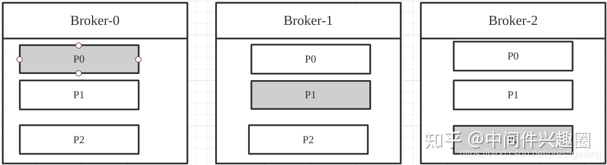
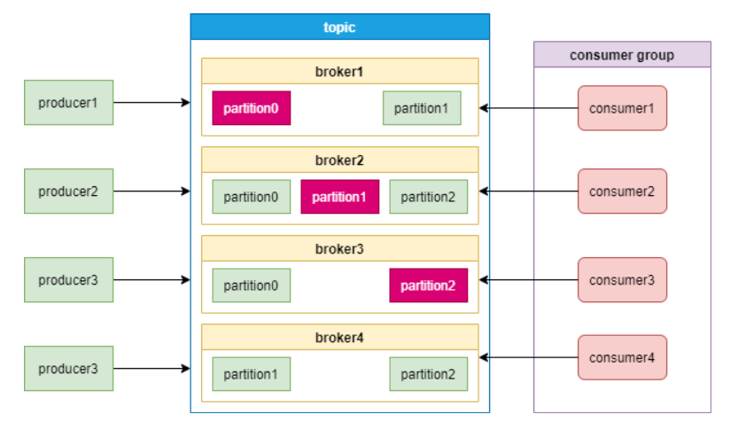
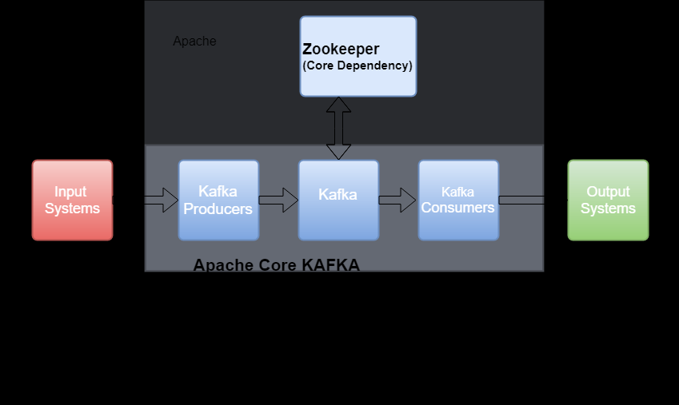
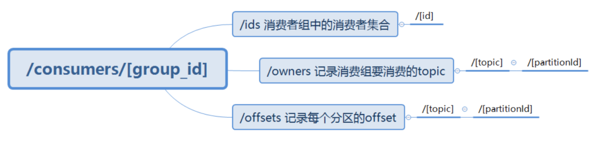
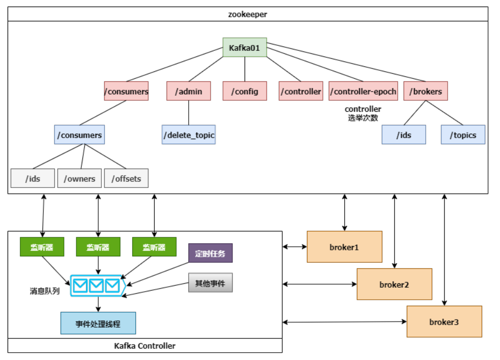
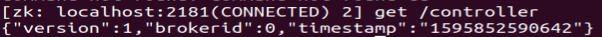
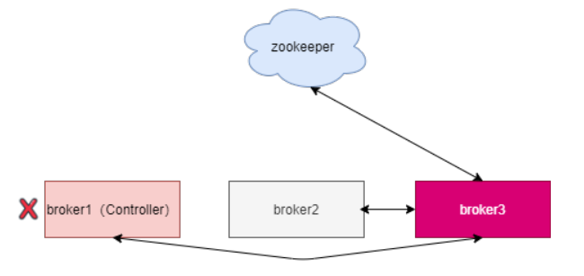
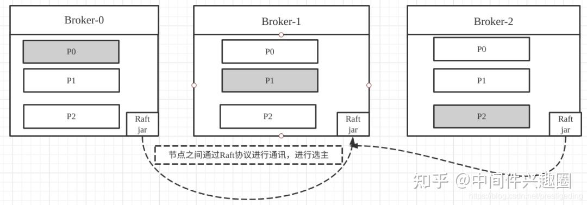

在  一文中，我们简单介绍了Zookeeper的基础概念。

而Kafka作为Zookeeper分布式协调的重要案例，本文将通过Kafka与Zookeeper的合与分展示Kafka与Zookeeper的前世今生。

### Kafka为什么需要Zookeeper

Kafka中存在众多的Leader选举，熟悉Kafka的朋友应该知道，一个主题可以拥有多个分区(数据分片)，每一个数据分片可以配置多个副本，如何保证一个分区的数据在多个副本之间的一致性成为一个迫切的需求。

Kafka的实现套路就是一个分区的多个副本，从中选举出一个Leader用来承担客户端的读写请求，从节点从主节点处拷贝内容，Leader节点根据数据在副本中成功写入情况，进行抉择来确定是否写入成功。

Kafka中topic的分区分布示意图：



故此处需要进行Leader选举,而基于Zookeeper能轻松实现，从此一拍即合，开启了一段“蜜月之旅”。

### Zookeeper为Kafka提供了什么
ZooKeeper 作为给分布式系统提供协调服务的工具被 kafka 所依赖。

在分布式系统中，消费者需要知道有哪些生产者是可用的，而如果每次消费者都需要和生产者建立连接并测试是否成功连接，那效率也太低了，显然是不可取的。



通过使用 ZooKeeper 协调服务，Kafka 就能将 Producer，Consumer，Broker 等结合在一起，同时借助 ZooKeeper，Kafka 就能够将所有组件在无状态的条件下建立起生产者和消费者的订阅关系，实现负载均衡。




1. 注册中心
   * Broker 信息注册
      * 在 ZooKeeper 上会有一个专门用来进行 Broker 服务器列表记录的节点，节点路径为 /brokers/ids。  
      * Kafka 的每个 Broker 启动时，都会在 ZooKeeper 中注册，创建 /brokers/ids/[0-N] 节点，写入 IP，端口等信息，每个 Broker 都有一个 BrokerId。  
      * Broker 创建的是临时节点，在连接断开时节点就会自动删除，所以在 ZooKeeper 上就可以通过 Broker 中节点的变化来得到 Broker 的可用性。
   * Topic 信息注册
      * 在 Kafka 中可以定义很多个 Topic，每个 Topic 又被分为很多个 Partition。一般情况下，每个 Partition 独立在存在一个 Broker 上，所有的这些 Topic 和 Broker 的对应关系都由 ZooKeeper 进行维护。
      * Zookeeper会为topic分配一个单独节点，每个topic都会以/brokers/topics/[topic_name]的形式记录在Zookeeper。
      * 一个topic的消息会被保存到多个partition，这些partition跟broker的对应关系也需要保存到Zookeeper。
      * partition是多副本保存的，上图中红色partition是leader副本。当leader副本所在的broker发生故障时，partition需要重新选举leader，这个需要由Zookeeper主导完成。
      * broker启动后，会把自己的Broker ID注册到到对应topic节点的分区列表中。

        我们查看一个topic是xxx，分区编号是1的信息，命令如下：
        ```
        [root@master] get /brokers/topics/xxx/partitions/1/state
        {"controller_epoch":15,"leader":11,"version":1,"leader_epoch":2,"isr":[11,12,13]}
        ```
        ```当broker退出后，Zookeeper会更新其对应topic的分区列表。```
   * consumer 信息注册
     
        消费者组也会向Zookeeper进行注册，Zookeeper会为其分配节点来保存相关数据，节点路径为/consumers/{group_id}，有3个子节点，如下图:
        
        

        这样Zookeeper可以记录分区跟消费者的关系，以及分区的offset。
    
2. 负载均衡

    生产者需要将消息发送给 Broker，消费者需要从 Broker 上获取消息，通过使用 ZooKeeper，就都能监听 Broker 上节点的状态信息，从而实现动态负载均衡。

    * broker向Zookeeper进行注册后，生产者根据broker节点来感知broker服务列表变化，这样可以实现动态负载均衡。
    * consumer group中的消费者，可以根据topic节点信息来拉取特定分区的消息,实现负载均衡。
    
3. Controller

    在 Kafka 中会有多个 Broker，其中一个 Broker 会被选举成为 Controller（控制器），在任意时刻，Kafka 集群中有且仅有一个控制器。
   
    Controller 负责管理集群中所有分区和副本的状态，当某个分区的 leader 副本出现故障时，由 Controller 为该分区选举出一个新的 leader。

    Controller具体职责如下：
    * 监听分区变化
        * 当某个分区的leader出现故障时，Controller会为该分区选举新的leader。
        * 当检测到分区的ISR集合发生变化时，Controller会通知所有broker更新元数据。
        * 当某个topic增加分区时，Controller会负责重新分配分区。
    * 监听topic相关的变化
    * 监听broker相关的变化
    * 集群元数据管理

    下面这张图展示了Controller、Zookeeper和broker的交互细节：
    

    Controller选举成功后，会从Zookeeper集群中拉取一份完整的元数据初始化ControllerContext，这些元数据缓存在Controller节点。当集群发生变化时，比如增加topic分区，Controller不仅需要变更本地的缓存数据，还需要将这些变更信息同步到其他Broker。

    Controller监听到Zookeeper事件、定时任务事件和其他事件后，将这些事件按照先后顺序暂存到LinkedBlockingQueue中，由事件处理线程按顺序处理，这些处理多数需要跟Zookeeper交互，Controller则需要更新自己的元数据。

    Kafka 的 Controller 选举就依靠 ZooKeeper 来完成，成功竞选为 Controller 的 Broker 会在 ZooKeeper 中创建 /controller 这个临时节点，在 ZooKeeper 中使用 get 命令查看节点内容：

    

    * “version”在目前版本中固定为1
    * “brokerid”表示 Broker 的编号
    * “timestamp”表示竞选称为 Controller 时的时间戳。

    Kafka Controller选举流程: 当 Broker 启动时，会尝试读取 /controller 中的“brokerid”: 
    * 如果读取到的值不是-1，则表示已经有节点竞选成为 Controller 了，当前节点就会放弃竞选；
    * 而如果读取到的值为-1，ZooKeeper 就会尝试创建 /controller 节点，当该 Broker 去创建的时候，可能还有其他 Broker 一起同时创建节点，但只有一个 Broker 能够创建成功，即成为唯一的 Controller。

### 为什么Kafka要抛弃Zookeeper
#### 外部依赖带来的复杂度及系统效率影响

对于 Kafka 来讲，ZooKeeper 是一套外部系统，要想部署一套 Kafka 集群，就要同时部署、管理、监控 ZooKeeper，Kafka的运维人员必须要具备Zookeeper的运维能力。

ZooKeeper 有自己的配置方式、管理工具，和 Kafka 完全不一样，所以，一起搞两套分布式系统，自然就提升了**复杂度**，也更容易出现问题。有时工作量还会加倍，例如要开启一些安全特性，Kafka 和 ZooKeeper 中都需要配置。

除了复杂度，外部存储也会**降低系统效率**。


例如 Kafka 集群每次启动的时候，Controller 必须从 ZooKeeper 加载集群的状态信息。

再比如选举出一个新的 Controller 之后也会比较麻烦，Kafaka依赖一个单一Controller节点跟Zookeeper进行交互，如果这个Controller节点发生了故障，就需要从broker中选择新的Controller。如下图,新的Controller变成了broker3。



新的Controller选举成功后，会重新从Zookeeper拉取元数据进行初始化，并且需要通知其他所有的broker更新ActiveControllerId。老的Controller需要关闭监听、事件处理线程和定时任务。分区数非常多时，这个过程非常耗时，而且这个过程中Kafka集群是不能工作的。

当分区数增加时，Zookeeper保存的元数据变多，Zookeeper集群压力变大，达到一定级别后，监听延迟增加，给Kafaka的工作带来了影响。

所以，Kafka单集群承载的**分区数量是一个瓶颈**。而这又恰恰是一些业务场景需要的。

#### Zookeeper的致命缺陷

Zookeeper是集群部署，只要集群中超过半数节点存活，即可提供服务，例如一个由3个节点的Zookeeper，允许1个Zookeeper节点宕机，集群仍然能提供服务；一个由５个节点的Zookeeper，允许2个节点宕机。

但Zookeeper的设计是CP模型，即要保证数据的强一致性，必然在可用性方面做出牺牲。

Zookeeper集群中也存在所谓的Leader节点和从节点，Leader节点负责写，Leader与从节点可用接受读请求，但在Zookeeper内部节点在选举时整个Zookeeper无法对外提供服务。当然正常情况下选举会非常快，但在异常情况下就不好说了，例如Zookeeper节点发生full Gc，此时造成的影响将是毁灭性的。

Zookeeper节点如果频繁发生Full Gc，此时与客户端的会话将超时，由于此时无法响应客户端的心跳请求(Stop World)，从而与会话相关联的临时节点将被删除，注意，此时是所有的临时节点会被删除，Zookeeper依赖的事件通知机制将失效，整个集群的选举服务将失效。

#### 设计优雅性

站在高可用性的角度，Kafka集群的可用性不仅取决于自身，还受到了外部组件的制约，从长久来看，显然都不是一个优雅的方案。

#### 分布式领域技术完善

随着分布式领域相关技术的不断完善，**去中心化**的思想逐步兴起，去Zookeeper的呼声也越来越高，在这个进程中涌现了一个非常优秀的算法：**Raft协议**。

Raft协议的两个重要组成部分：Leader选举、日志复制，而日志复制为多个副本提供数据强一致性提供了强一致性，并且一个显著的特点是Raft节点是去中心化的架构，不依赖外部的组件，而是作为一个协议簇嵌入到应用中的，即与应用本身是融合为一体的。

### Kafka去掉Zookeeper后怎么实现其功能

KIP-500用Quorum Controller代替之前的Controller，Quorum中每个Controller节点都会保存所有元数据，通过KRaft协议保证副本的一致性。这样即使Quorum Controller节点出故障了，新的Controller迁移也会非常快。

以Kafka Topic的分布图举例，引用Raft协议的示例图如下：



官方介绍，升级之后，Kafka可以轻松支持百万级别的分区。

```
Kafak团队把通过Raft协议同步数据的方式Kafka Raft Metadata mode,简称KRaft
```

关于Raft协议，本文并不打算深入进行探讨，具体参考文章[Raft协议原理详解](https://zhuanlan.zhihu.com/p/91288179)

Raft协议为选主提供了另外一种可行方案，而且还无需依赖第三方组件，何乐而不为呢？故最终Kafka在2.8版本中正式废弃了Zookeeper，拥抱Raft。

Kafaka计划在3.0版本会兼容Zookeeper Controller和Quorum Controller，这样用户可以进行灰度测试。

### 总结

在大规模集群和云原生的背景下，使用Zookeeper给Kafka的运维和集群性能造成了很大的压力。去除Zookeeper是必然趋势，这也符合大道至简的架构思想。
