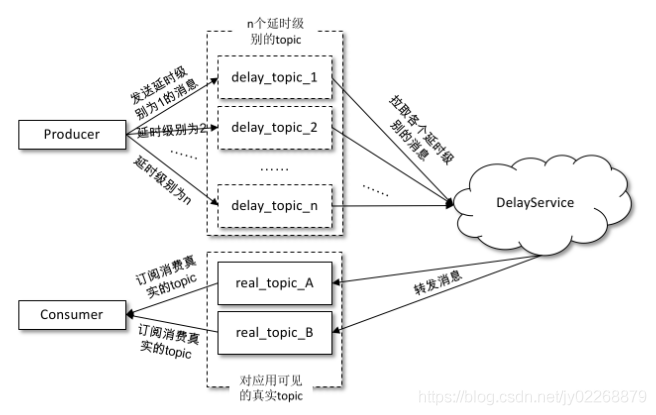
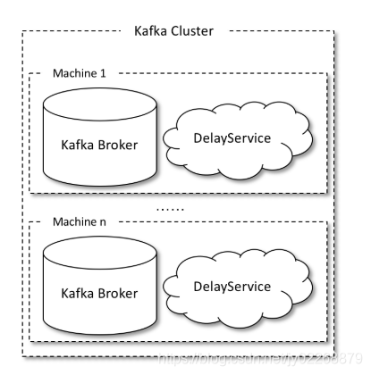
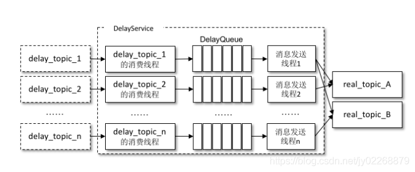
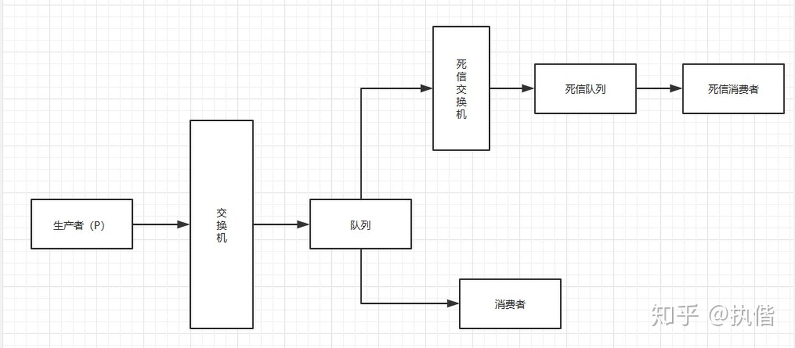
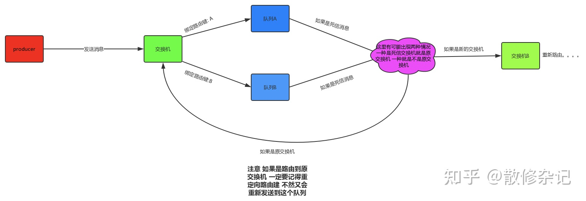

### 延迟队列
```
在发送延时消息的时候并不是先投递到要发送的真实主题（real_topic）中，而是先投递到一些 Kafka 内部的主题（delay_topic）中，这些内部主题对用户不可见，

然后通过一个自定义的服务拉取这些内部主题中的消息，并将满足条件的消息再投递到要发送的真实的主题中，消费者所订阅的还是真实的主题。
```
如果采用这种方案，那么一般是按照不同的延时等级来划分的，比如设定5s、10s、30s、1min、2min、5min、10min、20min、30min、45min、1hour、2hour这些按延时时间递增的延时等级，延时的消息按照延时时间投递到不同等级的主题中，投递到同一主题中的消息的延时时间会被强转为与此主题延时等级一致的延时时间，这样延时误差控制在两个延时等级的时间差范围之内（比如延时时间为17s的消息投递到30s的延时主题中，之后按照延时时间为30s进行计算，延时误差为13s）。虽然有一定的延时误差，但是误差可控，并且这样只需增加少许的主题就能实现延时队列的功能。



发送到内部主题（delaytopic*）中的消息会被一个独立的 DelayService 进程消费，这个 DelayService 进程和 Kafka broker 进程以一对一的配比进行同机部署（参考下图），以保证服务的可用性。



**针对不同延时级别的主题，在 DelayService 的内部都会有单独的线程来进行消息的拉取，以及单独的 DelayQueue（这里用的是 JUC 中 DelayQueue）进行消息的暂存。**

与此同时，在 DelayService 内部还会有专门的消息发送线程来获取 DelayQueue 的消息并转发到真实的主题中。从消费、暂存再到转发，线程之间都是一一对应的关系。如下图所示，DelayService 的设计应当尽量保持简单，避免锁机制产生的隐患。



为了保障内部 DelayQueue 不会因为未处理的消息过多而导致内存的占用过大，DelayService 会对主题中的每个分区进行计数，当达到一定的阈值之后，就会暂停拉取该分区中的消息。

因为一个主题中一般不止一个分区，分区之间的消息并不会按照投递时间进行排序，DelayQueue的作用是将消息按照再次投递时间进行有序排序，这样下游的消息发送线程就能够按照先后顺序获取最先满足投递条件的消息。

### 重试队列

重试队列其实可以看作一种回退队列，具体指消费端消费消息失败时，为了防止消息无故丢失而重新将消息回滚到 broker 中。

与回退队列不同的是，重试队列一般分成多个重试等级，每个重试等级一般也会设置重新投递延时，重试次数越多投递延时就越大。

理解了他们的概念之后我们就可以为每个主题设置重试队列，消息第一次消费失败入重试队列 Q1，Q1 的重新投递延时为5s，5s过后重新投递该消息；如果消息再次消费失败则入重试队列 Q2，Q2 的重新投递延时为10s，10s过后再次投递该消息。

然后再设置一个主题作为死信队列，重试越多次重新投递的时间就越久，并且需要设置一个上限，超过投递次数就进入死信队列。重试队列与延时队列有相同的地方，都需要设置延时级别。

### 死信队列

当一条消息初次消费失败，消息队列 MQ 会自动进行消息重试；

达到最大重试次数后，若消费依然失败，则表明消费者在正常情况下无法正确地消费该消息; 

此时，消息队列 MQ 不会立刻将消息丢弃，而是将其发送到该消费者对应的特殊队列中，这种正常情况下无法被消费的消息称为**死信消息**（Dead-Letter Message），存储死信消息的特殊队列称为**死信队列**（Dead-Letter Queue）。

当一条消息在队列中出现以下三种情况的时候，该消息就会变成一条死信。

* 消费者拒绝消费消息，并且不把消息重新放回原目标队列(消费者不想处理的数据)
* 消息TTL(time to live)过期(不符合处理要求的数据)
* 队列达到最大长度(消费者不能处理的数据)

当消息在一个队列中变成一个死信之后，如果配置了死信队列，它将被重新publish到死信交换机，死信交换机将死信投递到一个队列上，这个队列就是死信队列。



#### 死信队列处理的方式

* 丢弃，如果不是很重要，可以选择丢弃
* 记录死信入库，然后做后续的业务分析或处理
* 通过死信队列，由负责监听死信的应用程序进行处理



### 各中间件支持

#### Kafka

Kafka 没有重试机制不支持消息重试，也没有死信队列，因此使用 Kafka 做消息队列时，如果遇到了消息在业务处理时出现异常，就会很难进行下一步处理。

**使用KafkaConnector扩展实现死信队列**

Kafka连接器是Kafka的一部分，是在Kafka和其它技术之间构建流式管道的一个强有力的框架。它可用于将数据从多个地方（包括数据库、消息队列和文本文件）流式注入到Kafka，以及从Kafka将数据流式传输到目标端（如文档存储、NoSQL、数据库、对象存储等）中。

Kafka连接器可以配置为将无法处理的消息（例如上面提到的反序列化错误）发送到一个单独的Kafka主题，即死信队列。有效消息会正常处理，管道也会继续运行。然后可以从死信队列中检查无效消息，并根据需要忽略或修复并重新处理。
  
进行如下的配置可以启用死信队列：

```properties
errors.tolerance = all
errors.deadletterqueue.topic.name =
```

如果运行于单节点Kafka集群，还需要配置```errors.deadletterqueue.topic.replication.factor = 1```，其默认值为3。

但是只有看到消息才能知道它是无效的JSON，即便如此，也只能假设消息被拒绝的原因，要确定Kafka连接器将消息视为无效的实际原因，有两个方法：

* 死信队列的消息头；
* Kafka连接器的工作节点日志。

**记录消息的失败原因：消息头**

消息头是使用Kafka消息的键、值和时间戳存储的附加元数据，是在Kafka 0.11版本中引入的。Kafka连接器可以将有关消息拒绝原因的信息写入消息本身的消息头中。这个做法比写入日志文件更好，因为它将原因直接与消息联系起来。

配置如下的参数，可以在死信队列的消息头中包含拒绝原因：

    errors.deadletterqueue.context.headers.enable = true

**记录消息的失败原因：日志**

记录消息的拒绝原因的第二个选项是将其写入日志。根据安装方式不同，Kafka连接器会将其写入标准输出或日志文件。无论哪种方式都会为每个失败的消息生成一堆详细输出。进行如下配置可启用此功能：

    errors.log.enable = true

通过配置```errors.log.include.messages = true```，还可以在输出中包含有关消息本身的元数据。此元数据中包括一些和上面提到的消息头中一样的项目，包括源消息的主题和偏移量。注意它不包括消息键或值本身

#### RabbitMQ

默认的处理机制中，如果我们只对消息做重复消费，达到最大重试次数之后消息就进入死信队列了。RocketMQ 的处理方式为将达到最大重试次数（16 次）的消息标记为死信消息，将该死信消息投递到 DLQ 死信队列中，业务需要进行人工干预。