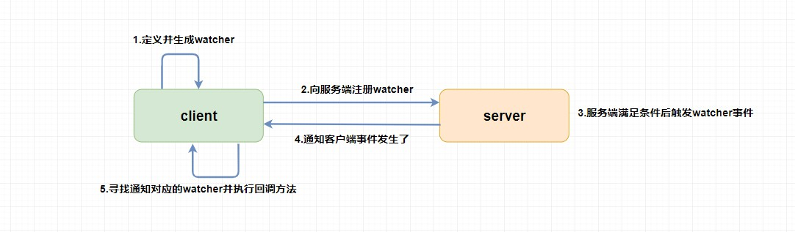
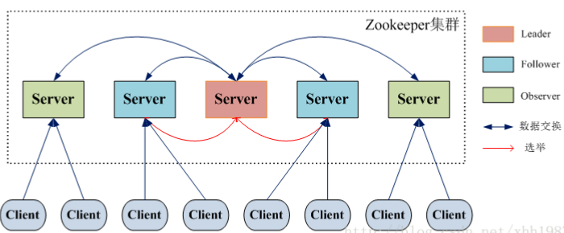

## 什么是分布式协调组件

讲Zookeeper之前，首先我们了解下什么是”分布式协调组件“。

所谓的“分布式协调组件”，就是我们在分布式应用开发中，为了协调分布式系统中各个机器协同运行而使用到的“公共组件”。比如Zookeeper、Redis等，都可以看作是“分布式协调组件”。

这里很容易可以看到，分布式环境中的“分布式协调组件”，和单机环境中的“多线程协调组件”（比如Java多线程并发工具包），其实是类似的东西。

不同的是: 

* 多线程协调组件是在同一台机器的内存中；而分布式协调组件的调用则是需要通过网络通信的，“网络不可达”的不确定性，就加大了使用分布式协调组件的使用难度
* 可用性：多线程协调组件是单机应用中的一部分，完全不需要担心某个并发变量会“挂掉”；而分布式协调组件一般是独立运行的，如何保障分布式协调组件的高可用，是一个很复杂的命题。比如一般会通过集群保障高可用，而集群里的机器之间如何保障数据一致性，则又是一个更加复杂的命题
* 分布式协调组件还需要考虑性能问题、可扩展性等

### 常用的分布式协调组件

**全局功能数据存储/有功能的组件**：
* K-V类：redis、memcache
* Zookeeper
* 消息队列
* 配置中心：Spring Cloud Config等

**持久数据存储**：
* MySQL
* MongoDB

### 分布式协调组件应用场景
* 分布式session
* 分布式计数器
* 分布式锁
* 分布式队列：
    * 先入先出队列
    * 要等所有队列元素聚集之后才能统一安排执行的Barrier模型队列
* 分布式配置
* 分布式协调 / 通知
* 数据发布、订阅
* 软负载均衡：域名 -> IP和端口号配置
* 命名服务：在分布式环境中，上层应用需要一个全局唯一的名字，类似于数据库中的主键
* 集群管理：
    * 集群监控（进群运行时状态收集）
    * 集群控制（对集群进行操作和控制）
* Master选举

## 分布式协调组件Zookeeper概览

### ZooKeeper 实现了什么

ZooKeeper 是一个开源的分布式协调服务，它的设计目标是将那些复杂且容易出错的分布式一致性服务封装起来，构成一个高效可靠的原语集，并以一系列简单易用的接口提供给用户使用。

**原语**： 操作系统或计算机网络用语范畴。是由若干条指令组成的，用于完成一定功能的一个过程。具有不可分割性·即原语的执行必须是连续的，在执行过程中不允许被中断。

ZooKeeper为我们提供了高可用、高性能、稳定的分布式数据一致性解决方案，通常被用于实现诸如**数据发布/订阅、负载均衡、命名服务、分布式协调/通知、集群管理、Master选举、分布式锁和分布式队列**等功能。

另外，ZooKeeper 将**数据保存在内存**中，性能是非常棒的。

* 在“读”多于“写”的应用程序中尤其地高性能，因为“写”会导致所有的服务器间同步状态。

```“读”多于“写”是协调服务的典型场景```

### ZooKeeper 特点

* **顺序一致性**： 从同一客户端发起的事务请求，最终将会严格地按照顺序被应用到 ZooKeeper 中去。

* **原子性**： 所有事务请求的处理结果在整个集群中所有机器上的应用情况是一致的，也就是说，要么整个集群中所有的机器都成功应用了某一个事务，要么都没有应用。

* **单一系统映像**： 无论客户端连到哪一个 ZooKeeper 服务器上，其看到的服务端数据模型都是一致的。

* **可靠性**： 一旦一次更改请求被应用，更改的结果就会被持久化，直到被下一次更改覆盖。

### ZooKeeper 典型应用场景

* **分布式锁**： 通过创建唯一节点获得分布式锁，当获得锁的一方执行完相关代码或者是挂掉之后就释放锁。

* **命名服务**： 可以通过 ZooKeeper 的顺序节点生成全局唯一 ID

* **数据发布/订阅**：通过 Watcher 机制可以很方便地实现数据发布/订阅。当你将数据发布到 ZooKeeper 被监听的节点上，其他机器可通过监听 ZooKeeper 上节点的变化来实现配置的动态更新。

## Zookeeper重要概念

### Data model（数据模型）

ZooKeeper 数据模型采用层次化的多叉树形结构，每个节点上都可以存储数据，这些数据可以是数字、字符串或者是二级制序列。并且。每个节点还可以拥有 N 个子节点，最上层是根节点以“/”来代表。每个数据节点在 ZooKeeper 中被称为 znode，它是 ZooKeeper 中数据的最小单元。并且，每个 znode 都一个唯一的路径标识。

强调一句：ZooKeeper 主要是用来协调服务的，而不是用来存储业务数据的，所以**不要放比较大的数据在znode上**，ZooKeeper 给出的上限是每个结点的数据大小最大是 1M。

ZooKeeper 节点路径标识方式和 Unix 文件系统路径非常相似，都是由一系列使用斜杠"/"进行分割的路径表示，开发员可以向这个节点中写人数据，也可以在节点下面创建子节点。


### znode（数据节点）

#### znode节点分类

* 持久（PERSISTENT）节点： 一旦创建就一直存在即使 ZooKeeper 集群宕机，直到将其删除。

* 临时（EPHEMERAL）节点： 临时节点的生命周期是与客户端会话（session）绑定的，会话消失则节点消失。并且，临时节点只能做叶子节点，不能创建子节点。

* 持久顺序（PERSISTENT_SEQUENTIAL）节点：除了具有持久（PERSISTENT）节点的特性之外， 子节点的名称还具有顺序性。比如/node1/app0000000001 、/node1/app0000000002 。

* 临时顺序（EPHEMERAL_SEQUENTIAL）节点：除了具备临时（EPHEMERAL）节点的特性之外，子节点的名称还具有顺序性。

#### znode 数据结构

每个 znode 由 2 部分组成:

* stat ：状态信息
* data ： 节点存放的数据的具体内容

Stat 类中包含了一个数据节点的所有状态信息的字段，包括事务 ID-cZxid、节点创建时间-ctime 和子节点个数-numChildren 等等，详细信息参考下表。

| znode 状态信息 | 解释                                                                                                |
|----------------|-----------------------------------------------------------------------------------------------------|
| cZxid          | create ZXID，即该数据节点被创建时的事务 id                                                          |
| ctime          | create time，即该节点的创建时间                                                                     |
| mZxid          | modified ZXID，即该节点最终一次更新时的事务 id                                                      |
| mtime          | modified time，即该节点最后一次的更新时间                                                           |
| pZxid          | 该节点的子节点列表最后一次修改时的事务 id，只有子节点列表变更才会更新 pZxid，子节点内容变更不会更新 |
| cversion       | 子节点版本号，当前节点的子节点每次变化时值增加 1                                                    |
| dataVersion    | 数据节点内容版本号，节点创建时为 0，每更新一次节点内容(不管内容有无变化)该版本号的值增加 1          |
| aclVersion     | 节点的 ACL 版本号，表示该节点 ACL 信息变更次数                                                      |
| ephemeralOwner | 创建该临时节点的会话的 sessionId；如果当前节点为持久节点，则 ephemeralOwner=0                       |
| dataLength     | 数据节点内容长度                                                                                    |
| numChildren    | 当前节点的子节点个数                                                                                |

### 版本

前面我们已经提到，对应于每个 znode，ZooKeeper 都会为其维护一个叫作 **Stat**的数据结构，Stat 中记录了这个 znode 的三个相关的版本：

-   **dataVersion** ：当前 znode 节点的版本号

-   **cversion** ： 当前 znode 子节点的版本

-   **aclVersion** ： 当前 znode 的 ACL 的版本。

### **ACL（权限控制）**

ZooKeeper 采用 ACL（AccessControlLists）策略来进行权限控制，类似于 UNIX 文件系统的权限控制。

对于 znode 操作的权限，ZooKeeper 提供了以下 5 种：

-   **CREATE** : 能创建子节点

-   **READ** ：能获取节点数据和列出其子节点

-   **WRITE** : 能设置/更新节点数据

-   **DELETE** : 能删除子节点

-   **ADMIN** : 能设置节点 ACL 的权限

其中尤其需要注意的是，**CREATE**和**DELETE**这两种权限都是针对**子节点**的权限控制。

对于身份认证，提供了以下几种方式：

-   **world** ： 默认方式，所有用户都可无条件访问。

-   **auth**: 不使用任何 id，代表任何已认证的用户。

-   **digest**: 用户名:密码认证方式： *username:password* 。

-   **ip**: 对指定 ip 进行限制。

### **Watcher**

Watcher（事件监听器），是 ZooKeeper 中的一个很重要的特性。ZooKeeper允许用户在指定节点上注册一些 Watcher，并且在一些特定事件触发的时候，ZooKeeper服务端会将事件通知到感兴趣的客户端上去，该机制是 ZooKeeper实现分布式协调服务的重要特性。



*用到 ZooKeeper 基本离不开 Watcher（事件监听器）机制。*

### **会话（Session）**

Session 可以看作是 ZooKeeper 服务器与客户端的之间的一个 TCP 长连接，通过这个连接，客户端能够通过心跳检测与服务器保持有效的会话，也能够向 ZooKeeper 服务器发送请求并接受响应，同时还能够通过该连接接收来自服务器的 Watcher 事件通知。

Session 有一个属性叫做：sessionTimeout ，sessionTimeout代表会话的超时时间。当由于服务器压力太大、网络故障或是客户端主动断开连接等各种原因导致客户端连接断开时，只要在sessionTimeout规定的时间内能够重新连接上集群中任意一台服务器，那么之前创建的会话仍然有效。

另外，在为客户端创建会话之前，服务端首先会为每个客户端都分配一个 sessionID。由于 sessionID是 ZooKeeper 会话的一个重要标识，许多与会话相关的运行机制都是基于这个 sessionID 的，因此，无论是哪台服务器为客户端分配的 sessionID，都务必保证全局唯一。

## ZooKeeper 集群

为了保证高可用，最好是以集群形态来部署 ZooKeeper，这样只要集群中大部分机器是可用的（能够容忍一定的机器故障），那么 ZooKeeper 本身仍然是可用的，通常 3 台服务器就可以构成一个 ZooKeeper 集群了。



上图中每一个 Server 代表一个安装 ZooKeeper 服务的服务器。组成 ZooKeeper 服务的服务器都会在内存中维护当前的服务器状态，并且每台服务器之间都互相保持着通信。集群间通过 ZAB 协议（ZooKeeper Atomic Broadcast）来保持数据的一致性。

**最典型集群模式： Master/Slave 模式（主备模式）**。

在这种模式中，通常 Master 服务器作为主服务器提供写服务，其他的 Slave 服务器从服务器通过异步复制的方式获取 Master 服务器最新的数据提供读服务。

### ZooKeeper 集群角色

| **角色** | **说明**                                                                                                                                                                            |
|----------|-------------------------------------------------------------------------------------------------------------------------------------------------------------------------------------|
| Leader   | 为客户端提供读和写的服务，负责投票的发起和决议，更新系统状态。                                                                                                                      |
| Follower | 为客户端提供读服务，如果是写服务则转发给 Leader。在选举过程中参与投票。                                                                                                             |
| Observer | 为客户端提供读服务器，如果是写服务则转发给 Leader。不参与选举过程中的投票，也不参与“过半写成功”策略。在不影响写性能的情况下提升集群的读性能。此角色于 ZooKeeper3.3 系列新增的角色。 |

### Zookeeper Leader选举

当 Leader 服务器出现网络中断、崩溃退出与重启等异常情况时，就会进入 Leader 选举过程，这个过程会选举产生新的 Leader 服务器。

这个过程大致是这样的：

1.  **Leader election（选举阶段）**: 节点在一开始都处于选举阶段，只要有一个节点得到超半数节点的票数，它就可以当选准 leader。

2.  **Discovery（发现阶段）**: 在这个阶段，followers 跟准 leader 进行通信，同步 followers 最近接收的事务提议。

3.  **Synchronization（同步阶段）**: 同步阶段主要是利用 leader 前一阶段获得的最新提议历史，同步集群中所有的副本。同步完成之后 准 leader 才会成为真正的 leader。

4.  **Broadcast（广播阶段）**: 到了这个阶段，ZooKeeper 集群才能正式对外提供事务服务，并且 leader 可以进行消息广播。同时如果有新的节点加入，还需要对新节点进行同步。

### **ZooKeeper 集群中的服务器状态**

-   **LOOKING**: 寻找 Leader。

-   **LEADING**: Leader 状态，对应的节点为 Leader。

-   **FOLLOWING**: Follower 状态，对应的节点为 Follower。

-   **OBSERVING**: Observer 状态，对应节点为 Observer，该节点不参与 Leader 选举。

### **ZooKeeper 集群为啥最好奇数台**

ZooKeeper 集群在宕掉几个 ZooKeeper 服务器之后，如果剩下的 ZooKeeper 服务器个数大于宕掉的个数的话整个 ZooKeeper 才依然可用。假如我们的集群中有 n 台 ZooKeeper 服务器，那么也就是剩下的服务数必须大于 n/2。先说一下结论，2n 和 2n-1 的容忍度是一样的，都是n-1，大家可以先自己仔细想一想，这应该是一个很简单的数学问题了。 比如假如我们有 3 台，那么最大允许宕掉 1 台 ZooKeeper 服务器，如果我们有 4 台的的时候也同样只允许宕掉 1 台。 假如我们有 5 台，那么最大允许宕掉 2 台ZooKeeper 服务器，如果我们有 6 台的的时候也同样只允许宕掉 2 台。

## ZAB 协议和Paxos 算法

Paxos 算法应该可以说是 ZooKeeper 的灵魂了。但是，ZooKeeper 并没有完全采用Paxos算法 ，而是使用 ZAB 协议作为其保证数据一致性的核心算法。另外，在ZooKeeper的官方文档中也指出，ZAB协议并不像Paxos算法那样，是一种通用的分布式一致性算法，它是一种特别为Zookeeper设计的崩溃可恢复的原子消息广播算法。

### **ZAB 协议介绍**

ZAB（ZooKeeper Atomic Broadcast 原子广播） 协议是为分布式协调服务 ZooKeeper 专门设计的一种支持崩溃恢复的原子广播协议。 在 ZooKeeper 中，主要依赖 ZAB 协议来实现分布式数据一致性，基于该协议，ZooKeeper 实现了一种主备模式的系统架构来保持集群中各个副本之间的数据一致性。

**ZAB 协议两种基本的模式：崩溃恢复和消息广播**

ZAB 协议包括两种基本的模式，分别是

-   **崩溃恢复**：当整个服务框架在启动过程中，或是当 Leader 服务器出现网络中断、崩溃退出与重启等异常情况时，ZAB 协议就会进入恢复模式并选举产生新的Leader服务器。当选举产生了新的 Leader 服务器，同时集群中已经有过半的机器与该Leader服务器完成了状态同步之后，ZAB协议就会退出恢复模式。  
    其中，**所谓的状态同步是指数据同步，用来保证集群中存在过半的机器能够和Leader服务器的数据状态保持一致**。

-   **消息广播**：**当集群中已经有过半的Follower服务器完成了和Leader服务器的状态同步，那么整个服务框架就可以进入消息广播模式了。**  
    当一台同样遵守ZAB协议的服务器启动后加入到集群中时，如果此时集群中已经存在一个Leader服务器在负责进行消息广播，那么新加入的服务器就会自觉地进入数据恢复模式：找到Leader所在的服务器，并与其进行数据同步，然后一起参与到消息广播流程中去。

具体ZAB协议介绍可参考 [实例详解ZooKeeper ZAB协议、分布式锁与领导选举](https://dbaplus.cn/news-141-1875-1.html)

## Zookeeper总结

1. ZooKeeper 本身就是一个分布式程序（只要半数以上节点存活，ZooKeeper 就能正常服务）。

2. 为了保证高可用，最好是以集群形态来部署ZooKeeper，这样只要集群中大部分机器是可用的（能够容忍一定的机器故障），那么ZooKeeper 本身仍然是可用的。

3. ZooKeeper 将数据保存在内存中，这也就保证了高吞吐量和低延迟
  * 但是内存限制了能够存储的容量不太大，此限制也是保持 znode 中存储的数据量较小的进一步原因。

4. ZooKeeper 是高性能的。  
   在“读”多于“写”的应用程序中尤其地明显，因为“写”会导致所有的服务器间同步状态。（“读”多于“写”是协调服务的典型场景。）

5. ZooKeeper 有临时节点的概念。  
  * 当创建临时节点的客户端会话一直保持活动，瞬时节点就一直存在。而当会话终结时，瞬时节点被删除。  
  * 持久节点是指一旦这个 znode 被创建了，除非主动进行 znode 的移除操作，否则这个 znode 将一直保存在 ZooKeeper 上。

6. ZooKeeper 底层其实只提供了两个功能：
  * 管理（存储、读取）用户程序提交的数据；
  * 为用户程序提供数据节点监听服务。
