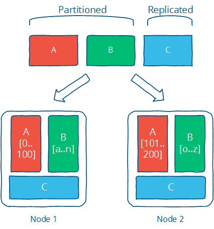
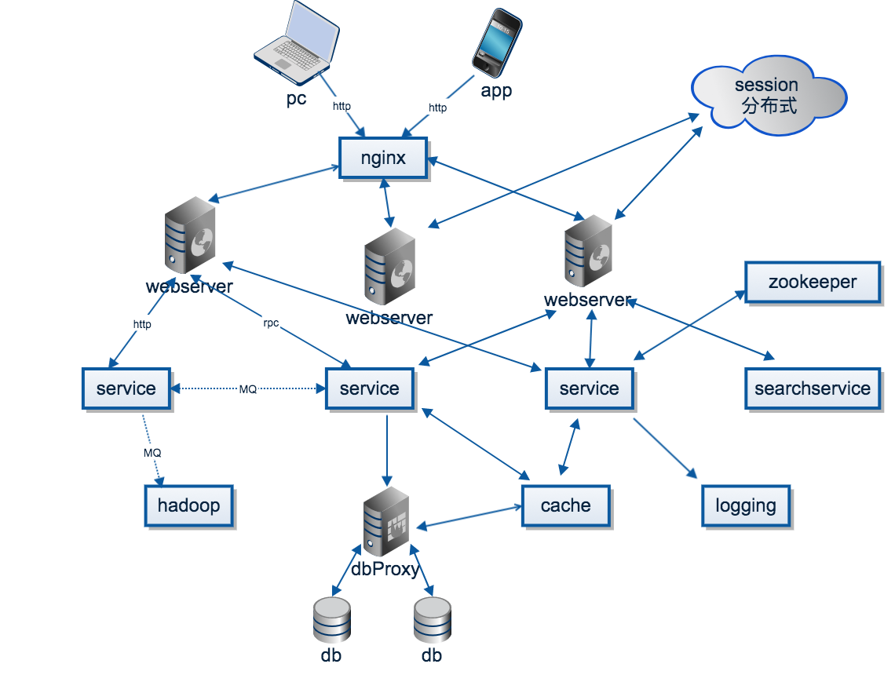

## 什么是分布式系统
分布式系统是由一组通过网络进行通信、为了完成共同的任务而协调工作的计算机节点组成的系统。

分布式系统的出现是为了用廉价的、普通的机器完成单个计算机无法完成的计算、存储任务。其目的是**利用更多的机器，处理更多的数据**。

首先需要明确的是，只有
* 单个节点的处理能力无法满足日益增长的计算、存储任务
* 且硬件的提升（加内存、加磁盘、使用更好的CPU）高昂到得不偿失
* 应用程序也不能进一步优化  

我们才需要考虑分布式系统。

因为，分布式系统要解决的问题本身就是和单机系统一样的，而由于分布式系统多节点、通过网络通信的拓扑结构，会引入很多单机系统没有的问题，为了解决这些问题又会引入更多的机制、协议，带来更多的问题。

分布式系统怎么将任务分发到这些计算机节点呢，很简单的思想，分而治之，即分片（partition）。对于计算，那么就是对计算任务进行切换，每个节点算一些，最终汇总就行了，这就是MapReduce的思想；对于存储，更好理解一下，每个节点存一部分数据就行了。当数据规模变大的时候，Partition是唯一的选择，同时也会带来一些好处：

* 提升性能和并发，操作被分发到不同的分片，相互独立
* 提升系统的可用性，即使部分分片不能用，其他分片不会受到影响

理想的情况下，有分片就行了，但事实的情况却不大理想。

原因在于，分布式系统中有大量的节点，且通过网络通信。单个节点的故障（进程crash、断电、磁盘损坏）是个小概率事件，但整个系统的故障率会随节点的增加而指数级增加，网络通信也可能出现断网、高延迟的情况。在这种一定会出现的“异常”情况下，分布式系统还是需要继续稳定的对外提供服务，即需要较强的容错性。最简单的办法，就是冗余或者复制集（Replication），即多个节点负责同一个任务，最为常见的就是分布式存储中，多个节点复杂存储同一份数据，以此增强可用性与可靠性。同时，Replication也会带来性能的提升，比如数据的locality可以减少用户的等待时间。

Partition和Replication是解决分布式系统问题的一记组合拳，很多具体的问题都可以用这个思路去解决。但这并不是银弹，往往是为了解决一个问题，会引入更多的问题，比如为了可用性与可靠性保证，引用了冗余（复制集）。有了冗余，各个副本间的一致性问题就变得很头疼，一致性在系统的角度和用户的角度又有不同的等级划分。如果要保证强一致性，那么会影响可用性与性能，在一些应用（比如电商、搜索）是难以接受的。如果是最终一致性，那么就需要处理数据冲突的情况。CAP、FLP这些理论告诉我们，在分布式系统中，没有最佳的选择，都是需要权衡，做出最合适的选择。

## 分布式系统面临的挑战
* 异构的机器与网络：

    分布式系统中的机器，配置不一样，其上运行的服务也可能由不同的语言、架构实现，因此处理能力也不一样；节点间通过网络连接，而不同网络运营商提供的网络的带宽、延时、丢包率又不一样。怎么保证大家齐头并进，共同完成目标，这四个不小的挑战。

* 普遍的节点故障：

    虽然单个节点的故障概率较低，但节点数目达到一定规模，出故障的概率就变高了。分布式系统需要保证故障发生的时候，系统仍然是可用的，这就需要监控节点的状态，在节点故障的情况下将该节点负责的计算、存储任务转移到其他节点

* 不可靠的网络：

    节点间通过网络通信，而网络是不可靠的。可能的网络问题包括：网络分割、延时、丢包、乱序。

    相比单机过程调用，网络通信最让人头疼的是超时：节点A向节点B发出请求，在约定的时间内没有收到节点B的响应，那么B是否处理了请求，这个是不确定的，这个不确定会带来诸多问题，最简单的，是否要重试请求，节点B会不会多次处理同一个请求。

总而言之，分布式的挑战来自**不确定性**，不确定计算机什么时候crash、断电，不确定磁盘什么时候损坏，不确定每次网络通信要延迟多久，也不确定通信对端是否处理了发送的消息。而分布式的规模放大了这个不确定性，不确定性是令人讨厌的，所以有诸多的分布式理论、协议来保证在这种不确定性的情况下，系统还能继续正常工作。

## 分布式系统特性与衡量标准
* **透明性**  
  使用分布式系统的用户并不关心系统是怎么实现的，也不关心读到的数据来自哪个节点，对用户而言，分布式系统的最高境界是用户根本感知不到这是一个分布式系统。

* **可扩展性**  
  分布式系统的根本目标就是为了处理单个计算机无法处理的任务，当任务增加的时候，分布式系统的处理能力需要随之增加。简单来说，要比较方便的通过增加机器来应对数据量的增长，同时，当任务规模缩减的时候，可以撤掉一些多余的机器，达到动态伸缩的效果

* **可用性与可靠性**  
  一般来说，分布式系统是需要长时间甚至7*24小时提供服务的。可用性是指系统在各种情况对外提供服务的能力，简单来说，可以通过不可用时间与正常服务时间的必知来衡量；而可靠性而是指计算结果正确、存储的数据不丢失。

* **高性能**  
  不管是单机还是分布式系统，大家都非常关注性能。不同的系统对性能的衡量指标是不同的，最常见的：高并发，单位时间内处理的任务越多越好；低延迟：每个任务的平均时间越少越好。这个其实跟操作系统CPU的调度策略很像

* **一致性**  
  分布式系统为了提高可用性可靠性，一般会引入冗余（复制集）。那么如何保证这些节点上的状态一致，这就是分布式系统不得不面对的一致性问题。一致性有很多等级，一致性越强，对用户越友好，但会制约系统的可用性；一致性等级越低，用户就需要兼容数据不一致的情况，但系统的可用性、并发性很高很多。
  
## 一个简化的架构图

### 概念及其实现
负载均衡：
Nginx：高性能、高并发的web服务器；功能包括负载均衡、反向代理、静态内容缓存、访问控制；工作在应用层

LVS： Linux virtual server，基于集群技术和Linux操作系统实现一个高性能、高可用的服务器；工作在网络层

webserver：
Java：Tomcat，Apache，Jboss

Python：gunicorn、uwsgi、twisted、webpy、tornado

service：
SOA、微服务、spring boot，django

容器：
docker，kubernetes

cache：
memcache、redis等

协调中心：
zookeeper、etcd等

zookeeper使用了Paxos协议Paxos是强一致性，高可用的去中心化分布式。zookeeper的使用场景非常广泛，之后细讲。

rpc框架：
grpc、dubbo、brpc

dubbo是阿里开源的Java语言开发的高性能RPC框架，在阿里系的诸多架构中，都使用了dubbo + spring boot

消息队列：
kafka、rabbitMQ、rocketMQ、QSP

消息队列的应用场景：异步处理、应用解耦、流量削锋和消息通讯

实时数据平台：
storm、akka

离线数据平台：
hadoop、spark

PS: spark、akka、kafka都是scala语言写的，看到这个语言还是很牛逼的

dbproxy：
cobar也是阿里开源的，在阿里系中使用也非常广泛，是关系型数据库的sharding + replica 代理

db：
mysql、oracle、MongoDB、HBase

搜索：
elasticsearch、solr

日志：
rsyslog、elk、flume