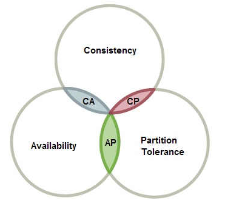

## CAP理论
### 名词解析
CAP理论作为分布式系统的基础理论,它描述的是一个分布式系统在以下三个特性中：
* **一致性（Consistency）**
    * 所有节点访问同一份最新的数据副本
* **可用性（Availability）**
    * 非故障的节点在合理的时间内返回合理的响应（不是错误或者超时的响应）。
* **分区容错性（Partition tolerance）**
    * 分布式系统出现网络分区（多个节点之前的网络本来是连通的，但是因为某些故障（比如部分节点网络出了问题）某些节点之间不连通了，整个网络就分成了几块区域）的时候，仍然能够对外提供服务。
最多满足其中的两个特性。 
      
也就是下图所描述的。分布式系统要么满足CA,要么CP，要么AP。无法同时满足CAP。


### CAP三者不可兼得，该如何取舍：

* **CA**: 优先保证一致性和可用性，放弃分区容错。 这也意味着放弃系统的扩展性，系统不再是分布式的，有违设计的初衷。
  * 当发生网络分区的时候，如果我们要继续服务，那么强一致性和可用性只能 2 选 1。也就是说当网络分区之后 P 是前提，决定了 P 之后才有 C 和 A 的选择。也就是说分区容错性（Partition tolerance）我们是必须要实现的。
  * **因此，分布式系统理论上不可能选择 CA 架构，只能选择 CP 或者 AP 架构。**
* **CP**: 优先保证一致性和分区容错性，放弃可用性。 在**数据一致性要求比较高的场合**(譬如:zookeeper,Hbase) 是比较常见的做法，一旦发生网络故障或者消息丢失，就会牺牲用户体验，等恢复之后用户才逐渐能访问。
* **AP**: 优先保证可用性和分区容错性，放弃一致性。 NoSQL中的Cassandra 就是这种架构。跟CP一样，放弃一致性不是说一致性就不保证了，而是逐渐的变得一致。

### 实际应用案例--注册中心

常见的可以作为注册中心的组件有：ZooKeeper、Eureka、Nacos...。 
* ZooKeeper 保证的是 CP。  
  任何时刻对 ZooKeeper 的读请求都能得到一致性的结果。
  但是， ZooKeeper 不保证每次请求的可用性，比如在 Leader 选举过程中或者半数以上的机器不可用的时候服务就是不可用的。
* Eureka 保证的则是 AP。  
  Eureka 在设计的时候就是优先保证 A （可用性）。  
  在 Eureka 中不存在什么 Leader 节点，每个节点都是一样的、平等的。   
  因此 Eureka 不会像 ZooKeeper 那样出现选举过程中或者半数以上的机器不可用的时候服务就是不可用的情况。  
  Eureka 保证即使大部分节点挂掉也不会影响正常提供服务，只要有一个节点是可用的就行了。只不过这个节点上的数据可能并不是最新的。   
* Nacos 不仅支持 CP 也支持 AP。

### 总结

在进行分布式系统设计和开发时，我们不应该仅仅局限在 CAP 问题上，还要关注系统的扩展性、可用性等等。  
如果系统发生“分区”，我们要考虑选择 CP 还是 AP。如果系统没有发生“分区”（网络连接通信正常）的话，我们要思考如何保证 CA。

## BASE理论
### BASE理论名词解析

* **基本可用（Basically Available）**  
  基本可用是指分布式系统在出现不可预知故障的时候，允许损失部分可用性。但是，这绝不等价于系统不可用。  
  什么叫允许损失部分可用性呢？ 
  * 响应时间上的损失: 正常情况下，处理用户请求需要 0.5s 返回结果，但是由于系统出现故障，处理用户请求的时间变为 3 s。 
  * 系统功能上的损失：正常情况下，用户可以使用系统的全部功能，但是由于系统访问量突然剧增，系统的部分非核心功能无法使用。
* **软状态（Soft State）**  
  软状态指允许系统中的数据存在中间状态（CAP 理论中的数据不一致），并认为该中间状态的存在不会影响系统的整体可用性，即允许系统在不同节点的数据副本之间进行数据同步的过程存在延时。
* **最终一致性（Eventually Consistent）**  
  虽然允许软状态，但是系统不可能一直是软状态，必须有个时间期限。在期限过后，应当保证所有副本保持数据一致性，从而达到数据的最终一致性。这个时间期限取决于网络延时、系统负载、数据复制方案设计等等因素。  
  实际工程实践中，最终一致性分为5种：
  * 因果一致性（Causal consistency）   
    如果节点A在更新完某个数据后通知了节点B，那么节点B之后对该数据的访问和修改都是基于A更新后的值。于此同时，和节点A无因果关系的节点C的数据访问则没有这样的限制。
  * 读己之所写（Read your writes）  
    节点A更新一个数据后，它自身总是能访问到自身更新过的最新值，而不会看到旧值。其实也算一种因果一致性。
  * 会话一致性（Session consistency）  
    系统能保证在同一个有效的会话中实现 “读己之所写” 的一致性，也就是说，执行更新操作之后，客户端能够在同一个会话中始终读取到该数据项的最新值。
  * 单调读一致性（Monotonic read consistency）  
    如果一个节点从系统中读取出一个数据项的某个值后，那么系统对于该节点后续的任何数据访问都不应该返回更旧的值。
  * 单调写一致性（Monotonic write consistency）  
    一个系统要能够保证来自同一个节点的写操作被顺序的执行。

  
### 系统一致性说明

* **强一致性**：系统写入了什么，读出来的就是什么。 
* **弱一致性**：不一定可以读取到最新写入的值，也不保证多少时间之后读取到的数据是最新的，只是会尽量保证某个时刻达到数据一致的状态。
* **最终一致性**：弱一致性的升级版，系统会保证在一定时间内达到数据一致的状态。

### BASE理论的核心思想

BASE 理论本质上是对 CAP 的延伸和补充，更具体地说，是对 CAP 中 AP 方案的一个补充。

```
既是无法做到强一致性（Strong consistency），但每个应用都可以根据自身的业务特点，采用适当的方式来使系统达到最终一致性（Eventual consistency）。
```

CAP的3选2实际是个伪命题，实际上，系统没有发生P(分区)的话，必须在C（一致性）和A（可用性）之间任选其一。  
分区的情况很少出现，CAP在大多时间能够同时满足C和A。  
对于分区存在或者探知其影响的情况下，需要提供一种预备策略做出处理：
* 探知分区的发生；
* 进入显示的分区模式，限制某些操作；
* 启动恢复过程，恢复数据一致性，补偿分区发生期间的错误。

因此，AP方案只是在系统发生分区的时候放弃一致性，而不是永远放弃一致性。  
在分区故障恢复后，系统应该达到最终一致性。这一点其实就是 BASE 理论延伸的地方。

## ACID本地事务四大特性

* **原子性（atomicity）**  
一个事务中的所有操作，不可分割，要么全部成功，要么全部失败；
* **一致性（consistency）**  
一个事务执行前与执行后数据的完整性必须保持一致；
* **隔离性（isolation）**  
一个事务的执行，不能被其他事务干扰，多并发时事务之间要相互隔离；
* **持久性（durability）**  
一个事务一旦被提交，它对数据库中数据的改变是永久性的。
  
## 幂等性设计

幂等（Idempotent）是一个数学与计算机学中的概念。f(n) = 1^n // 无论n等于多少，f(n)永远值等于1；在程序中，使用相同参数执行同一个方法，每一次执行结果都是相同的，即具有幂等性。

# 总结

* ACID 是数据库事务完整性的理论，
* CAP 是分布式系统设计理论，
* BASE 是 CAP 理论中 AP 方案的延伸。