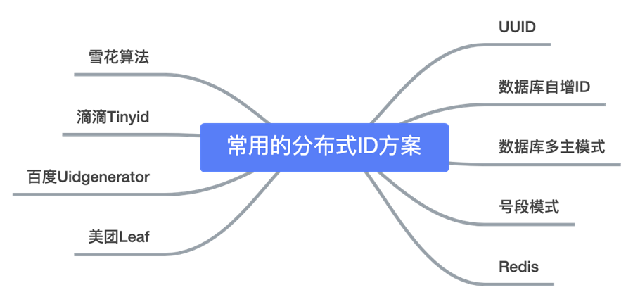
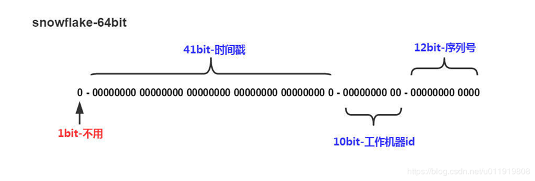

## 为什么需要分布式ID

在复杂分布式系统中，往往需要对大量的数据和消息进行唯一标识。比如数据量太大之后，往往需要对进行对数据进行分库分表，分库分表后需要有一个唯一 ID 来标识一条数据或消息，数据库的自增 ID 显然不能满足需求。

## 分布式ID生成方案



### 数据库自增ID
需要一个单独的Mysql实例，虽然可行，但是基于性能与可靠性来考虑的话都不够，业务系统每次需要一个ID时，都需要请求数据库获取，性能低，并且如果此数据库实例下线了，那么将影响所有的业务系统。

### 数据库多主模式
多个数据库主节点实例，单独设置步长防止产生相同ID，或者使用号段模式每个节点生产部分号段的ID

### 雪花算法
核心思想是：分布式ID固定是一个long型的数字，一个long型占8个字节，也就是64个bit，原始snowflake算法中对于bit的分配如下图：

* 第一个bit位是标识部分，在java中由于long的最高位是符号位，正数是0，负数是1，一般生成的ID为正数，所以固定为0。
* 时间戳部分占41bit，这个是毫秒级的时间，一般实现上不会存储当前的时间戳，而是时间戳的差值（当前时间-固定的开始时间），这样可以使产生的ID从更小值开始；41位的时间戳可以使用69年，(1L << 41) / (1000L * 60 * 60 * 24 * 365) = 69年
* 工作机器id占10bit，这里比较灵活，比如，可以使用前5位作为数据中心机房标识，后5位作为单机房机器标识，可以部署1024个节点。
* 序列号部分占12bit，支持同一毫秒内同一个节点可以生成4096个ID
* 备注： 工作机器ID可以通过某种改造自动生成。

### Redis自增ID
使用Redis来生成分布式ID，其实和利用Mysql自增ID类似，可以利用Redis中的incr命令来实现原子性的自增与返回，比如：
```shell
127.0.0.1:6379> set seq_id 1 // 初始化自增ID为1 OK 
127.0.0.1:6379> incr seq_id // 增加1，并返回 (integer) 2 
127.0.0.1:6379> incr seq_id // 增加1，并返回
备注：使用redis需要考虑持久化问题,RDB&AOF。
```
