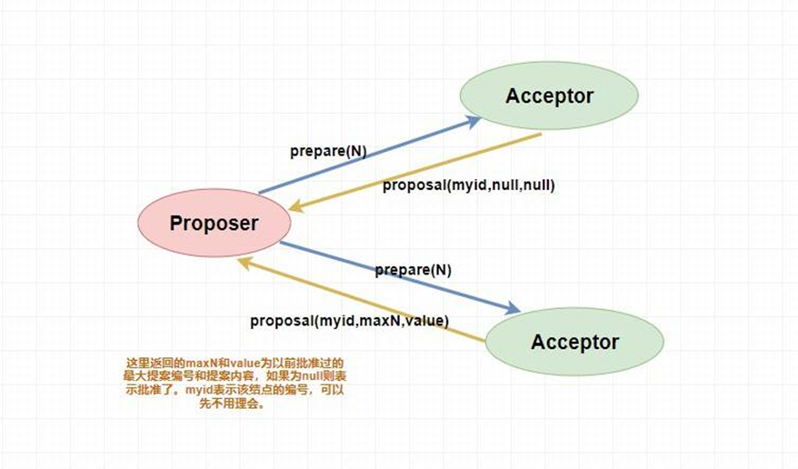
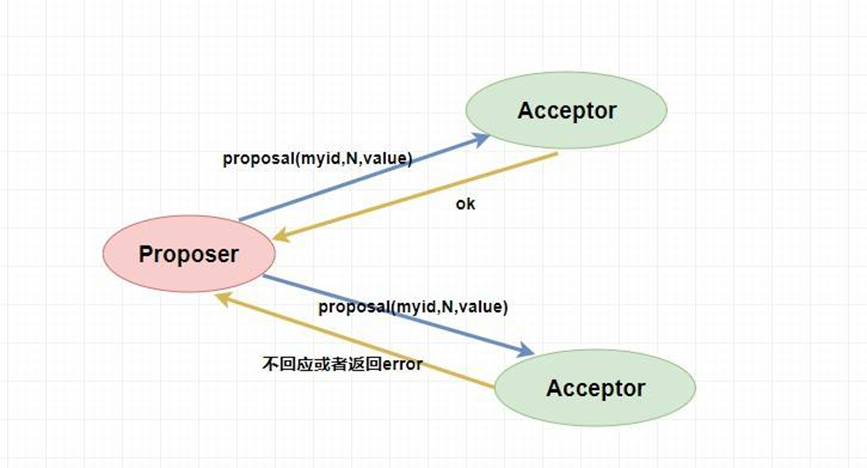
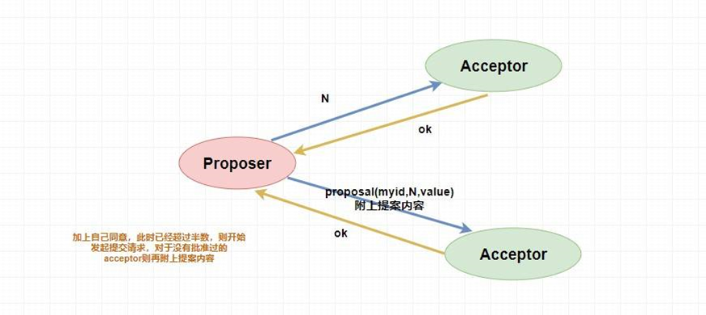
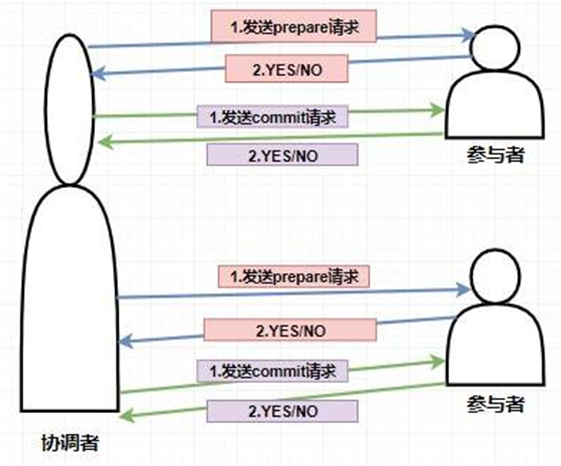
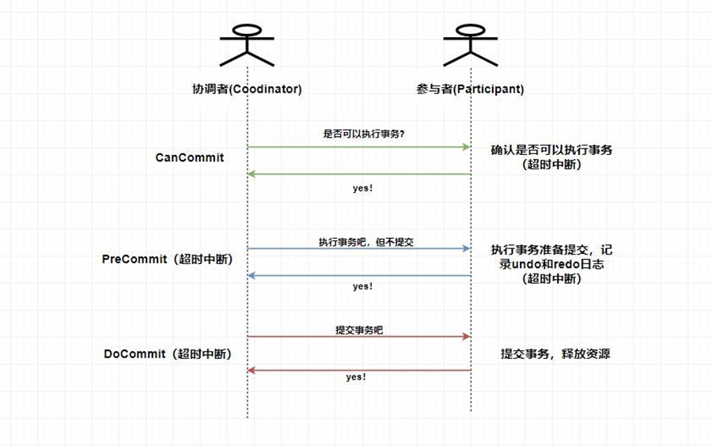
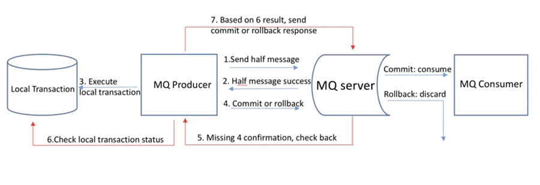

## 什么是分布式事务
分布式事务就是指事务的参与者、支持事务的服务器、资源服务器以及事务管理器分别位于不同的分布式系统的不同节点之上。

## 核心思想
简单的说，就是一次大的操作由不同的小操作组成，这些小的操作分布在不同的服务器上，且属于不同的应用，分布式事务需要保证这些小操作要么全部成功，要么全部失败。本质上来说，分布式事务就是为了保证不同数据库的数据一致性。

## 分布式系统一致性基础算法
### Paxos算法
Paxos 算法是基于消息传递且具有高度容错特性的一致性算法，是目前公认的解决分布式一致性问题最有效的算法之一，其解决的问题就是在分布式系统中如何就某个值（决议）达成一致 。

在 Paxos 中主要有三个角色，分别为 Proposer提案者、Acceptor表决者、Learner学习者。Paxos 算法和 2PC 一样，也有两个阶段，分别为 Prepare 和 accept 阶段。  
* prepare 阶段
    * Proposer提案者：负责提出 proposal，每个提案者在提出提案时都会首先获取到一个 具有全局唯一性的、递增的提案编号N，即在整个集群中是唯一的编号 N，然后将该编号赋予其要提出的提案，在第一阶段是只将提案编号发送给所有的表决者。  
    * Acceptor表决者：每个表决者在 accept 某提案后，会将该提案编号N记录在本地，这样每个表决者中保存的已经被 accept 的提案中会存在一个编号最大的提案，其编号假设为 maxN。每个表决者仅会 accept 编号大于自己本地 maxN 的提案，在批准提案时表决者会将以前接受过的最大编号的提案作为响应反馈给 Proposer。
    
* accept 阶段
  当一个提案被 Proposer 提出后，如果 Proposer 收到了超过半数的 Acceptor 的批准（Proposer 本身同意），那么此时 Proposer 会给所有的 Acceptor 发送真正的提案（你可以理解为第一阶段为试探），这个时候 Proposer 就会发送提案的内容和提案编号。  
  表决者收到提案请求后会再次比较本身已经批准过的最大提案编号和该提案编号，如果该提案编号 大于等于 已经批准过的最大提案编号，那么就 accept 该提案（此时执行提案内容但不提交），随后将情况返回给 Proposer 。如果不满足则不回应或者返回 NO 。
  
  当 Proposer 收到超过半数的 accept ，那么它这个时候会向所有的 acceptor 发送提案的提交请求。需要注意的是，因为上述仅仅是超过半数的 acceptor 批准执行了该提案内容，其他没有批准的并没有执行该提案内容，所以这个时候需要向未批准的 acceptor 发送提案内容和提案编号并让它无条件执行和提交，而对于前面已经批准过该提案的 acceptor 来说 仅仅需要发送该提案的编号 ，让 acceptor 执行提交就行了。  
  而如果 Proposer 如果没有收到超过半数的 accept 那么它将会将 递增 该 Proposal 的编号，然后 重新进入 Prepare 阶段 。
  
  而如果 Proposer 如果没有收到超过半数的 accept 那么它将会将 递增 该 Proposal 的编号，然后 重新进入 Prepare 阶段 。
  
#### Paxos算法的死循环问题
其实就有点类似于两个人吵架，小明说我是对的，小红说我才是对的，两个人据理力争的谁也不让谁🤬🤬。  
比如说，此时提案者 P1 提出一个方案 M1，完成了 Prepare 阶段的工作，这个时候 acceptor 则批准了 M1，但是此时提案者 P2 同时也提出了一个方案 M2，它也完成了 Prepare 阶段的工作。然后 P1 的方案已经不能在第二阶段被批准了（因为 acceptor 已经批准了比 M1 更大的 M2），所以 P1 自增方案变为 M3 重新进入 Prepare 阶段，然后 acceptor ，又批准了新的 M3 方案，它又不能批准 M2 了，这个时候 M2 又自增进入 Prepare 阶段。  
就这样无休无止的永远提案下去，这就是 paxos 算法的死循环问题。  
那么如何解决呢？很简单，人多了容易吵架，我现在 就允许一个能提案 就行了。

### Raft 算法

## 分布式事务解决方案
### XA规范/协议
X/Open组织（现在的Open Group）定义了一套DTP（Distributed Transaction Processing）分布式事务处理模型，主要包含以下四部分：
* AP（应用程序） 
* TM（事务管理器）：交易中间件
* RM（资源管理器）：数据库
* CRM（通信资源管理器）：消息中间件

**XA规范**则是DTP模型定义TM和RM之间通讯的接口规范。  

XA接口函数由数据库厂商提供。  
TM用它来通知数据库事务的开始、结束、提交、回滚。  
基于XA规范衍生出下面的二阶段提交（2PC）、三阶段提交（3PC）。  

XA规范包括两套函数，以xa_开头的及以ax_开头的。
以下的函数使事务管理器可以对资源管理器进行的操作：
* xa_open,xa_close：建立和关闭与资源管理器的连接。
* xa_start,xa_end：开始和结束一个本地事务。
* xa_prepare,xa_commit,xa_rollback：预提交、提交、回滚一个本地事务。
* xa_recover：回滚一个已进行预提交的事务。
* ax_开头的函数使资源管理器可以动态地在事务管理器中进行注册，并可以对XID(TRANSACTION IDS)进行操作。
* ax_reg,ax_unreg；允许一个资源管理器在一个TMS(TRANSACTION MANAGER SERVER)中动态注册或撤消注册。
XA的一些问题：
* 性能（阻塞、响应时间增加、死锁）；
* 依赖于独立的J2EE中间件，Weblogic、Jboss，后期轻量级的Atomikos、Narayana、Bitronix；
* 不是所有资源(RM)都支持XA协议；
  
####  JTA（Java Transaction API）
即Java的事务API，基于XA实现，也就是RM需要支持XA，所以也有JTA(XA)的说法，JTA仅定义了接口。主要包括javax.sql.XADataResource、javax.sql.XAConnection、javax.sql.XAException、javax.transaction.xa.XAResource、javax.transaction.Xid。 目下JTA的实现有几种形式：
  * J2EE容器提供的JTA实现（Weblogic、JBoss ）；
  * JOTM（Java Open Transaction Manager）、Atomikos，可独立于J2EE容器的环境下实现JTA；

#### 二阶段提交（2PC）
2PC就是分布式事务中将事务分为两步进行提交。基于数据库的XA协议完成事务本质上就是二阶段提交（XA、JTA/JTS）。
* 协调者（Coordinater）：事务管理器（TM）
* 参与者（participants）：资源管理器（RM）

* **准备阶段**：  
    * 协调者向参与者发送prepare信息，以询问参与者是否能够提交事务；
    * 参与者在收到prepare信息后，进行本地事务的预处理，但不提交。并根据处理结果返回，失败not commit or 成功ready ；

* **提交阶段**：  
    * 如协调者收到参与者的失败消息，则向每个参与者发送rollback消息进行回滚；
    * 所有参与者都返回ready，则向每个参与者发送提交commit消息，通知参与者进行事务提交；

两阶段提交的一些问题:
* 同步阻塞，事务执行过程中所有参与者都是阻塞型的，第三方参与者访问参与者占有的资源时会被阻塞；
* 单点故障，协调者一旦发生故障，参与者会被阻塞。尤其在提交阶段，所有参与者都处于锁定资源状态中，无法完成事务操作；（可以选择新的协调者，但无法解决参与者被阻塞的问题）；
* 数据不一致，提交阶段协调者向参与者发送commit信息，发生局部网络故障，会导致存在参与者未收到commit信息无法提交事务情况，导致出现数据不一致现象；

#### 三阶段提交（3PC）
相比于2PC，3PC把2PC的准备阶段再次进行拆分，并且3PC引入了参与者超时机制。
* canCommit：协调者询问参与者，是否具备执行事务的条件，参与者进行自身事务必要条件的检查；
* preCommit：协调者通知参与者进行事务的预提交；
* doCommit：协调者根据preCommit阶段参与者的反馈结果通知参与者是否进行事务提交或是进行事务回滚。
  

#### TCC事务补偿方案
TCC的核心思想就是校验、资源锁定、补偿，对每个操作（Try）都提供确认（Confirm）和取消（cancel）的操作，这样根据操作的结果，来确认是进行Confirm还是Cancel。
可以看出XA的两阶段提交是基于资源层面的，而TCC也是一种两阶段提交，但它是基于应用层面的。

* Try：主要负责对业务进行数据检查和资源预留，例如：对资金进行冻结；对状态更改为处理中；
* Confirm：确认执行业务的操作，例如：进行实际资金扣除；更改状态为最终结果；
* Cancel：取消执行业务的操作，例如：解冻资金；更改状态为未处理；

TCC存在的一些问题：
* 业务操作的是不同服务的Try来进行资源预留，每个Try都是独立完成本地事务，因此不会对资源一直加锁。
* 业务服务需要提供try、confirm、cancel，业务侵入性强，如不适用三方框架要做到对各阶段状态的感知，比较麻烦。
* Confirm/Cancel要做幂等性设计。

常用TCC框架：
tcc-transaction、ByteTCC、spring-cloud-rest-tcc、Himly

常见的微服务系统大部分接口调用是同步的，这时候使用TCC来保证一致性是比较合适的。

#### SAGA
Saga的核心是补偿，与TCC不同的是Saga不需要Try，而是直接进行confirm、cancel操作。  
* Confirm：依次按顺序依次执行资源操作，各个资源直接处理本地事务，如无问题，二阶段什么都不用做；
* Cancel：异常情况下需要调用的补偿事务（逆操作）来保证数据的一致性。

可以看出，Saga和TCC有些类似，都是补偿型事务

优势：
* 一阶段提交本地事务，无锁，高性能；
* 事件驱动模式，参与者可异步执行，高吞吐；
* 应用成本低，补偿服务易于实现；

劣势：
* 无法保证隔离性（脏写）

#### 事务消息
有一些情况，服务间调用时异步的，服务A将消息发送到MQ，服务B进行消息的消费。这时我们就需要用到可靠消息最终一致性来解决分布式事务问题

* 可靠消息：即这个消息一定是可靠的，并且最终一定需要被消费的。 
* 最终一致性：过程中数据存在一定时间内的不一致，但超过限定时间后，需要最终会保持一致。

保证以上两点的情况下，可以通过消息中间件（RocketMQ）来完成分布式事务处理，因为RocketMQ支持事务消息，可以方便的让我们进行分布式事务控制。

RocketMQ的事务消息的原理：  

half message：半消息，此时消息不能被consumer所发现和消费，需producer进行二次消息确认。

* producer发送half message给MQ Server；
* producer根据MQ Server应答结果判断half message是否发送成功；
* producer处理本地事务；
* producer发送最终确认消息commit / rollback；
* commit：consumer对消息可见并进行消费；
* rollback：discard抛弃消息，consumer无法进行消息消费；

如遇异常情况下step4最终确认消息为达到MQ Server，MQ Server会定期查询当前处于半消息状态下的消息，主动进行消息回查来询问producer该消息的最终状态；
* producer检查本地事务执行的最终结果；
* producer根据检查到的结果，再次提交确认消息，MQ Server仍然按照step4进行后续操作。

事务消息发送对应步骤1、2、3、4，事务消息回查对应步骤5、6、7。  
由以上步骤可以看出通过事务性消息的两步操作，避免了消息直接投递所产生一些问题。最终投递到MQ Server的消息，是真实可靠且必须被消费的。

## 总结
### 分布式事务设计权衡点
* 实现复杂度：事务模式与当前业务结合，实施成本是否过高；
* 业务侵入性：基于注解、XML、补偿逻辑； 
* TC/TM部署：独立部署、与应用部署；
* 性能：回滚概率、回滚所付出的代价、响应时间、吞吐量；
* 高可用：数据库、注册中心、配置中心
* 持久化：文件、数据库；
* 同步/异步：分布式事务执行过程中是否阻塞，还是非阻塞；

### 分布式事务解决方案对比
分布式系统中，基于不同的一致性需求产生了不同的分布式事务解决方案，追求强一致的两阶段提交、追求最终一致性的柔性事务和事务消息等等。  

我们综合对比下几种分布式事务解决方案：  
* 一致性保证：XA > TCC = SAGA > 事务消息  
* 业务友好性：XA > 事务消息 > SAGA > TCC  
* 性 能 损 耗：XA > TCC > SAGA = 事务消息
  
在柔性事务解决方案中，虽然SAGA和TCC看上去可以保证数据的最终一致性，但分布式系统的生产环境复杂多变，某些情况是可以导致柔性事务机制失效的，所以无论使用那种方案，都需要最终的兜底策略，人工校验，修复数据。

### 分布式事务框架Seata

阿里开源的Seata 是一款分布式事务解决方案，提供了 AT、TCC、SAGA 和 XA 事务模式。

Seata架构的亮点主要有几个:
* 应用层基于SQL解析实现了自动补偿，从而最大程度的降低业务侵入性；
* 将分布式事务中TC（事务协调者）独立部署，负责事务的注册、回滚（支持多种注册中心形式以及本地文件形式）；
* 通过全局锁实现了写隔离与读隔离。