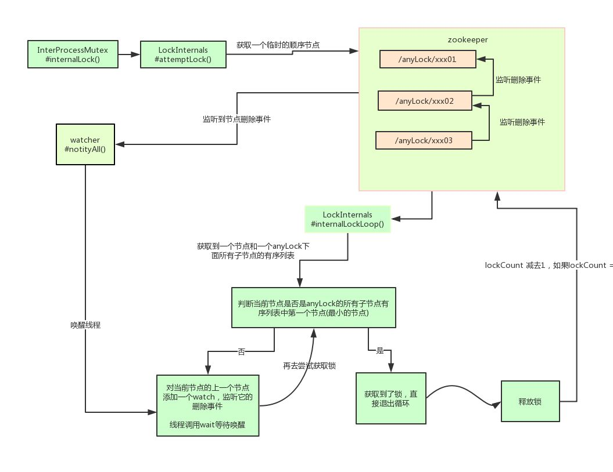

## 什么是分布式锁 

* 分布式模型下，数据只有一份，需要锁技术控制某一时刻修改数据的进程数。 
* 不仅需要保证进程可见，还需要考虑进程与锁的网络问题 
* 可以将标记存在内存，但是内存不是进程分配而是公共内存（redis、zk）,保证标记互斥。

## Java分布式锁需求
* 同一个方法在同一时间只能被一台机器上一个线程执行。
* 可重入（避免死锁）
* 阻塞锁（业务需求） 
* 公平锁（业务需求） 
* 高可用、高性能获取/释放锁

## Java分布式锁解决方案
### 基于数据库

基于表主键唯一做分布式锁

### 基于redis

#### 基于 redis 的 SETNX()、EXPIRE() 方法做分布式锁

使用步骤：
* setnx(lockkey, 1) 返回1，占位成功
* expire()对lockkey设置超时时间，避免死锁
* 执行完业务后，delete命令删除key

在 expire() 命令执行成功前，发生了宕机的现象，那么就依然会出现死锁的问题。

#### 基于 redis 的 setnx()、get() 和 getset() 方法来实现分布式锁。

使用步骤

* setnx(lockkey, 当前时间+过期超时时间)，如果返回 1，则获取锁成功；如果返回 0 则没有获取到锁，转向 2。
* get(lockkey) 获取值 oldExpireTime ，并将这个 value 值与当前的系统时间进行比较，如果小于当前系统时间，则认为这个锁已经超时，可以允许别的请求重新获取，转向 3。
* 计算 newExpireTime = 当前时间+过期超时时间，然后 getset(lockkey, newExpireTime) 会返回当前 lockkey 的值currentExpireTime。
* 判断 currentExpireTime 与 oldExpireTime 是否相等，如果相等，说明当前 getset 设置成功，获取到了锁。如果不相等，说明这个锁又被别的请求获取走了，那么当前请求可以直接返回失败，或者继续重试。
* 在获取到锁之后，当前线程可以开始自己的业务处理，当处理完毕后，比较自己的处理时间和对于锁设置的超时时间，如果小于锁设置的超时时间，则直接执行 delete 释放锁；如果大于锁设置的超时时间，则不需要再锁进行处理。

#### 分布式锁Redlock
解决问题：  
解决redis分布式锁的单点故障问题

使用步骤：
* 获取当前时间（毫秒数）。
* 按顺序依次向N个Redis节点执行获取锁的操作。这个获取操作跟前面基于单Redis节点的获取锁的过程相同，包含随机字符串my_random_value，也包含过期时间(比如PX 30000，即锁的有效时间)。为了保证在某个Redis节点不可用的时候算法能够继续运行，这个获取锁的操作还有一个超时时间(time out)，它要远小于锁的有效时间（几十毫秒量级）。客户端在向某个Redis节点获取锁失败以后，应该立即尝试下一个Redis节点。这里的失败，应该包含任何类型的失败，比如该Redis节点不可用，或者该Redis节点上的锁已经被其它客户端持有（注：Redlock原文中这里只提到了Redis节点不可用的情况，但也应该包含其它的失败情况）。
* 计算整个获取锁的过程总共消耗了多长时间，计算方法是用当前时间减去第1步记录的时间。如果客户端从大多数Redis节点（>= N/2+1）成功获取到了锁，并且获取锁总共消耗的时间没有超过锁的有效时间(lock validity time)，那么这时客户端才认为最终获取锁成功；否则，认为最终获取锁失败。
* 如果最终获取锁成功了，那么这个锁的有效时间应该重新计算，它等于最初的锁的有效时间减去第3步计算出来的获取锁消耗的时间。
* 如果最终获取锁失败了（可能由于获取到锁的Redis节点个数少于N/2+1，或者整个获取锁的过程消耗的时间超过了锁的最初有效时间），那么客户端应该立即向所有Redis节点发起释放锁的操作（即前面介绍的Redis Lua脚本）。

#### 基于 REDISSON 做分布式锁

redis 官方的分布式锁组件，解决超时时间设置不合理问题。每获得一个锁时，只设置一个很短的超时时间，同时起一个线程在每次快要到超时时间时去刷新锁的超时时间。在释放锁的同时结束这个线程。

### zookeeper实现分布式锁
其实基于ZooKeeper，就是使用它的临时有序节点来实现的分布式锁。

当某客户端要进行逻辑的加锁时，就在zookeeper上的某个指定节点的目录下，去生成一个唯一的临时有序节点， 然后判断自己是否是这些有序节点中序号最小的一个。
* 如果是，则算是获取了锁。
* 如果不是，则说明没有获取到锁，那么就需要在序列中找到比自己小的那个节点，并对其调用exist()方法，对其注册事件监听，当监听到这个节点被删除了，那就再去判断一次自己当初创建的节点是否变成了序列中最小的。
    * 如果是，则获取锁，如果不是，则重复上述步骤。

当释放锁的时候，只需将这个临时节点删除即可。

## redis分布式锁和zookeeper分布式锁的区别
### 优缺点对比

对于redis的分布式锁而言：

* 它获取锁的方式简单粗暴，获取不到锁直接不断尝试获取锁，比较消耗性能。

* redis的设计定位决定了它的数据并不是强一致性的，在某些极端情况下，可能会出现问题。锁的模型不够健壮

    * 即便使用redlock算法来实现，在某些复杂场景下，也无法保证其实现100%没有问题，关于redlock的讨论可以看How to do distributed locking
    
但是另一方面使用redis实现分布式锁在很多企业中非常常见，而且大部分情况下都不会遇到所谓的“极端复杂场景”

所以使用redis作为分布式锁也不失为一种好的方案，最重要的一点是redis的性能很高，可以支撑高并发的获取、释放锁操作。

对于zk分布式锁而言:

* zookeeper天生设计定位就是分布式协调，强一致性。锁的模型健壮、简单易用、适合做分布式锁。

* 如果获取不到锁，只需要添加一个监听器就可以了，不用一直轮询，性能消耗较小。

但是zk也有其缺点：如果有较多的客户端频繁的申请加锁、释放锁，对于zk集群的压力会比较大。

### 技术选型
就个人而言的话，我**比较推崇zk实现的锁**：

因为redis是有可能存在隐患的，可能会导致数据不对的情况。但是，怎么选用要看具体在公司的场景了。

如果公司里面有zk集群条件，优先选用zk实现，但是如果说公司里面只有redis集群，没有条件搭建zk集群。

那么其实用redis来实现也可以，另外还可能是系统设计者考虑到了系统已经有redis，但是又不希望再次引入一些外部依赖的情况下，可以选用redis。