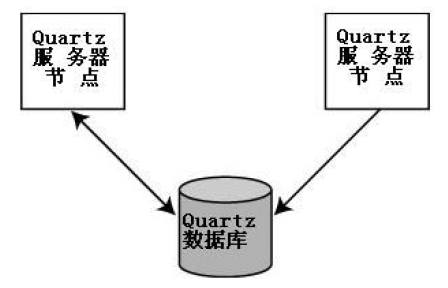
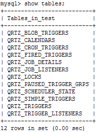
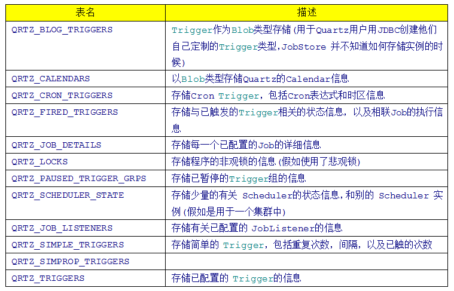

### Quartz集群架构
一个Quartz集群中的每个节点是一个独立的Quartz应用，它又管理着其他的节点。这就意味着你必须对每个节点分别启动或停止。Quartz集群中，独立的Quartz节点并不与另一其的节点或是管理节点通信，而是通过相同的数据库表来感知到另一Quartz应用的，如图2.1所示。

### Quartz集群相关数据库表
因为Quartz集群依赖于数据库，所以必须首先创建Quartz数据库表，Quartz发布包中包括了所有被支持的数据库平台的SQL脚本。这些SQL脚本存放于<quartz_home>/docs/dbTables 目录下。

这里采用的Quartz 1.8.4版本，总共12张表，不同版本，表个数可能不同。数据库为mysql，用tables_mysql.sql创建数据库表。

Quartz 1.8.4在mysql数据库中生成的表：

Quartz数据表简介：

### Quartz Scheduler在集群中的启动流程
Quartz Scheduler自身是察觉不到被集群的，只有配置给Scheduler的JDBC JobStore才知道。  
当Quartz Scheduler启动时，它调用JobStore的schedulerStarted()方法，它告诉JobStore Scheduler已经启动了。  
schedulerStarted() 方法是在JobStoreSupport类中实现的。  
JobStoreSupport类会根据**quartz.properties**文件中的设置来确定Scheduler实例是否参与到集群中。  
假如配置了集群，一个新的ClusterManager类的实例就被创建、初始化并启动。  
ClusterManager是在JobStoreSupport类中的一个内嵌类，继承了java.lang.Thread，它会定期运行，并对Scheduler实例执行检入的功能。  
Scheduler也要查看是否有任何一个别的集群节点失败了。检入操作执行周期在quartz.properties中配置。

#### 侦测失败的Scheduler节点
当一个Scheduler实例执行检入时，它会查看是否有其他的Scheduler实例在到达他们所预期的时间还未检入。这是通过检查SCHEDULER_STATE表中Scheduler记录在LAST_CHEDK_TIME列的值是否早于org.quartz.jobStore.clusterCheckinInterval来确定的。如果一个或多个节点到了预定时间还没有检入，那么运行中的Scheduler就假定它(们) 失败了。

#### 从故障实例中恢复Job
当一个Sheduler实例在执行某个Job时失败了，有可能由另一正常工作的Scheduler实例接过这个Job重新运行。要实现这种行为，配置给JobDetail对象的Job可恢复属性必须设置为true（job.setRequestsRecovery(true)）。如果可恢复属性被设置为false(默认为false)，当某个Scheduler在运行该job失败时，它将不会重新运行；而是由另一个Scheduler实例在下一次触发时间触发。Scheduler实例出现故障后多快能被侦测到取决于每个Scheduler的检入间隔（即2.3中提到的org.quartz.jobStore.clusterCheckinInterval）。

### 注意事项
#### 时间同步问题
Quartz实际并不关心你是在相同还是不同的机器上运行节点。当集群放置在不同的机器上时，称之为水平集群。节点跑在同一台机器上时，称之为垂直集群。对于垂直集群，存在着单点故障的问题。这对高可用性的应用来说是无法接受的，因为一旦机器崩溃了，所有的节点也就被终止了。对于水平集群，存在着时间同步问题。

节点用时间戳来通知其他实例它自己的最后检入时间。假如节点的时钟被设置为将来的时间，那么运行中的Scheduler将再也意识不到那个结点已经宕掉了。另一方面，如果某个节点的时钟被设置为过去的时间，也许另一节点就会认定那个节点已宕掉并试图接过它的Job重运行。最简单的同步计算机时钟的方式是使用某一个Internet时间服务器(Internet Time Server ITS)。

#### 节点争抢Job问题
因为Quartz使用了一个随机的负载均衡算法， Job以随机的方式由不同的实例执行。Quartz官网上提到当前，还不存在一个方法来指派(钉住) 一个 Job 到集群中特定的节点。

#### 从集群获取Job列表问题
当前，如果不直接进到数据库查询的话，还没有一个简单的方式来得到集群中所有正在执行的Job列表。请求一个Scheduler实例，将只能得到在那个实例上正运行Job的列表。Quartz官网建议可以通过写一些访问数据库JDBC代码来从相应的表中获取全部的Job信息。