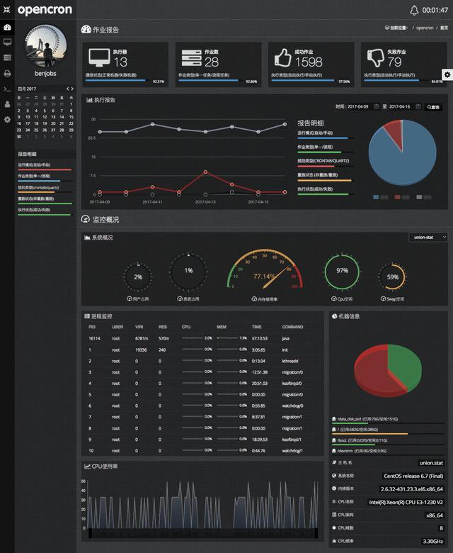
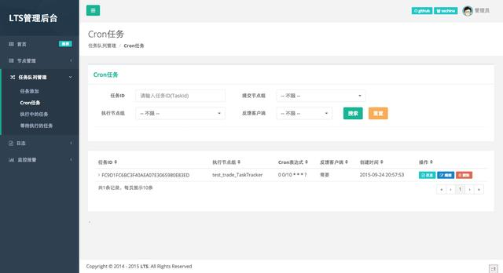
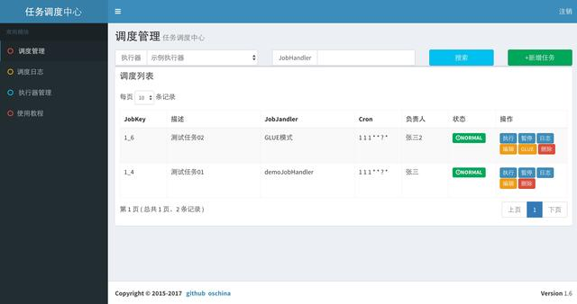
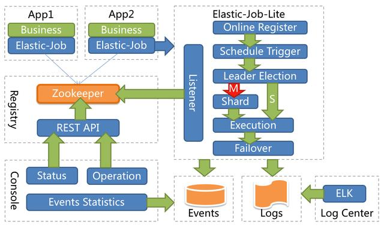
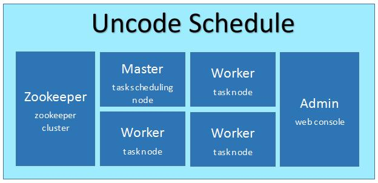
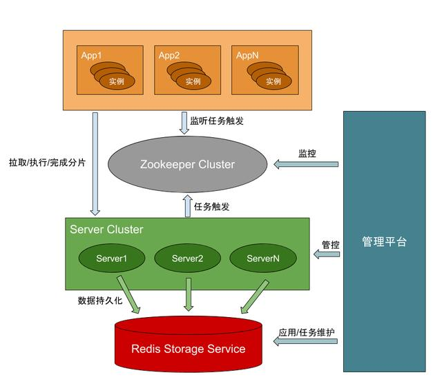

### opencron
opencron 是一个功能完善且通用的开源定时任务调度系统，拥有先进可靠的自动化任务管理调度功能，提供可操作的 web 图形化管理满足多种场景下各种复杂的定时任务调度，同时集成了 linux 实时监控、webssh 等功能特性。

### LTS
LTS，light-task-scheduler，是一款分布式任务调度框架, 支持实时任务、定时任务和 Cron 任务。有较好的伸缩性和扩展性，提供对 Spring 的支持（包括 Xml 和注解），提供业务日志记录器。支持节点监控、任务执行监、JVM 监控，支持动态提交、更改、停止任务。

### XXL-JOB
XXL-JOB 是一个轻量级分布式任务调度框架，支持通过 Web 页面对任务进行 CRUD 操作，支持动态修改任务状态、暂停/恢复任务，以及终止运行中任务，支持在线配置调度任务入参和在线查看调度结果。

### Elastic-Job
Elastic-Job 是一个分布式调度解决方案，由两个相互独立的子项目 Elastic-Job-Lite 和 Elastic-Job-Cloud 组成。定位为轻量级无中心化解决方案，使用 jar 包的形式提供分布式任务的协调服务。支持分布式调度协调、弹性扩容缩容、失效转移、错过执行作业重触发、并行调度、自诊断和修复等等功能特性。

### Uncode-Schedule
Uncode-Schedule 是基于 ZooKeeper + Quartz / spring task 的分布式任务调度组件，确保每个任务在集群中不同节点上不重复的执行。支持动态添加和删除任务，支持添加 ip 黑名单，过滤不需要执行任务的节点。

### Antares
Antares 是一款基于 Quartz 机制的分布式任务调度管理平台，内部重写执行逻辑，一个任务仅会被服务器集群中的某个节点调度。用户可通过对任务预分片，有效提升任务执行效率；也可通过控制台 antares-tower 对任务进行基本操作，如触发，暂停，监控等。
