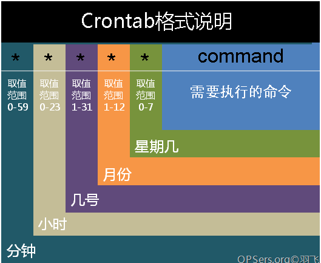
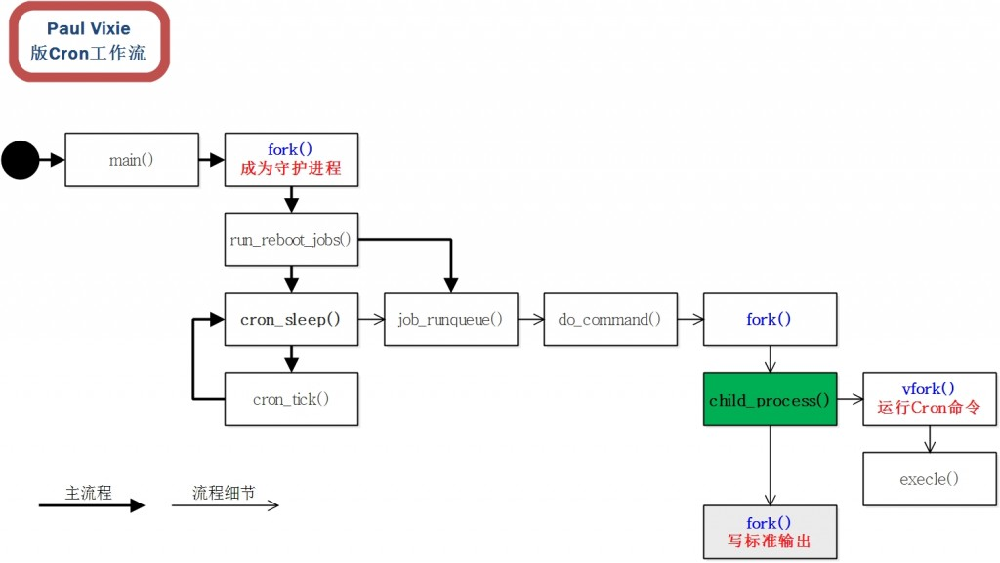
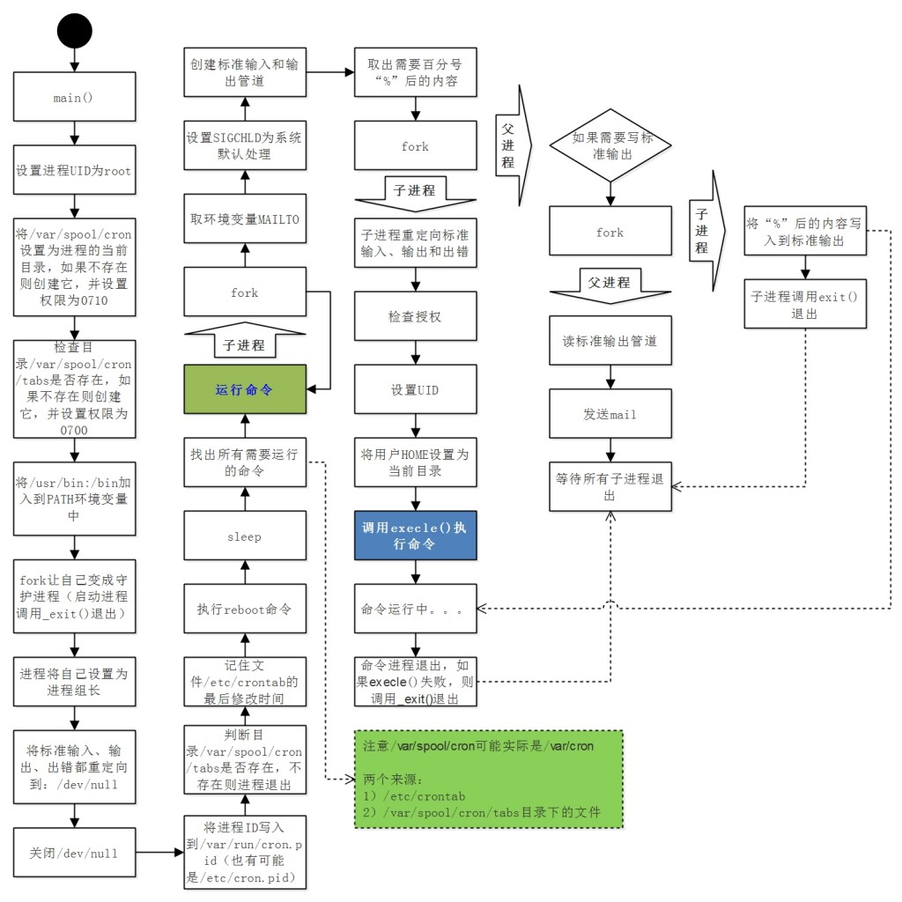

实现linux定时任务有：cron、anacron、at,使用最多的是cron任务

## 名词解释
* cron--服务名；
* crond--linux下用来周期性的执行某种任务或等待处理某些事件的一个守护进程，与windows下的计划任务类似；
* crontab--是定制好的计划任务表，一个设置cron的工具

## 软件包安装
要使用cron服务，先要安装vixie-cron软件包和crontabs软件包，两个软件包作用如下：

* vixie-cron软件包是cron的主程序。
  * 查看是否安装了cron软件包: rpm -qa|grep vixie-cron
* crontabs软件包是用来安装、卸装、或列举用来驱动 cron 守护进程的表格的程序。
  * 查看是否安装了crontabs软件包:rpm -qa|grep crontabs

如果没有安装，则执行如下命令安装软件包(软件包必须存在)
```shell
rpm -ivh vixie-cron-4.1-54.FC5*
rpm -ivh crontabs*
```

如果本地没有安装包，在能够连网的情况下可以在线安装
```shell
yum install vixie-cron
yum install crontabs
```

### 查看crond服务是否运行
```shell
pgrep crond 或 
/sbin/service crond status 或 
ps -elf|grep crond|grep -v "grep"
```


### crond服务操作命令
```shell
/sbin/service crond start //启动服务  
/sbin/service crond stop //关闭服务  
/sbin/service crond restart //重启服务  
/sbin/service crond reload //重新载入配置
```

## 配置定时任务
cron有两个配置文件，一个是一个全局配置文件（/etc/crontab），是针对系统任务的；一组是crontab命令生成的配置文件（/var/spool/cron下的文件），是针对某个用户的.定时任务配置到任意一个中都可以。

查看全局配置文件配置情况: ```cat /etc/crontab```

```shell
　---------------------------------------------
　　SHELL=/bin/bash
　　PATH=/sbin:/bin:/usr/sbin:/usr/bin
　　MAILTO=root
　　HOME=/

　　# run-parts
　　01 * * * * root run-parts /etc/cron.hourly
　　02 4 * * * root run-parts /etc/cron.daily
　　22 4 * * 0 root run-parts /etc/cron.weekly
　　42 4 1 * * root run-parts /etc/cron.monthly
　　----------------------------------------------
```

查看用户下的定时任务:crontab -l或cat /var/spool/cron/用户名

### crontab任务配置基本格式


```
-----------------------------------------------------------------------
*   *　 *　 *　 *　　command
分钟(0-59)　小时(0-23)　日期(1-31)　月份(1-12)　星期(0-6,0代表星期天)　 命令
第1列表示分钟1～59 每分钟用*或者 */1表示
第2列表示小时1～23（0表示0点）
第3列表示日期1～31
第4列表示月份1～12
第5列标识号星期0～6（0表示星期天）
第6列要运行的命令

-----------------------------------------------------------------------
在以上任何值中，星号（*）可以用来代表所有有效的值。譬如，月份值中的星号意味着在满足其它制约条件后每月都执行该命令。
整数间的短线（-）指定一个整数范围。譬如，1-4 意味着整数 1、2、3、4。
用逗号（,）隔开的一系列值指定一个列表。譬如，3, 4, 6, 8 标明这四个指定的整数。
正斜线（/）可以用来指定间隔频率。在范围后加上 /<integer> 意味着在范围内可以跳过 integer。譬如，0-59/2 可以用来在分钟字段定义每两分钟。间隔频率值还可以和星号一起使用。例如，*/3 的值可以用在月份字段中表示每三个月运行一次任务。
开头为井号（#）的行是注释，不会被处理
-----------------------------------------------------------------------
```

<details>
<summary>使用实例</summary>
<pre><code>实例1：每1分钟执行一次command
命令：* * * * * command

实例2：每小时的第3和第15分钟执行
命令：3,15 * * * * command

实例3：在上午8点到11点的第3和第15分钟执行
命令：3,15 8-11 * * * command

实例4：每隔两天的上午8点到11点的第3和第15分钟执行
命令：3,15 8-11 */2 * * command

实例5：每个星期一的上午8点到11点的第3和第15分钟执行
命令：3,15 8-11 * * 1 command

实例6：每晚的21:30重启smb
命令：30 21 * * * /etc/init.d/smb restart

实例7：每月1、10、22日的4 : 45重启smb
命令：45 4 1,10,22 * * /etc/init.d/smb restart

实例8：每周六、周日的1 : 10重启smb
命令：10 1 * * 6,0 /etc/init.d/smb restart

实例9：每天18 : 00至23 : 00之间每隔30分钟重启smb
命令：0,30 18-23 * * * /etc/init.d/smb restart

实例10：每星期六的晚上11 : 00 pm重启smb
命令：0 23 * * 6 /etc/init.d/smb restart

实例11：每一小时重启smb
命令：* */1 * * * /etc/init.d/smb restart

实例12：晚上11点到早上7点之间，每隔一小时重启smb
命令：* 23-7/1 * * * /etc/init.d/smb restart

实例13：每月的4号与每周一到周三的11点重启smb
命令：0 11 4 * mon-wed /etc/init.d/smb restart

实例14：一月一号的4点重启smb
命令：0 4 1 jan * /etc/init.d/smb restart

实例15：每小时执行/etc/cron.hourly目录内的脚本
命令：01   *   *   *   *     root run-parts /etc/cron.hourly
说明：
run-parts这个参数了，如果去掉这个参数的话，后面就可以写要运行的某个脚本名，而不是目录名了</code></pre>
</details>

## cron实现原理
### 基本原理图解
fork 进程 + sleep 轮询

Cron每分钟做一次检查，看看哪个命令可执行。

从上图可以看到，有4次fork，这4次fork分别是：
- 第一个fork，让Cron自己成为Daemon进程，即成为守护进程；
- 第二个fork，当Cron检查到有命令需要执行时被创建，但注意它并不执行命令，执行命令由它的子进程来做；
- 第三个fork，有些版本调用的是vfork，但有些版本却是fork，它是负责执行Cron命令的进程，即会调用execle()的进程；
- 第四个fork不是必须的，只有为Cron命令配置了标准输入才会用：  
  ```*/1 * * * * /tmp/X/x%1234567890```  
  像上面有个百分符“%”，后面跟一串，则会有第四个fork，它的作用是将“%”后面的内容作为标准输入传递给第三个fork出来的进程。

注意fork出来的进程没有忽略(ignore)管道信号(SIGPIPE)，所以如果遇到SIGPIPE，则会导致进程无声无息的退出，比如标准输主输出重定向管道的读端被关闭了，写时就会触发SIGPIPE。

实践中，可能会遇到child_process()在做上述所说的第三个fork前因SIGPIPE信号退出，导致难以理解的问题。其中一个现象 是：Cron命令被执行了若干次，但之后再也不执行了，原因在于第二个fork出来的进程因SIGPIPE退出了，导致没有进行第三个fork，因此 Cron命令没有被调用(总是由execle()调用)。



### 一个诡异的问题
你有可能遇到这样的情况，假设在cron中有如下一条配置：
```shell
*/1 * * * * echo hello >> /tmp/hello.txt
```
观察到它正常运行几次后，就不再运行了，或者一次也不能，但确认无其它问题，因此十分诡异。

这个问题的原因，有可能是因为有共享库Hook了cron，共享库代码触发了SIGPIPE，导致了第二个fork出的进程退出，没来得及执行vfork。

fork出来的子进程，没有对SIGPIPE进行任何处理，默认行为是悄悄退出进程。通过修改/etc/ld.so.preload，可以将共享库注入到非关联的进程中，可通过ldd观察到这种依赖，使用LD_PRELOAD也可以达到同样的效果。

### crontab编辑后cron异常
使用crontab编辑后，cron卡住不动(不是指进程卡住了，而是指命令没有被调用)，原因可能是因为“tcb table full”，最简单的办法是重启cron。

建议避免写下面这样的嵌套命令语句，它有可能导致cron不能正常工作：
```shell
 */1 * * * * echo "`date +%H:%M:%S` hello" >> /tmp/hello.txt
```
“echo”中嵌套了“date”，可以改成脚本调用，或者不嵌套命令，如：
```shell
 */1 * * * * echo "hello" >> /tmp/hello.txt
```
一个现象是有一个cron子进程(如下述的14786)不退出了：
```shell
# ps -ef|grep cron

root     10325     1  0 15:08 ?        00:00:00 /usr/sbin/cron
root     14786 10325  0 15:13 ?        00:00:00 /usr/sbin/cron
```
gdb看到的调用栈为：
```shell
#0  0xffffe410 in __kernel_vsyscall ()
#1  0xb7e88a63 in __read_nocancel () from /lib/libc.so.6
#2  0xb7e38e38 in _IO_file_read_internal () from /lib/libc.so.6
#3  0xb7e3a0bb in _IO_new_file_underflow () from /lib/libc.so.6
#4  0xb7e3a7fb in _IO_default_uflow_internal () from /lib/libc.so.6
#5  0xb7e3bb2d in __uflow () from /lib/libc.so.6
#6  0xb7e35b7b in getc () from /lib/libc.so.6
#7  0x80005d73 in ?? () from /usr/sbin/cron
```
strace看到如下：
```shell
# strace -f -p 14786

Process 14786 attached
read(7,
```
借助lsof可以看到：
```shell
cron    14786 root    7r  FIFO        0,6         117960708 pipe
```
为一个管道，read()挂住的原因可能是因为管道另一端所在进程调用_exit()退出而不是调用exit()退出。

这个时候只有人工kill这个挂起的cron子进程。