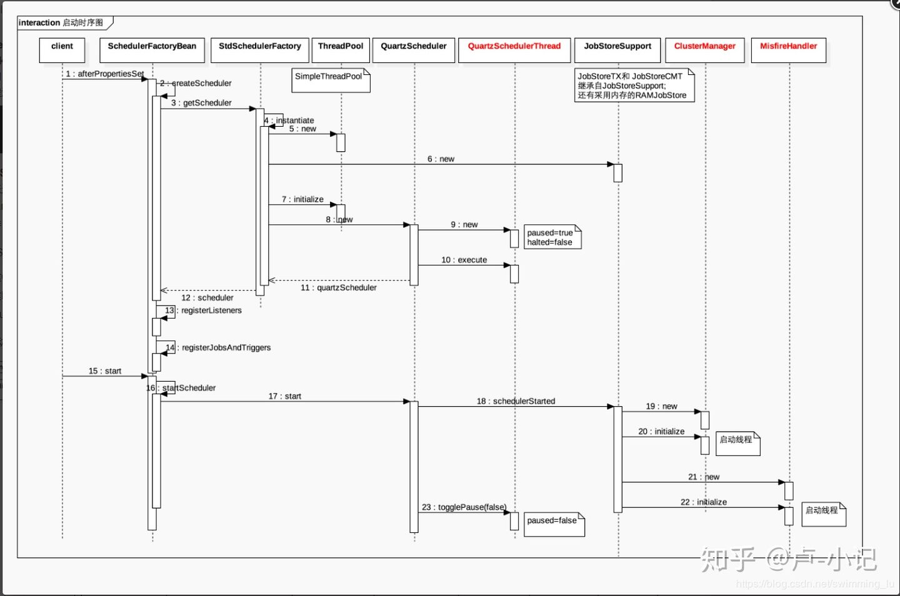
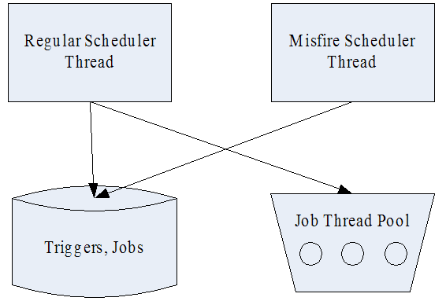
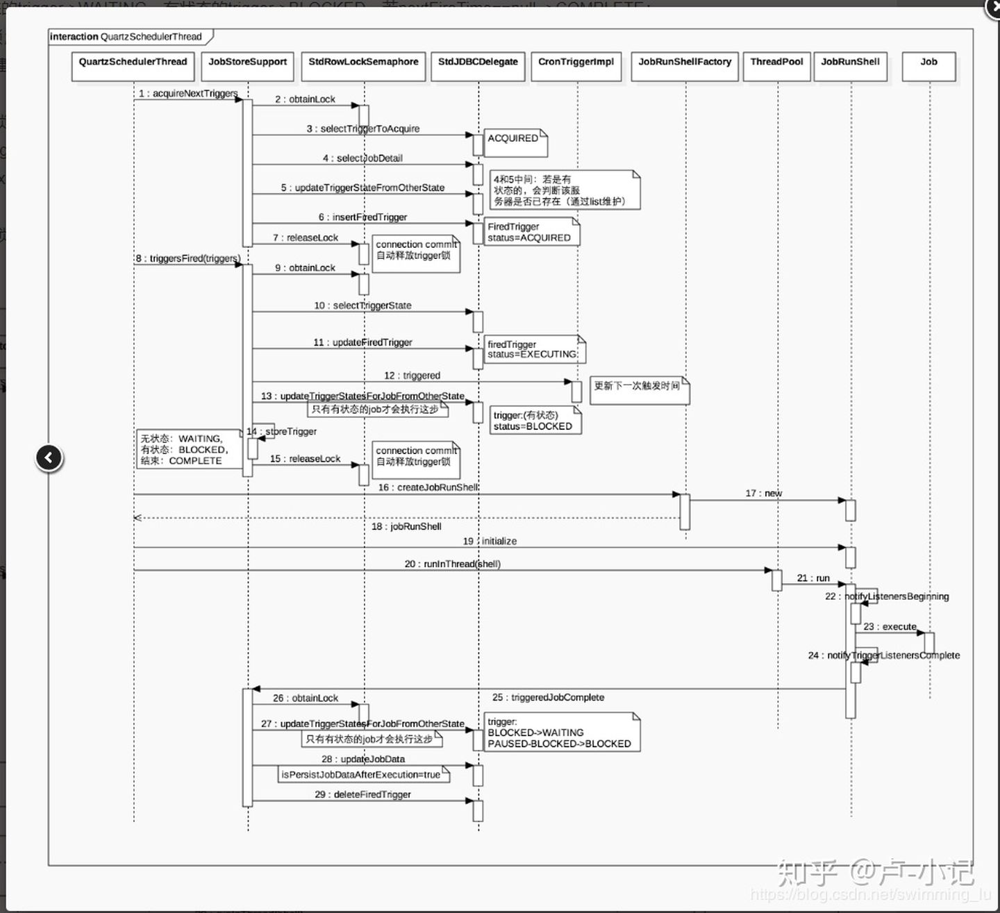
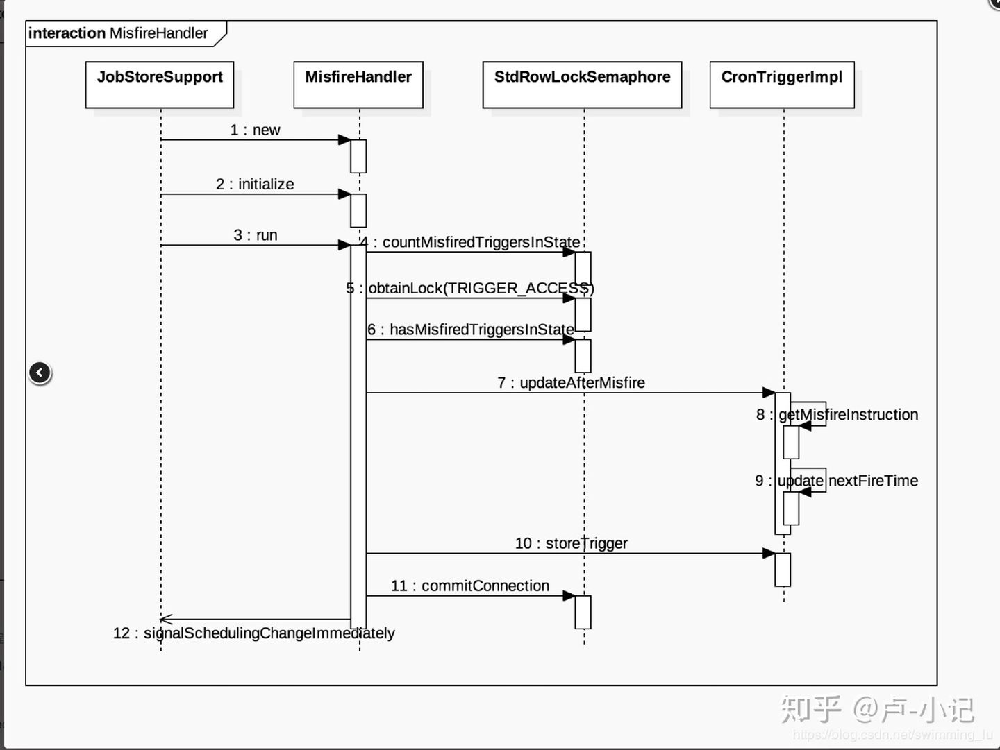

## Quartz可以用来做什么？
在某一个有规律的时间点干某件事。  
并且时间的触发的条件可以非常复杂（比如每月最后一个工作日的17:50），复杂到需要一个专门的框架来干这个事。  
Quartz就是来干这样的事，你给它一个触发条件的定义，它负责到了时间点，触发相应的Job起来干活。

## Quartz使用总结
### 从简单示例看Quartz核心设计
#### 一个简单的Demo程序
这里面的所有例子都是基于Quartz 2.2.1
<details>
<summary>点击展开/收起</summary>

```java
package com.test.quartz;

import static org.quartz.DateBuilder.newDate;
import static org.quartz.JobBuilder.newJob;
import static org.quartz.SimpleScheduleBuilder.simpleSchedule;
import static org.quartz.TriggerBuilder.newTrigger;

import java.util.GregorianCalendar;

import org.quartz.JobDetail;
import org.quartz.Scheduler;
import org.quartz.Trigger;
import org.quartz.impl.StdSchedulerFactory;
import org.quartz.impl.calendar.AnnualCalendar;

public class QuartzTest {

    public static void main(String[] args) {
        try {
            //创建scheduler
            Scheduler scheduler = StdSchedulerFactory.getDefaultScheduler();

            //定义一个Trigger
            Trigger trigger = newTrigger().withIdentity("trigger1", "group1") //定义name/group
                .startNow()//一旦加入scheduler，立即生效
                .withSchedule(simpleSchedule() //使用SimpleTrigger
                    .withIntervalInSeconds(1) //每隔一秒执行一次
                    .repeatForever()) //一直执行，奔腾到老不停歇
                .build();

            //定义一个JobDetail
            JobDetail job = newJob(HelloQuartz.class) //定义Job类为HelloQuartz类，这是真正的执行逻辑所在
                .withIdentity("job1", "group1") //定义name/group
                .usingJobData("name", "quartz") //定义属性
                .build();

            //加入这个调度
            scheduler.scheduleJob(job, trigger);

            //启动之
            scheduler.start();

            //运行一段时间后关闭
            Thread.sleep(10000);
            scheduler.shutdown(true);
        } catch (Exception e) {
            e.printStackTrace();
        }
    }
}
```
```java
package com.test.quartz;

import java.util.Date;

import org.quartz.DisallowConcurrentExecution;
import org.quartz.Job;
import org.quartz.JobDetail;
import org.quartz.JobExecutionContext;
import org.quartz.JobExecutionException;

public class HelloQuartz implements Job {
    public void execute(JobExecutionContext context) throws JobExecutionException {
        JobDetail detail = context.getJobDetail();
        String name = detail.getJobDataMap().getString("name");
        System.out.println("say hello to " + name + " at " + new Date());
    }
}
```
</details>

#### Quartz核心元素：

* Scheduler：调度器。  
  负责整个定时系统的调度，内部通过线程池进行调度。

* Trigger： 定义触发的条件。  
  主要有四种类型：SimpleTrigger、CronTrigger、DataIntervalTrigger、NthIncludedTrigger，在项目中常用的为：SimpleTrigger和CronTrigger。。

* JobDetail：定义任务数据。  
  记录Job的名字、组及任务执行的具体类和任务执行所需要的参数
* Job： 真正的执行逻辑。  
  
为什么设计成JobDetail + Job，不直接使用Job？  
这是因为任务是有可能并发执行，如果Scheduler直接使用Job，就会存在对同一个Job实例并发访问的问题。  
而JobDetail & Job 方式，sheduler每次执行，都会根据JobDetail创建一个新的Job实例，这样就可以规避并发访问的问题。

#### 核心元素之间的关系
* 先由SchedulerFactory创建Scheduler调度器
* 由调度器去调取即将执行的Trigger
* 执行时获取到对于的JobDetail信息
* 找到对应的Job类执行业务逻辑

### Quartz API
Quartz的API的风格在2.x以后，采用的是DSL风格（通常意味着fluent interface风格），就是示例中newTrigger()那一段东西。它是通过Builder实现的，就是以下几个。（** 下面大部分代码都要引用这些Builder ** )
```java
//job相关的builder
import static org.quartz.JobBuilder.*;

//trigger相关的builder
import static org.quartz.TriggerBuilder.*;
import static org.quartz.SimpleScheduleBuilder.*;
import static org.quartz.CronScheduleBuilder.*;
import static org.quartz.DailyTimeIntervalScheduleBuilder.*;
import static org.quartz.CalendarIntervalScheduleBuilder.*;

//日期相关的builder
import static org.quartz.DateBuilder.*;
```
DSL风格写起来会更加连贯，畅快，而且由于不是使用setter的风格，语义上会更容易理解一些。对比一下：
```
JobDetail jobDetail=new JobDetailImpl("jobDetail1","group1",HelloQuartz.class);
jobDetail.getJobDataMap().put("name", "quartz");

SimpleTriggerImpl trigger=new SimpleTriggerImpl("trigger1","group1");
trigger.setStartTime(new Date());
trigger.setRepeatInterval(1);
trigger.setRepeatCount(-1);
```

### 关于name和group
JobDetail和Trigger都有name和group。

name是它们在这个sheduler里面的唯一标识。如果我们要更新一个JobDetail定义，只需要设置一个name相同的JobDetail实例即可。

group是一个组织单元，sheduler会提供一些对整组操作的API，比如 scheduler.resumeJobs()。

### Trigger
#### StartTime & EndTime
startTime和endTime指定的Trigger会被触发的时间区间。在这个区间之外，Trigger是不会被触发的。

** 所有Trigger都会包含这两个属性 **

#### 优先级（Priority）
当scheduler比较繁忙的时候，可能在同一个时刻，有多个Trigger被触发了，但资源不足（比如线程池不足）。那么这个时候比剪刀石头布更好的方式，就是设置优先级。优先级高的先执行。

需要注意的是，优先级只有在同一时刻执行的Trigger之间才会起作用，如果一个Trigger是9:00，另一个Trigger是9:30。那么无论后一个优先级多高，前一个都是先执行。

优先级的值默认是5，当为负数时使用默认值。最大值似乎没有指定，但建议遵循Java的标准，使用1-10，不然鬼才知道看到【优先级为10】是时，上头还有没有更大的值。

#### Misfire(错失触发）策略
类似的Scheduler资源不足的时候，或者机器崩溃重启等，有可能某一些Trigger在应该触发的时间点没有被触发，也就是Miss Fire了。这个时候Trigger需要一个策略来处理这种情况。每种Trigger可选的策略各不相同。

这里有两个点需要重点注意：

* MisFire的触发是有一个阀值，这个阀值是配置在JobStore的。比RAMJobStore是org.quartz.jobStore.misfireThreshold。只有超过这个阀值，才会算MisFire。小于这个阀值，Quartz是会全部重新触发。

所有MisFire的策略实际上都是解答两个问题：
* 已经MisFire的任务还要重新触发吗？
* 如果发生MisFire，要调整现有的调度时间吗？

<details>
<summary>比如SimpleTrigger的MisFire策略有</summary>

```markdown
* MISFIRE_INSTRUCTION_IGNORE_MISFIRE_POLICY

    这个不是忽略已经错失的触发的意思，而是说忽略MisFire策略。它会在资源合适的时候，重新触发所有的MisFire任务，并且不会影响现有的调度时间。

    比如，SimpleTrigger每15秒执行一次，而中间有5分钟时间它都MisFire了，一共错失了20个，5分钟后，假设资源充足了，并且任务允许并发，它会被一次性触发。

    这个属性是所有Trigger都适用。

* MISFIRE_INSTRUCTION_FIRE_NOW

  忽略已经MisFire的任务，并且立即执行调度。这通常只适用于只执行一次的任务。

* MISFIRE_INSTRUCTION_RESCHEDULE_NOW_WITH_EXISTING_REPEAT_COUNT

  将startTime设置当前时间，立即重新调度任务，包括的MisFire的

* MISFIRE_INSTRUCTION_RESCHEDULE_NOW_WITH_REMAINING_REPEAT_COUNT

  类似MISFIRE_INSTRUCTION_RESCHEDULE_NOW_WITH_EXISTING_REPEAT_COUNT，区别在于会忽略已经MisFire的任务

* MISFIRE_INSTRUCTION_RESCHEDULE_NEXT_WITH_EXISTING_COUNT

  在下一次调度时间点，重新开始调度任务，包括的MisFire的

* MISFIRE_INSTRUCTION_RESCHEDULE_NEXT_WITH_REMAINING_COUNT

  类似于MISFIRE_INSTRUCTION_RESCHEDULE_NEXT_WITH_EXISTING_COUNT，区别在于会忽略已经MisFire的任务。

* MISFIRE_INSTRUCTION_SMART_POLICY

  所有的Trigger的MisFire默认值都是这个，大致意思是“把处理逻辑交给聪明的Quartz去决定”。基本策略是，

  * 如果是只执行一次的调度，使用MISFIRE_INSTRUCTION_FIRE_NOW
  * 如果是无限次的调度(repeatCount是无限的)，使用MISFIRE_INSTRUCTION_RESCHEDULE_NEXT_WITH_REMAINING_COUNT
  * 否则，使用MISFIRE_INSTRUCTION_RESCHEDULE_NOW_WITH_EXISTING_REPEAT_COUNT
```
</details>

#### Calendar
这里的Calendar不是jdk的java.util.Calendar，不是为了计算日期的。它的作用是在于补充Trigger的时间。可以排除或加入某一些特定的时间点。

以”每月25日零点自动还卡债“为例，我们想排除掉每年的2月25号零点这个时间点（因为有2.14，所以2月一定会破产）。这个时间，就可以用Calendar来实现。

<details>
<summary>例子</summary>
<pre><code>AnnualCalendar cal = new AnnualCalendar(); //定义一个每年执行Calendar，精度为天，即不能定义到2.25号下午2:00
java.util.Calendar excludeDay = new GregorianCalendar();
excludeDay.setTime(newDate().inMonthOnDay(2, 25).build());
cal.setDayExcluded(excludeDay, true);  //设置排除2.25这个日期
scheduler.addCalendar("FebCal", cal, false, false); //scheduler加入这个Calendar
//定义一个Trigger
Trigger trigger = newTrigger().withIdentity("trigger1", "group1")
.startNow()//一旦加入scheduler，立即生效
.modifiedByCalendar("FebCal") //使用Calendar !!
.withSchedule(simpleSchedule()
.withIntervalInSeconds(1)
.repeatForever())
.build();</code></pre>
</details>

Quartz体贴地为我们提供以下几种Calendar，注意，所有的Calendar既可以是排除，也可以是包含，取决于：
* HolidayCalendar。指定特定的日期，比如20140613。精度到天。
* DailyCalendar。指定每天的时间段（rangeStartingTime, rangeEndingTime)，格式是HH:MM[:SS[:mmm]]。也就是最大精度可以到毫秒。
* WeeklyCalendar。指定每星期的星期几，可选值比如为java.util.Calendar.SUNDAY。精度是天。
* MonthlyCalendar。指定每月的几号。可选值为1-31。精度是天
* AnnualCalendar。 指定每年的哪一天。使用方式如上例。精度是天。
* CronCalendar。指定Cron表达式。精度取决于Cron表达式，也就是最大精度可以到秒。

#### 其他属性
* Durability(耐久性？)

  如果一个任务不是durable，那么当没有Trigger关联它的时候，它就会被自动删除。

* RequestsRecovery

  如果一个任务是"requests recovery"，那么当任务运行过程非正常退出时（比如进程崩溃，机器断电，但不包括抛出异常这种情况），Quartz再次启动时，会重新运行一次这个任务实例。

  可以通过JobExecutionContext.isRecovering()查询任务是否是被恢复的。

#### Trigger实现类
##### SimpleTrigger
指定从某一个时间开始，以一定的时间间隔（单位是毫秒）执行的任务。

它适合的任务类似于：9:00 开始，每隔1小时，执行一次。

它的属性有：

* repeatInterval 重复间隔
* repeatCount 重复次数。实际执行次数是 repeatCount+1。因为在startTime的时候一定会执行一次。**下面有关repeatCount 属性的都是同理**

<details>
<summary>例子</summary>

```
simpleSchedule()
        .withIntervalInHours(1) //每小时执行一次
        .repeatForever() //次数不限
        .build();

simpleSchedule()
    .withIntervalInMinutes(1) //每分钟执行一次
    .withRepeatCount(10) //次数为10次
    .build();
```
</details>

##### CalendarIntervalTrigger
类似于SimpleTrigger，指定从某一个时间开始，以一定的时间间隔执行的任务。  
但是不同的是SimpleTrigger指定的时间间隔为毫秒，没办法指定每隔一个月执行一次（每月的时间间隔不是固定值），而CalendarIntervalTrigger支持的间隔单位有秒，分钟，小时，天，月，年，星期。

相较于SimpleTrigger有两个优势：1、更方便，比如每隔1小时执行，你不用自己去计算1小时等于多少毫秒。 2、支持不是固定长度的间隔，比如间隔为月和年。但劣势是精度只能到秒。

它适合的任务类似于：9:00 开始执行，并且以后每周 9:00 执行一次

它的属性有:
* interval 执行间隔
* intervalUnit 执行间隔的单位（秒，分钟，小时，天，月，年，星期）

<details>
<summary>例子</summary>

```
calendarIntervalSchedule()
    .withIntervalInDays(1) //每天执行一次
    .build();

calendarIntervalSchedule()
    .withIntervalInWeeks(1) //每周执行一次
    .build();
```
</details>

##### DailyTimeIntervalTrigger
指定每天的某个时间段内，以一定的时间间隔执行任务。并且它可以支持指定星期。

它适合的任务类似于：指定每天9:00 至 18:00 ，每隔70秒执行一次，并且只要周一至周五执行。

它的属性有:

* startTimeOfDay 每天开始时间
* endTimeOfDay 每天结束时间
* daysOfWeek 需要执行的星期
* interval 执行间隔
* intervalUnit 执行间隔的单位（秒，分钟，小时，天，月，年，星期）
* repeatCount 重复次数

<details>
<summary>例子</summary>

```
dailyTimeIntervalSchedule()
    .startingDailyAt(TimeOfDay.hourAndMinuteOfDay(9, 0)) //第天9：00开始
    .endingDailyAt(TimeOfDay.hourAndMinuteOfDay(16, 0)) //16：00 结束 
    .onDaysOfTheWeek(MONDAY,TUESDAY,WEDNESDAY,THURSDAY,FRIDAY) //周一至周五执行
    .withIntervalInHours(1) //每间隔1小时执行一次
    .withRepeatCount(100) //最多重复100次（实际执行100+1次）
    .build();

dailyTimeIntervalSchedule()
    .startingDailyAt(TimeOfDay.hourAndMinuteOfDay(9, 0)) //第天9：00开始
    .endingDailyAfterCount(10) //每天执行10次，这个方法实际上根据 startTimeOfDay+interval*count 算出 endTimeOfDay
    .onDaysOfTheWeek(MONDAY,TUESDAY,WEDNESDAY,THURSDAY,FRIDAY) //周一至周五执行
    .withIntervalInHours(1) //每间隔1小时执行一次
    .build();
```
</details>

##### CronTrigger
适合于更复杂的任务，它支持类型于Linux Cron的语法（并且更强大）。基本上它覆盖了以上三个Trigger的绝大部分能力（但不是全部）—— 当然，也更难理解。

它适合的任务类似于：每天0:00,9:00,18:00各执行一次。

它的属性只有:

Cron表达式。但这个表示式本身就够复杂了。

### JobDetail & Job
JobDetail是任务的定义，而Job是任务的执行逻辑。在JobDetail里会引用一个Job Class定义。

<details>
<summary>一个最简单的例子</summary>

```java
public class JobTest {
    public static void main(String[] args) throws SchedulerException, IOException {
           JobDetail job=newJob()
               .ofType(DoNothingJob.class) //引用Job Class
               .withIdentity("job1", "group1") //设置name/group
               .withDescription("this is a test job") //设置描述
               .usingJobData("age", 18) //加入属性到ageJobDataMap
               .build();

           job.getJobDataMap().put("name", "quertz"); //加入属性name到JobDataMap

           //定义一个每秒执行一次的SimpleTrigger
           Trigger trigger=newTrigger()
                   .startNow()
                   .withIdentity("trigger1")
                   .withSchedule(simpleSchedule()
                       .withIntervalInSeconds(1)
                       .repeatForever())
                   .build();

           Scheduler sche=StdSchedulerFactory.getDefaultScheduler();
           sche.scheduleJob(job, trigger);

           sche.start();

           System.in.read();

           sche.shutdown();
    }
}


public class DoNothingJob implements Job {
    public void execute(JobExecutionContext context) throws JobExecutionException {
        System.out.println("do nothing");
    }
}
```
</details>

从上例我们可以看出，要定义一个任务，需要干几件事：
* 创建一个org.quartz.Job的实现类，并实现实现自己的业务逻辑。比如上面的DoNothingJob。
* 定义一个JobDetail，引用这个实现类
* 加入scheduleJob

Quartz调度一次任务，会干如下的事：

* JobClass jobClass=JobDetail.getJobClass()
* Job jobInstance=jobClass.newInstance()。所以Job实现类，必须有一个public的无参构建方法。
* jobInstance.execute(JobExecutionContext context)。JobExecutionContext是Job运行的上下文，可以获得Trigger、Scheduler、JobDetail的信息。

也就是说，每次调度都会创建一个新的Job实例，这样的好处是有些任务并发执行的时候，不存在对临界资源的访问问题——当然，如果需要共享JobDataMap的时候，还是存在临界资源的并发访问的问题。

#### JobDataMap
每一个JobDetail都会有一个JobDataMap。JobDataMap本质就是一个Map的扩展类，只是提供了一些更便捷的方法，比如getString()之类的。

我们可以在定义JobDetail，加入属性值，方式有二：
```
newJob().usingJobData("age", 18) //加入属性到ageJobDataMap

 or

job.getJobDataMap().put("name", "quertz"); //加入属性name到JobDataMap
```

然后在Job中可以获取这个JobDataMap的值，方式同样有二：

```java
public class HelloQuartz implements Job {
    private String name;

    public void execute(JobExecutionContext context) throws JobExecutionException {
        JobDetail detail = context.getJobDetail();
        JobDataMap map = detail.getJobDataMap(); //方法一：获得JobDataMap
        System.out.println("say hello to " + name + "[" + map.getInt("age") + "]" + " at "
                           + new Date());
    }

    //方法二：属性的setter方法，会将JobDataMap的属性自动注入
    public void setName(String name) { 
        this.name = name;
    }
}
```

对于同一个JobDetail实例，执行的多个Job实例，是共享同样的JobDataMap，也就是说，如果你在任务里修改了里面的值，会对其他Job实例（并发的或者后续的）造成影响。

除了JobDetail，Trigger同样有一个JobDataMap，共享范围是所有使用这个Trigger的Job实例。

#### Job并发
Job是有可能并发执行的，比如一个任务要执行10秒中，而调度算法是每秒中触发1次，那么就有可能多个任务被并发执行。

有时候我们并不想任务并发执行，比如这个任务要去”获得数据库中所有未发送邮件的名单“，如果是并发执行，就需要一个数据库锁去避免一个数据被多次处理。这个时候一个@DisallowConcurrentExecution解决这个问题。

就是这样
```java
public class DoNothingJob implements Job {
    @DisallowConcurrentExecution
    public void execute(JobExecutionContext context) throws JobExecutionException {
        System.out.println("do nothing");
    }
}
```
注意，@DisallowConcurrentExecution是对JobDetail实例生效，也就是如果你定义两个JobDetail，引用同一个Job类，是可以并发执行的。


#### JobExecutionException
Job.execute()方法是不允许抛出除JobExecutionException之外的所有异常的（包括RuntimeException)，所以编码的时候，最好是try-catch住所有的Throwable，小心处理。

### Scheduler
Scheduler就是Quartz的大脑，所有任务都是由它来设施。

Schduelr包含一个两个重要组件: JobStore和ThreadPool。

JobStore是会来存储运行时信息的，包括Trigger,Schduler,JobDetail，业务锁等。它有多种实现RAMJob(内存实现)，JobStoreTX(JDBC，事务由Quartz管理），JobStoreCMT(JDBC，使用容器事务)，ClusteredJobStore(集群实现)、TerracottaJobStore(什么是Terractta)。

ThreadPool就是线程池，Quartz有自己的线程池实现。所有任务的都会由线程池执行。
#### SchedulerFactory
SchdulerFactory，顾名思义就是来用创建Schduler了，有两个实现：DirectSchedulerFactory和 StdSchdulerFactory。前者可以用来在代码里定制你自己的Schduler参数。后者是直接读取classpath下的quartz.properties（不存在就都使用默认值）配置来实例化Schduler。通常来讲，我们使用StdSchdulerFactory也就足够了。

SchdulerFactory本身是支持创建RMI stub的，可以用来管理远程的Scheduler，功能与本地一样，可以远程提交个Job什么的。

DirectSchedulerFactory的创建接口
```
/**
     * Same as
     * {@link DirectSchedulerFactory#createScheduler(ThreadPool threadPool, JobStore jobStore)},
     * with the addition of specifying the scheduler name and instance ID. This
     * scheduler can only be retrieved via
     * {@link DirectSchedulerFactory#getScheduler(String)}
     *
     * @param schedulerName
     *          The name for the scheduler.
     * @param schedulerInstanceId
     *          The instance ID for the scheduler.
     * @param threadPool
     *          The thread pool for executing jobs
     * @param jobStore
     *          The type of job store
     * @throws SchedulerException
     *           if initialization failed
     */
    public void createScheduler(String schedulerName,
            String schedulerInstanceId, ThreadPool threadPool, JobStore jobStore)
        throws SchedulerException;
```
StdSchdulerFactory的配置例子，更多配置，参考[Quartz配置指南](http://quartz-scheduler.org/documentation/quartz-2.2.x/configuration/)

```
org.quartz.scheduler.instanceName = DefaultQuartzScheduler
org.quartz.threadPool.class = org.quartz.simpl.SimpleThreadPool
org.quartz.threadPool.threadCount = 10 
org.quartz.threadPool.threadPriority = 5
org.quartz.threadPool.threadsInheritContextClassLoaderOfInitializingThread = true
org.quartz.jobStore.class = org.quartz.simpl.RAMJobStore
```


### 其他
* JobStore 
  * [介绍](http://quartz-scheduler.org/documentation/quartz-2.2.x/tutorials/tutorial-lesson-09)
  * [配置](http://quartz-scheduler.org/documentation/quartz-2.2.x/configuration/)
* 集群: 
  * [介绍](http://quartz-scheduler.org/documentation/quartz-2.2.x/tutorials/tutorial-lesson-11)
  * [配置](http://quartz-scheduler.org/documentation/quartz-2.2.x/configuration/ConfigJDBCJobStoreClustering)
* RMI
* 监听器 
  * [TriggerListeners and JobListeners](http://quartz-scheduler.org/documentation/quartz-2.2.x/tutorials/tutorial-lesson-07)
  * [SchedulerListeners](http://quartz-scheduler.org/documentation/quartz-2.2.x/tutorials/tutorial-lesson-08)
* 插件

主要的资料来自[官方文档](http://quartz-scheduler.org/documentation/quartz-2.2.x/tutorials/)，这里有教程，例子，配置等，非常详细

## Quartz源码解析
### Quartz启动流程
当服务器启动时，Spring就加载相关的bean。  
SchedulerFactoryBean实现了InitializingBean接口，因此在初始化bean的时候，会执行afterPropertiesSet方法，该方法将会调用SchedulerFactory(DirectSchedulerFactory 或者 StdSchedulerFactory，通常用StdSchedulerFactory)创建Scheduler。==
我们在SchedulerFactoryBean配置类中配了相关的配置及配置文件参数，所以会读取配置文件参数，初始化各个组件。  

关键组件如下：
- **ThreadPool**：一般是使用SimpleThreadPool(线程数量固定的线程池),SimpleThreadPool创建了一定数量的WorkerThread实例来使得Job能够在线程中进行处理。WorkerThread是定义在SimpleThreadPool类中的内部类，它实质上就是一个线程。  
  在SimpleThreadPool中有三个list：workers-存放池中所有的线程引用，availWorkers-存放所有空闲的线程，busyWorkers-存放所有工作中的线程；配置如下：
```
  org.quartz.threadPool.class=org.quartz.simpl.SimpleThreadPool
  org.quartz.threadPool.threadCount=3
  org.quartz.threadPool.threadPriority=5
```
  
- **JobStore**： 初始化定时任务的数据存储方式，分为两种：
  
  - 存储在内存的RAMJobStore  
    存取速度非常快，但是由于其在系统被停止后所有的数据都会丢失，所以在集群应用中，必须使用JobStoreSupport
    
  - 存储在数据库的JobStoreSupport(包括JobStoreTX和JobStoreCMT两种实现，JobStoreCMT是依赖于容器来进行事务的管理，而JobStoreTX是自己管理事务） 
  
- **QuartzSchedulerThread**： 初始化调度线程，在初始化的时候paused=true,halted=false,虽然线程开始运行了，但是paused=true，线程会一直等待，直到start方法将paused置为false；SchedulerFactoryBean还实现了SmartLifeCycle接口，因此初始化完成后，会执行start()方法，该方法将主要会执行以下的几个动作：
  - 创建ClusterManager线程并启动线程:该线程用来进行集群故障检测和处理
  - 创建MisfireHandler线程并启动线程:该线程用来进行misfire任务的处理
  - 置QuartzSchedulerThread的paused=false，调度线程才真正开始调度
  
  整个启动流程图如下：
  
  流程图简要说明：
  1. 先读取配置文件
  2. 初始化SchedulerFactoryBean
  3. 初始化SchedulerFactory
  4. 实例化执行线程池（TheadPool）
  5. 实例化数据存储
  6. 初始化QuartzScheduler(为Scheduler的简单实现，包括调度作业、注册JobListener实例等方法。)
  7. new一个QuartzSchedulerThread调度线程（负责执行在QuartzScheduler中注册的触发触发器的线程。），并开始运行
  8. 调度开始，注册监听器，注册Job和Trigger
  9. SchedulerFactoryBean初始化完成后执行start()方法
  10. 创建ClusterManager线程并启动线程
  11. 创建MisfireHandler线程并启动线程
  12. 置QuartzSchedulerThread的paused=false，调度线程真正开始调度，开始执行run方法

### Quartz 线程视图
在Quartz中，有两类线程，Scheduler调度线程和任务执行线程，其中任务执行线程通常使用一个线程池维护一组线程。


Scheduler调度线程主要有两个：执行常规调度的线程，和执行misfiredtrigger的线程。  
- 常规调度线程轮询存储的所有trigger，如果有需要触发的trigger，即到达了下一次触发的时间，则从任务执行线程池获取一个空闲线程，执行与该trigger关联的任务。
— Misfire线程是扫描所有的trigger，查看是否有misfiredtrigger，如果有的话根据misfire的策略分别处理(fire now OR wait for the next fire)。

### QuartzSchedulerThread逻辑具体介绍
类中主要的方法就是run方法，下面主要对run方法进行介绍：

<details>
<summary>源码解析</summary>

```
//只有当Quartzscheduler执行start方法时被调用
void togglePause(boolean pause) {
    synchronized(this.sigLock) {
        this.paused = pause;
        if (this.paused) {
          this.signalSchedulingChange(0L);
        } else {
          this.sigLock.notifyAll();
        }
    }
}
```
```
public void run() {
    boolean lastAcquireFailed = false;
    label214:
    //此处判断调度器是否终止
    while(!this.halted.get()) {
        try {
            synchronized(this.sigLock) {
                //此处判断调度器是否终止或是否暂停，由于我们在初始化的时候
                //将paused=true，那么调度线程此时不会真正开始执行只会在不断循环阻塞
                //只有当Quartzscheduler执行start方法时调用togglePause开始将
                //paused置为false,run方法开始真正运行
                while(this.paused && !this.halted.get()) {
                    try {
                        this.sigLock.wait(1000L);
                    } catch (InterruptedException var23) {
                    }
                }
                if (this.halted.get()) {
                    break;
                }
            }
            //取出执行线程池中空闲的线程数量
            int availThreadCount = this.qsRsrcs.getThreadPool().blockForAvailableThreads();
            if (availThreadCount > 0) {
            ...
            ...
            //如果可用线程数量足够那么查看30秒内需要触发的触发器。如果没有的
            //话那么就是30后再次扫描，其中方法中三个参数idleWaitTime为如果
            //没有的再次扫描的时间，第二个为最多取几个，最后一个参数
            //batchTimeWindow，这个参数默认是0，同样是一个时间范围，如果
            //有两个任务只差一两秒，而执行线程数量满足及batchTimeWindow时间
            //也满足的情况下就会两个都取出来

            triggers = this.qsRsrcs.getJobStore().acquireNextTriggers(now + this.idleWaitTime, Math.min(availThreadCount, this.qsRsrcs.getMaxBatchSize()), this.qsRsrcs.getBatchTimeWindow());
            ...
            ...
            //trigger列表是以下次执行时间排序查出来的
            //在列表不为空的时候进行后续操作
            if (triggers != null && !triggers.isEmpty()) {
            now = System.currentTimeMillis();
            //取出集合中最早执行的触发器
            long triggerTime = ((OperableTrigger)triggers.get(0)).getNextFireTime().getTime();
            //判断距离执行时间是否大于两毫秒
            for(long timeUntilTrigger = triggerTime - now; timeUntilTrigger > 2L; timeUntilTrigger = triggerTime - now) {
                synchronized(this.sigLock) {
                    if (this.halted.get()) {
                        break;
                    }
                    //判断是否还有更早的trigger
                    if (!this.isCandidateNewTimeEarlierWithinReason(triggerTime, false)) {
                    //没有的话进行简单的阻塞，到时候再执行
                        try {
                            now = System.currentTimeMillis();
                            timeUntilTrigger = triggerTime - now;
                            if (timeUntilTrigger >= 1L) {
                                this.sigLock.wait(timeUntilTrigger);
                            }
                        } catch (InterruptedException var22) {
                        }
                    }
                }
                //开始根据需要执行的trigger从数据库中获取相应的JobDetail
                 if (goAhead) {
                    try {
                        List<TriggerFiredResult> res = this.qsRsrcs.getJobStore().triggersFired(triggers);
                        if (res != null) {
                            bndles = res;
                        }
                    } catch (SchedulerException var24) {
                        this.qs.notifySchedulerListenersError("An error occurred while firing triggers '" + triggers + "'", var24);
                        int i = 0;

                        while(true) {
                            if (i >= triggers.size()) {
                                continue label214;
                            }

                            this.qsRsrcs.getJobStore().releaseAcquiredTrigger((OperableTrigger)triggers.get(i));
                            ++i;
                        }
                    }
                }
                //将查询到的结果封装成为 TriggerFiredResult
                 for(int i = 0; i < ((List)bndles).size(); ++i) {
                    TriggerFiredResult result = (TriggerFiredResult)((List)bndles).get(i);
                    TriggerFiredBundle bndle = result.getTriggerFiredBundle();
                    Exception exception = result.getException();
                    if (exception instanceof RuntimeException) {
                        this.getLog().error("RuntimeException while firing trigger " + triggers.get(i), exception);
                        this.qsRsrcs.getJobStore().releaseAcquiredTrigger((OperableTrigger)triggers.get(i));
                    } else if (bndle == null) {
                        this.qsRsrcs.getJobStore().releaseAcquiredTrigger((OperableTrigger)triggers.get(i));
                    } else {
                        JobRunShell shell = null;

                        try {
                        //把任务封装成JobRunShell线程任务，然后放到线程池中跑动。
                            shell = this.qsRsrcs.getJobRunShellFactory().createJobRunShell(bndle);
                            shell.initialize(this.qs);
                        } catch (SchedulerException var27) {
                            this.qsRsrcs.getJobStore().triggeredJobComplete((OperableTrigger)triggers.get(i), bndle.getJobDetail(), CompletedExecutionInstruction.SET_ALL_JOB_TRIGGERS_ERROR);
                            continue;
                        }
                        //runInThread方法加Job放入对应的工作线程进行执行Job
                        if (!this.qsRsrcs.getThreadPool().runInThread(shell)) {
                            this.getLog().error("ThreadPool.runInThread() return false!");
                            this.qsRsrcs.getJobStore().triggeredJobComplete((OperableTrigger)triggers.get(i), bndle.getJobDetail(), CompletedExecutionInstruction.SET_ALL_JOB_TRIGGERS_ERROR);
                        }
                    }
                }
```
</details>



总结下来:
1. 先获取线程池中的可用线程数量（若没有可用的会阻塞，直到有可用的）；
2. 获取30m内要执行的trigger(即acquireNextTriggers)获取trigger的锁，通过select …for update方式实现；获取30m内（可配置）要执行的triggers（需要保证集群节点的时间一致），若@ConcurrentExectionDisallowed且列表存在该条trigger则跳过，否则更新trigger状态为ACQUIRED(刚开始为WAITING)；插入firedTrigger表，状态为ACQUIRED;（注意：在RAMJobStore中，有个timeTriggers，排序方式是按触发时间nextFireTime排的；JobStoreSupport从数据库取出triggers时是按照nextFireTime排序）;
3. 待直到获取的trigger中最先执行的trigger在2ms内；
4. triggersFired：
   1. 更新firedTrigger的status=EXECUTING;
   2. 更新trigger下一次触发的时间; 
   3. 更新trigger的状态：无状态的trigger->WAITING，有状态的trigger->BLOCKED，若nextFireTime==null ->COMPLETE；
   4. commit connection,释放锁；
5. 针对每个要执行的trigger，创建JobRunShell，并放入线程池执行：
   1. execute:执行job
   2. 获取TRIGGER_ACCESS锁
   3. 若是有状态的job：更新trigger状态：BLOCKED->WAITING,PAUSED_BLOCKED->BLOCKED
   4. 若@PersistJobDataAfterExecution，则updateJobData
   5. 删除firedTrigger
   6. commit connection，释放锁

### misfireHandler线程
下面这些原因可能造成 misfired job:
1. 系统因为某些原因被重启。在系统关闭到重新启动之间的一段时间里，可能有些任务会被 misfire；
2. Trigger 被暂停（suspend）的一段时间里，有些任务可能会被 misfire；
3. 线程池中所有线程都被占用，导致任务无法被触发执行，造成 misfire；
4. 有状态任务在下次触发时间到达时，上次执行还没有结束；为了处理 misfired job，Quartz 中为 trigger定义了处理策略，主要有下面两种：MISFIRE_INSTRUCTION_FIRE_ONCE_NOW：针对 misfired job马上执行一次；MISFIRE_INSTRUCTION_DO_NOTHING：忽略 misfired job，等待下次触发；默认是MISFIRE_INSTRUCTION_SMART_POLICY，该策略在CronTrigger中=MISFIRE_INSTRUCTION_FIRE_ONCE_NOW线程默认1分钟执行一次；在一个事务中，默认一次最多recovery 20个；

执行流程：

1. 若配置(默认为true，可配置)成获取锁前先检查是否有需要recovery的trigger，先获取misfireCount；
2. 获取TRIGGER_ACCESS锁；
3. hasMisfiredTriggersInState：获取misfired的trigger，默认一个事务里只能最大20个misfired trigger（可配置），misfired判断依据：status=waiting,next_fire_time < current_time-misfirethreshold(可配置，默认1min)
4. notifyTriggerListenersMisfired
5. updateAfterMisfire:获取misfire策略(默认是MISFIRE_INSTRUCTION_SMART_POLICY，该策略在CronTrigger中=MISFIRE_INSTRUCTION_FIRE_ONCE_NOW)，根据策略更新nextFireTime；
6. 将nextFireTime等更新到trigger表；
7. commit connection，释放锁8.如果还有更多的misfired，sleep短暂时间(为了集群负载均衡)，否则sleep misfirethreshold时间，后继续轮询；
