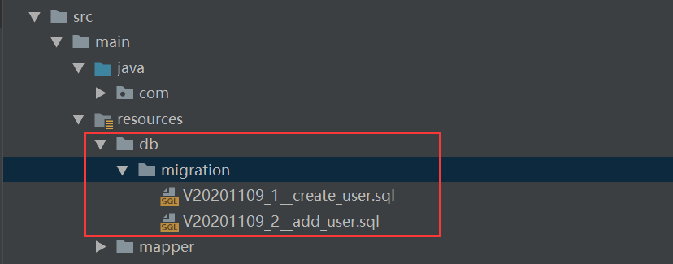

对于数据库版本管理，我们已经介绍过一款类似工具

本文将介绍另一种数据库版本管理工具flyway.

老规矩，首先上[官网](https://flywaydb.org/documentation)

### Flyway是如何工作的
flyway 工作原理与 Liquibase 基本一致，其工作流程如下:

1. 项目启动，应用程序完成数据库连接池的建立后，Flyway自动运行。
2. 初次使用时，Flyway会创建一个flyway_schema_history表，用于记录sql执行记录。
3. Flyway会扫描项目指定路径下(默认是classpath:db/migration)的所有sql脚本，与flyway_schema_history表脚本记录进行比对。如果数据库记录执行过的脚本记录，与项目中的sql脚本不一致，Flyway会报错并停止项目执行。
4. 如果校验通过，则根据表中的sql记录最大版本号，忽略所有版本号不大于该版本的脚本。再按照版本号从小到大，逐个执行其余脚本。

### 在SpringBoot项目使用Flyway

1. 初始化一个SpringBoot项目，引入MySQL数据库驱动依赖等，并且需要引入Flyway依赖：

```xml
<!--引入flyway-->
<dependency>
    <groupId>org.flywaydb</groupId>
    <artifactId>flyway-core</artifactId>
    <version>6.1.0</version>
</dependency>
```

2. 添加Flyway配置
```properties
spring:
  # 数据库连接配置
  datasource:
    driver-class-name: com.mysql.cj.jdbc.Driver
    url: jdbc:mysql://localhost:3306/ssm-demo?characterEncoding=utf-8&useSSL=false&serverTimezone=GMT%2B8
    username: xxx
    password: xxx
  flyway:
    # 是否启用flyway
    enabled: true
    # 编码格式，默认UTF-8
    encoding: UTF-8
    # 迁移sql脚本文件存放路径，默认db/migration
    locations: classpath:db/migration
    # 迁移sql脚本文件名称的前缀，默认V
    sql-migration-prefix: V
    # 迁移sql脚本文件名称的分隔符，默认2个下划线__
    sql-migration-separator: __
    # 迁移sql脚本文件名称的后缀
    sql-migration-suffixes: .sql
    # 迁移时是否进行校验，默认true
    validate-on-migrate: true
    # 当迁移发现数据库非空且存在没有元数据的表时，自动执行基准迁移，新建schema_version表
    baseline-on-migrate: true
```

3. 根据在配置文件的脚本存放路径的配置，在resource目录下建立文件夹db/migration

4. 添加需要运行的sql脚本。sql脚本的命名规范为：V+版本号(版本号的数字间以”.“或”_“分隔开)+双下划线(用来分隔版本号和描述)+文件描述+后缀名，例如：V20201100__create_user.sql。如图所示：
    

5. 启动项目。启动成功后，在数据库中可以看到已按照定义好的脚本，完成数据库变更，并在flyway_schema_history表插入了sql执行记录。