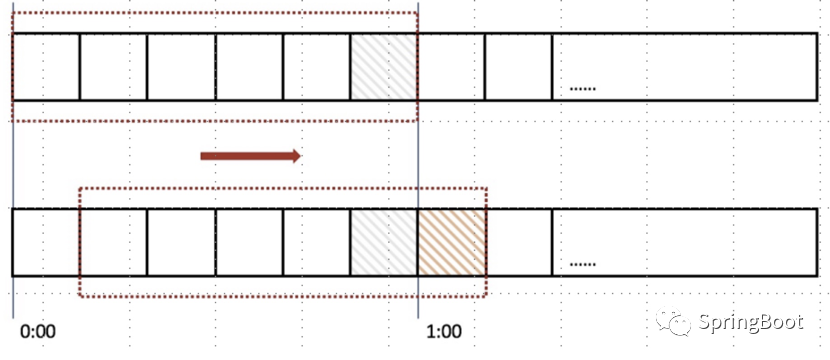
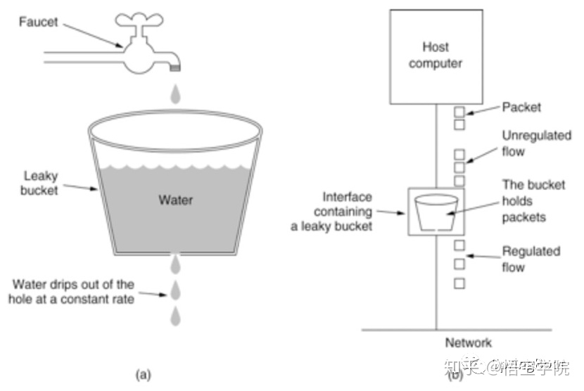
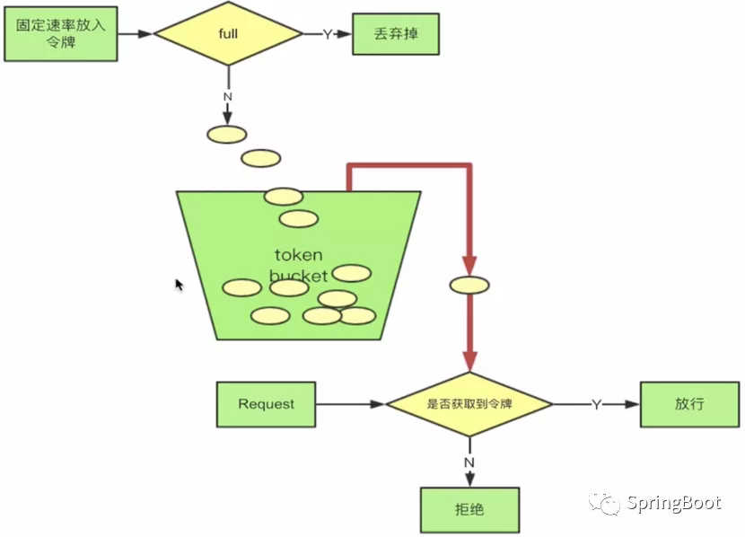

**高并发三大利器**
* 缓存  --  缓存目的是提升系统访问速度和增大系统能处理的容量，可谓是抗高并发流量的银弹
* 降级  --  当服务出问题或者影响到核心流程的性能则需要暂时屏蔽掉，待高峰或者问题解决后再打开
* 限流  --  通过对并发访问/请求进行限速或者一个时间窗口内的的请求进行限速来保护系统，一旦达到限制速率则可以拒绝服务（定向到错误页或告知资源没有了）、排队或等待（比如秒杀、评论、下单）、降级（返回兜底数据或默认数据，如商品详情页库存默认有货）、特权处理(优先处理需要高保障的用户群体)

## 限流算法
### 快速失败 – 滑动时间窗口
滑动窗口算法是将时间周期分为N个小周期，分别记录每个小周期内访问次数，并且根据时间滑动删除过期的小周期

### 排队等待 - 漏桶算法
漏桶算法思路很简单，水（请求）先进入到漏桶里，漏桶以一定的速度出水，当水流入速度过大会直接溢出，可以看出漏桶算法能强行限制数据的传输速率。

首先，我们有一个固定容量的桶，有水流进来，也有水流出去。对于流进来的水来说，我们无法预计一共有多少水会流进来，也无法预计水流的速度。但是对于流出去的水来说，这个桶可以固定水流出的速率。而且，当桶满了之后，多余的水将会溢出。

我们将算法中的水换成实际应用中的请求，我们可以看到漏桶算法天生就限制了请求的速度。当使用了漏桶算法，我们可以保证接口会以一个常速速率来处理请求。所以漏桶算法天生不会出现临界问题。
漏桶算法可以粗略的认为就是注水漏水过程，往桶中**以一定速率流出水，以任意速率流入水**，当水超过桶流量则丢弃，因为桶容量是不变的，保证了整体的速率。

### Warm Up - 令牌桶算法
首先，我们有一个固定容量的桶，桶里存放着令牌（token）。  
桶一开始是空的，token以 一个固定的速率r往桶里填充，直到达到桶的容量，多余的令牌将会被丢弃。  
每当一个请求过来时，就会尝试从桶里移除一个令牌，如果没有令牌的话，请求无法通过。

#### 解决问题：
* Warm Up（冷启动/预热）：通过”冷启动”，让通过的流量缓慢增加，在一定时间内逐渐增加到阈值上限，给冷系统一个预热的时间，避免冷系统被压垮。

### 各算法适用场景
* 计数法用于简单粗暴的连接池数量等。
* 令牌桶可以用来保护自己，主要用来对调用者频率进行限流，为的是让自己不被打垮。所以如果自己本身有处理能力的时候，如果流量突发（实际消费能力强于配置的流量限制），那么实际处理速率可以超过配置的限制。
* 漏桶算法，这是用来保护他人，也就是保护他所调用的系统。主要场景是，当调用的第三方系统本身没有保护机制，或者有流量限制的时候，我们的调用速度不能超过他的限制，由于我们不能更改第三方系统，所以只有在主调方控制。这个时候，即使流量突发，也必须舍弃。因为消费能力是第三方决定的。

** 简单粗暴场景用计数法。如果要让自己的系统不被打垮，用令牌桶。如果保证别人的系统不被打垮，用漏桶。**

## 流量控制组件对比

## 参考文献

[高并发系统限流-漏桶算法和令牌桶算法](https://www.cnblogs.com/xuwc/p/9123078.html)