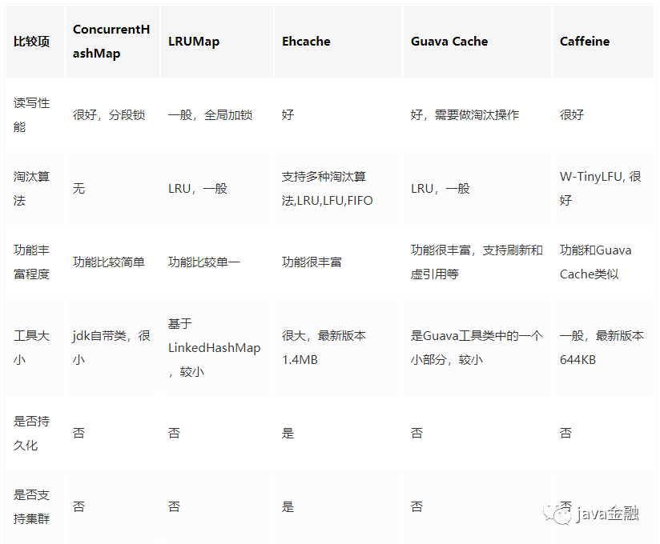

**高并发三大利器**
* 缓存  --  缓存目的是提升系统访问速度和增大系统能处理的容量，可谓是抗高并发流量的银弹
* 降级  --  当服务出问题或者影响到核心流程的性能则需要暂时屏蔽掉，待高峰或者问题解决后再打开
* 限流  --  通过对并发访问/请求进行限速或者一个时间窗口内的的请求进行限速来保护系统，一旦达到限制速率则可以拒绝服务（定向到错误页或告知资源没有了）、排队或等待（比如秒杀、评论、下单）、降级（返回兜底数据或默认数据，如商品详情页库存默认有货）、特权处理(优先处理需要高保障的用户群体)

## 缓存分类

* 分布式缓存： 如redis、memcached等
* 本地（进程内）缓存： 如ehcache、GuavaCache、Caffeine等

## 缓存特性

### 命中率

命中率=命中数/（命中数+没有命中数）当某个请求能够通过访问缓存而得到响应时，称为缓存命中。缓存命中率越高，缓存的利用率也就越高。

### 最大空间

缓存中可以容纳最大元素的数量。当缓存存放的数据超过最大空间时，就需要根据淘汰算法来淘汰部分数据存放新到达的数据。

### 淘汰算法

缓存的存储空间有限制，当缓存空间被用满时，如何保证在稳定服务的同时有效提升命中率？这就由缓存淘汰算法来处理，设计适合自身数据特征的淘汰算法能够有效提升缓存命中率。  
常见的淘汰算法有：

* FIFO(first in first out)「先进先出」  
  最先进入缓存的数据在缓存空间不够的情况下（超出最大元素限制）会被优先被清除掉，以腾出新的空间接受新的数据。策略算法主要比较缓存元素的创建时间。「适用于保证高频数据有效性场景，优先保障最新数据可用」。

* LFU(less frequently used)「最少使用」  
  无论是否过期，根据元素的被使用次数判断，清除使用次数较少的元素释放空间。策略算法主要比较元素的hitCount（命中次数）。「适用于保证高频数据有效性场景」。

* LRU(least recently used)「最近最少使用」  
  无论是否过期，根据元素最后一次被使用的时间戳，清除最远使用时间戳的元素释放空间。策略算法主要比较元素最近一次被get使用时间。「比较适用于热点数据场景，优先保证热点数据的有效性。」
  
## 本地缓存

常见本地缓存有以下几种实现方式：

其中性能最佳的是Caffeine，了解更详细信息参考： [本地缓存性能之王](https://mp.weixin.qq.com/s?__biz=MzIyMjQwMTgyNA==&mid=2247483811&idx=1&sn=9d0b207044b5fe447169d630a7f77aab&scene=21#wechat_redirect)

## 分布式缓存

分布式缓存详细信息参考redis系列文章

## 缓存更新方案
我们一般的缓存更新主要有以下几种更新策略：

* 先更新缓存，再更新数据库
* 先更新数据库，再更新缓存
* 先删除缓存，再更新数据库
* 先更新数据源库，再删除缓存
  
至于选择哪种更新策略的话，没有绝对的选择，可以根据自己的业务情况来选择适合自己的。  
不过一般推荐的话是选择 「**先更新数据源库，再删除缓存**」。

## 缓存常见问题
### 缓存穿透

大量查询数据库不存在数据，缓存无数据，大量无效请求落库。

解决方案
* 数据库不存在数据写空值入缓存

### 缓存雪崩

大规模缓存崩溃，大量请求落库。

解决方案
* 事前：redis 高可用，主从+哨兵，redis cluster，避免全盘崩溃。
* 事中：本地 ehcache 缓存 + hystrix 限流&降级，避免 MySQL 被打死。
* 事后：redis 持久化，一旦重启，自动从磁盘上加载数据，快速恢复缓存数据。

### 缓存击穿

热点key失效瞬间大量请求落库。

解决方案
* 基本不会发生更新的，则可尝试将该热点数据设置为永不过期。
* 更新不频繁且更新时间段，加互斥锁保证少量请求重建缓存。
* 数据更新频繁或更新时间长，定时线程主动重建缓存。

### 缓存双写一致性

缓存使用方法：
读的时候，先读缓存，缓存没有的话，就读数据库，然后取出数据后放入缓存，同时返回响应。
更新的时候，先更新数据库，然后再删除缓存。

不一致解决方案
* 初级：先删除缓存，再更新数据库。
* 高并发：使用队列做轻异步，多个并发更新请求阻塞过滤。（必须压测防止长时间阻塞积压）

### redis并发竞争

多客户端同时并发写key，后来的数据先改。

解决方案：
* Redis存在CAS方案
* 实现分布式锁
* 写前判断版本号